#PERMACULTURE IN HUMID LANDSCAPES

##BY BILL MOLLISON

###Pamphlet II in the Permaculture Design Course Series

**PUBLISHED BY YANKEE PERMACULTURE**

**Publisher and Distributor of Permaculture Publications**

**Barking Frogs Permaculture Center**

**P.O. Box 69, Sparr FL 32192-0069 USA**

Email: <mailto:YankeePerm@aol.com>

<http://www.barkingfrogspermaculture.org>

**Edited from the Transcript of the Permaculture Design Course**

**The Rural Education Center, Wilton, NH USA 1981**

**Reproduction of this Pamphlet Is Free and Encouraged**

**Re-edited for Markdown and Ebooks by [Nathan Luedtke](mailto:luedtke@gmail.com) in 2014**

***

###PERMACULTURE IN HUMID LANDSCAPES

The category we are in now is humid landscapes, which means a rainfall of more than 30 inches. Our thesis is the storage of this water on the landscape. The important part is that America is not doing it.

The humid landscape is water controlled, and unless it is an extremely new landscape- volcanic or newly faulted--it has softly rounded outlines. When you are walking up the valley, or walking on the ridge, observe that there is a rounded 'S' shaped profile to the hills.

Where the landscape turns from convex to concave occurs a critical point that we call a keypoint. [Bill's treatment of keyline differs significantly from that of P. A. Yeomans, originator of the keyline plan. For a more detailed and more accurate treatment of keyline, see Water for Every Farm-- Yeomans Keyline Plan, an updated version of Yeomans' work available from Yankee Permaculture at the address on the cover.]

The main valley is the main flow, with many little creeks entering. At the valley head where these creeks start, we locate the major keypoint. From there on, the keyline starts to fall from one in 1,000 to one in 2,000 below contour. The dams we make in the lower valleys will be slightly lower at each point. They will not be at the keypoint.

Rain falling on the hilltop runs off. The paths described by single raindrops, wherever they fall, are similar in that they cross contours at right angles, because that is the shortest drop between two contours. Water takes the shortest path across the landscape from where it falls to where it hits the river line. It is along this path that raindrops are doing their thing. As soon as they are in the river valley, they are off to the sea.

It is possible to locate the keypoint from a contour map. Find where the contours start to spread. That is the keypoint.

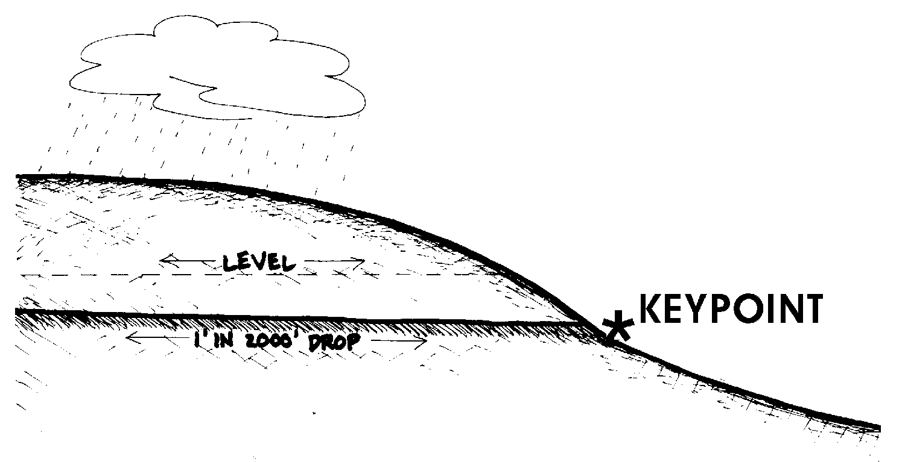

Having found the keypoint, we can now treat the whole landscape as if it were a roof and a tank. In a fairly descending line, falling gently away from the horizontal, we put in a groove around the hill. This is the highest point at which we can work with mechanical tools. Above that, it is too steep. We make a little shelf around the hill leading to the keypoint. No matter where this water was going, we have now started to divert it, bringing it right around the hill to the keypoint. In effect, we have put a gutter around our roof, a very gently falling gutter. We started at the keypoint and extended a line that we lifted one foot at every 2,000 feet. We want to create a very, very gentle fall. Water just moves along it, and that is all. We have directed the water to our keypoint.

At the keypoint, we put a little dam; for it is the highest point in the profile of the valley that we can economically store water. It is a rather deep little dam, and we need a fair amount of Earth to build it. It is not the most economical dam that we will have, but it gathers all the water from the top of the hill to that point. We can make that keypoint dam as large as we can afford. It will enable us at any time of the year to run water right around this contour and let it fall on any area that we want. 

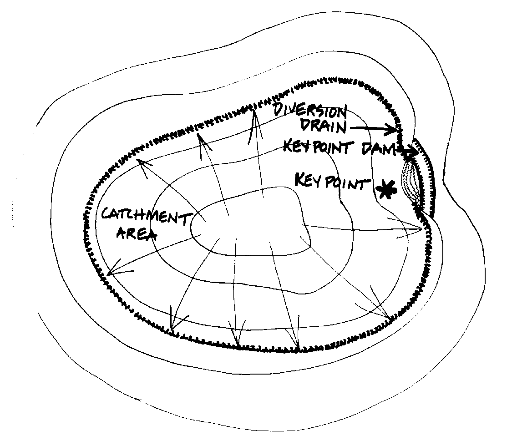

We lead the water out through the wall of the dam, either by siphon or a lock-pipe, allowing it to enter a contour drain. We control the flow in the drain by a sheet of canvas or plastic, fastening it like a flag to a very light plastic pipe. A chain attaches to the other end of the flag, serving as a weight. We may peg that flag down within the drain, holding back the flow until the drain has filled behind the flag. Then the water spills over, sheeting down across the hillside. About twice a year, in summer, this will usually be enough to keep the countryside very green.

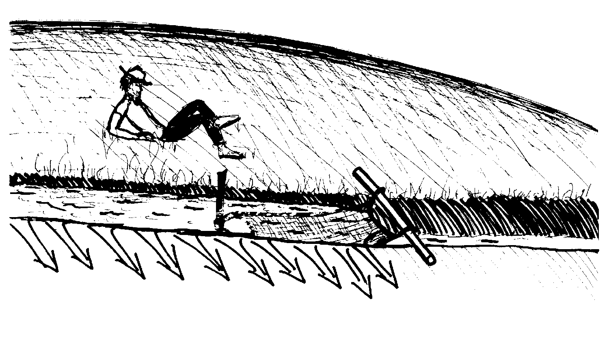

If you want to put out a bush fire you just walk backwards with the flag, and you douse the whole hillside. One person can water hundreds of acres this way with no effort at all. It is very light work. No pumps.

For very large dams, holding five or six million gallons, you merely put a sliding gate or lock-pipe in the dam wall, generally about 18 inches square. This water will flow out about as fast as you can walk, walking fairly slowly. The drain being filled will follow you along. The most restful way to irrigate a large area in this way is to have two people and two flags. We peg here, and our friend goes 100 feet ahead and pegs. When we have soaked our part of the field, we just pull our flag, and our water flows on to his flag.

The depth of your ditch depends on the size of your dam. If you have a 5,000 gallon dam and a little garden, a small market garden, you can have a small ditch, and you can control the flow just by putting a spade in it.

Alternately, you can have something as big as a lake, for which you will need a large lock pipe with a big wheel on it, and the ditch itself may be half the size of this room. This will require a fair size flag. In this situation, we may be trying to irrigate 2,000 or 3,000 acres a day.

On large property, taking in a whole watershed, we may go on constructing further dams on a descending contour. Away we go, dam to dam to dam, falling all the way on this one to two thousand keyline. As long as your main dam is the highest, you can come down to all the little valleys, taking in both sides of the watershed. The keypoint should fall to both sides of the watershed. In the next valley, the dam is a little lower, and the next one a little lower. As for the river, it will flow quite continuously. The more storage you have on the hills, the longer that river will flow in summer.

You can also find situations in which one side of the valley is very, very steep, and the other side very gentle. In this case, it is possible to put storages on the gentler slope.

Sometimes, again, the keypoint is well up-slope on very gentle, low sloping country.

What we are up to is taking water off non-agricultural land, and preferably forested land, collecting the water and the snow melt that has filtered through this forest. We don't want to cultivate those upper slopes. They are too steep, and they shouldn't be cultivated. Depending on your soil, don't cultivate beyond a 19 degree slope. You can get guidance on this from your local soils people. Generally, the sandier it gets, the less slope you will cultivate. With clay, you might get away with cultivating at 20 degrees probably once or twice.

The keypoint decides not only the most economical place to start to catch the water; it also defines the point above which you should probably consider forestry, while using the land below for irrigated pasture, croplands, orchards, or even irrigated forest. If you are dealing with a fairly wild forest of walnut and other nuts, it is very useful to be able to pour water on just about the time you are going to harvest. Then all your husks split and the nuts drop out. Below the keypoint lies the potential for cultivation.

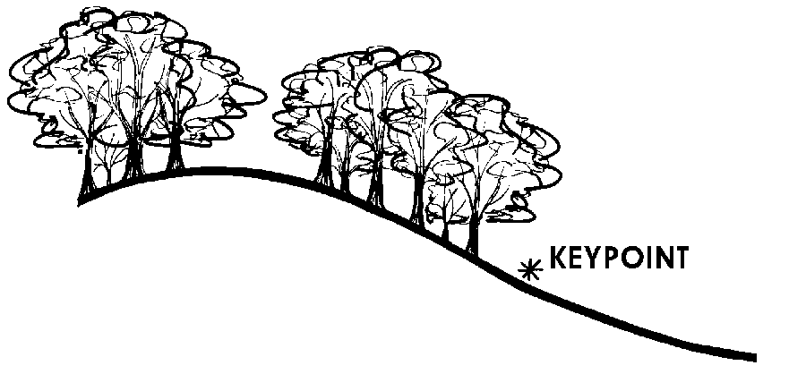

All this that I have been giving you is just a model. I don't expect the countryside to be like that, for here we may have rocks and falls and trees, and maybe a small pasture-- but just as a model, that is the way we would do it.

The slope with which we are working varies between sand and clay. Even with sand, if the drop is one foot in 2,000, we hardly shift a grain of sand in these ditches. We ran an eight mile ditch recently in northeast Tasmania. We got five or six miles along with one of these ditches--it was in the summertime and it hadn't rained for months--and there came a light, misty rain. We walked back a couple of miles and the ditch was running in the sand. It had been a guess, sort of a bet. We were doing it with a backhoe. It was just in sand, and it worked. We filled the first dam on the first day of light rain.

Here you are saying, you have rocks all over the place. Yet, it is very easy to go around outside them, or to bank up on outside of them. If they are as big as this room, run the ditch to the rock, let it drop down the side of the rock, pick it up at the bottom and go on. It is easy to go around a rock, just go around it and backhoe it. It may only need to be a little ditch, maybe just six inches deep.

The best way to answer your questions of how big this ditch needs to be is perhaps this way: The aboriginal people put mutton bird in casks. These people have an extraordinary dry sense of humor. They had a man from Sydney come down from a television team. He was interviewing an old friend of mine, a man named Devony Brown, and he was treating him as a simple-minded idiot, which Mr. Brown is not. He said, "Mr. Brown, you cut your birds, and you split your birds, and you put them in a barrel." And he said, "How many birds do you get in a barrel?"

"Well, oh, well, now," he says, "a small barrel, we don't get many, but you get me a big barrel and I'll get you a bloody lot of bird in it."

So does this answer your questions at all?

Look, if we are opening a valve on a 5,000,000 gallon dam, and we are getting rid of two and a half million gallons of water that day, we want a very big ditch - right? If we are opening a valve in a 2,000 gallon Earth tank at the top of somebody's back yard, we just want a trickle through the garden.

There is another way to construct a ditch that makes a fantastic landscape. That is to make the ditch a lake. Just go along and make a very broad ditch, and widen it wherever it is easy, and let the whole ditch fill with water, and your ditch is also a storage lake. I have seen it done once. It really makes something of the landscape.

There is a point, perhaps beyond five or six million gallons, that you are out of agricultural storages and into civil work. That will be valley dams. They will be subject to floods. We do not worry about floods with these little storages. While they may impound much water, they are very low dams. If they break, a six inch flood rushes out for two hundred feet. We design only with the sort of dams that you would feel quite confident about constructing. You are not about to put in a dam that is going to flood the next five or six villages down the stream, that will require concrete spillways and chutes and all that.

Here on these wooded slopes, though you encounter rocks, bracken, and trees, you look and you can see that there are ditches out there right now in operation. It is up to you to find those ditches and determine how they are made, and who made them, and where they go. There are storages out there. I want you to find those storages and determine what they will do. This is early springtime. There are little ditches flowing all day long out there, carrying off snow melt. You call them roads. Just look and see how far those roads are diverting water around the landscape. You know, the driving of a vehicle around the keyline will bring the water to the dam. We should use the keyline system as our road system. Just go and have a look at the roads right here. See where this road collects the water and where it drops it, and see where it takes it from.

You are asking me why people didn't think of this keyline system earlier? Common sense is an uncommon quality.

Now we go back to the top profile. This time we will be dealing with the hill profile itself. What we have been discussing so far is the valley profile.

Any dams worth making in valleys are keypoint dams. The other dams, which we will now discuss, won't be in valleys.

Here is a typical profile of ridge tops, a sky-line profile. What I consider now is the little saddles in the ridges. Some of them are not so little.

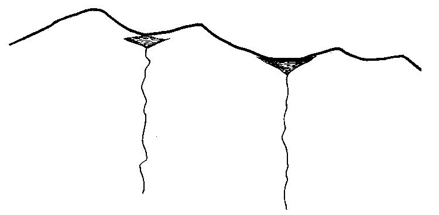

These saddles often mark points of weakness in the landscape, which may be massive, solid rock. The saddles mark those places where the rivers start coming down on both sides of the ridge. These rivers, obviously, have above them very large catchments. By making walls on either side, or perhaps on but one side of the saddle, we can obviously get very large and very high water storages. These are the highest water storages you can get on any property. These are real power storages. You may get one, or you might be able to get a whole series of these high storages on a single property.

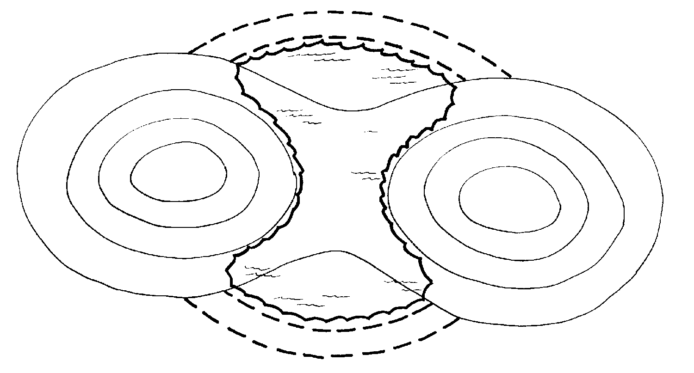

Let us consider what these storages would be useful for. They are marvelous places for your house water supply. It might be possible to generate electricity with them. If we had a very broad saddle, maybe 300 feet wide, we would just have to make two wide semi-circular bowls on the side of the saddle. We would have a sheet of water running across the saddle, and could run a hydro-electric stream off that. With this perched 400 feet above one friend's garden beds--a 400 foot fall is the maximum that you can get thick walled plastic pipe to hold at that--when the tap is opened at the bottom, you should see the sprinklers! You can stage the pressure down. You need not bring it down at 400 foot pressure. You can bring it down 200 feet, put a stop valve on a tiny tank, maybe a 100 gallon tank that you carry up on your back, and start again from that little tank and bring it down the last 200 feet.

These are excellent storages for intermittent mechanical power, for operating a turbine, supplying mechanical power for grinding or for a sawmill. You can operate a washing machine. In Australia, we have a washing machine, one of our best. It looks like a concrete mixer and runs off a very simple little gizmo. There is also a spin dryer that works on a little water jet. When you have 100 feet of fall and a little jet and a small turbine, it is simply your tap adjustment that becomes your speed adjustment.

There are other reasons for these high dams. Up there where it may be a fairly arid landscape in summer, you will find that the complexity of wildlife and the number of species, the number of seed-eating birds like grouse and quail rise sharply once you have these small storages up high. Wild chicks of seed eating birds need water daily, within 24 hours. These little storages are very enriching. These little saddle dams, which sometimes occur naturally, are great places for wild life.

Another important use for these high storages is to run sprinklers in a fire protection system. Two sprinklers will cover your two precious acres. When fire comes, if you have a single tap to twist and the thing runs for half an hour, you are out of trouble. So all you need, really, is 1,200 gallons up there.

Those saddle dams are pretty permanent. Even the natural ones are there for thousands of years. What's more, these are often filling when you have very little water down below. They fill faster that the lower dams. We are going to get a lot of energy back out of them, for, remember, you will not be pumping water anymore. The energy required to set up this system is what I call restitutional mechanics; we use it just once.

Now we will go to the subject of **contour dams**.

For this, we choose the least sloping site. We build an Earth wall, and we run our diversion drains as usual. These contour dams can perch on the knoll of a hill, where it dwindles out.

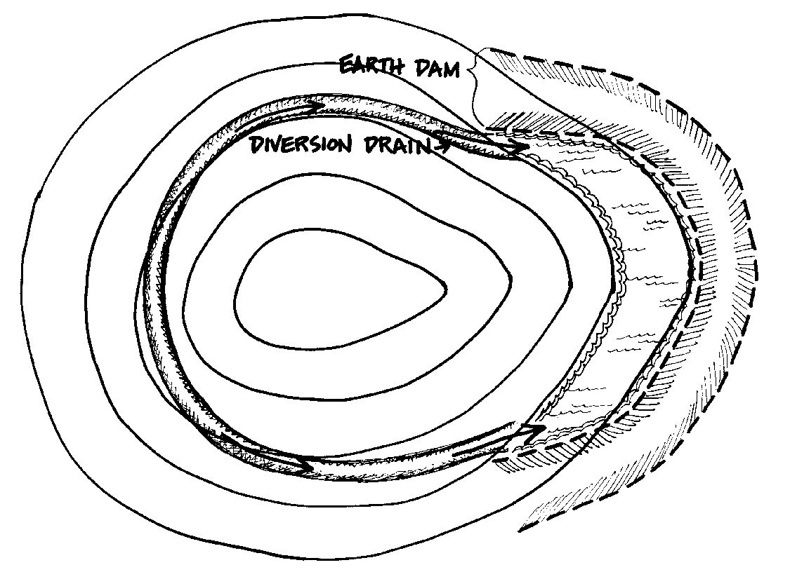

The contour dam is a shallow dam with a large surface area. It will be a very, very cheap dam. For the amount of Earth moved, we are going to get a lot more water. So if there is any flattish area up high, even if we have to hand-cut out diversion drains for a hundred yards with shovels-- you don't need a big diversion drain-- we will get water way up there.

These dams have two or three effects. There is significant increase in the water table in the surrounding area because these dams all leak a little bit, and because you are running the water around those diversion drains, you get a better absorption. What we are doing is giving the water far more time on the landscape. We have decreased the rush-off of water.

You know, when it rains heavily, our storages fill first. So we have buffered the erosion by taking the first shock of water. After that, these dams continue to give to the water table as the water table dries out, so they are moderating systems. That's why throughout Australia the authorities encourage you to build as many of these small dams as you can build. It means that down in the large storages, the power storages, there will be far more constant flow of water and the chances of flooding mitigate. 
 These dams will stand up to any amount of rainfall, because they simply overflow. You put in a normal spillway, and when you put a spillway in, you always contour it away from the dam and grade it out so what you get is a sheet flow over it. Now you bring it out as a broad ditch and runs it along on contour, gradually letting the ditch taper out to nothing. We often plant the spilldown area with shrubs.

From the skyline of the landscape, we have observed the natural path of water. We diverted it to cheap storage points. With very cheap, extraordinarily cheap earthworks, we have stored that water permanently, and we have stored it for different uses at different levels. It should be obvious to you that the high water should be water for cleanest use, and that as water comes downhill we can afford to let it become contaminated more and more with manurial pollutants for crops and with humic acid from forests.

We have set many priorities for our client. First, we get his domestic water supply for the house. We ought to do that before he ever starts mixing his concrete. We then look after the garden, the intensive garden; and then, lastly, we look after the extensive agricultural system.

This applies to people with larger properties. At present, we are doing the grand scale. We will put 13% to 15% of his landscape under water, if we can get it, and more if he chooses an aquatic crop.

You are asking how I define the "grand scale?" It depends upon whether you are an Australian, a Texan, or a New Hampshire man. In New Hampshire, 140 acres is a grand scale; in Texas, or in the Northern Territory of Australia, 5,000 square miles is reasonably modest property. In large, dry areas you are dealing with total catchments, total river systems. On an area up there in Northern Australia, there are five mountain ranges and five rivers, starting way up in the hills and ending with crocodiles down in the estuary. There we have gobs of landscape to play around on. Usually we are dealing with areas larger than fifty acres. In this highly dissected country, little catchments may lie within modest properties.

In setting the water in the landscape, we also establish the placement of a number of other elements. If the first decision that we make is to control the water in the landscape, then the functions that it serves, the uses to which we put it, decide the subsequent placements, and the thing really does start to become harmonious.

We have talked a lot about Type One Errors, which a designer must avoid. One of those is the house on the hill, which I call the Berchtesgarten syndrome. You have heard of Adolph Schickelgruber, the famous paper hanger of the 1930's? He later became reasonably well off, and built a great concrete blockhouse on top of a crag, where, as far as I know, he could have perished of thirst. I don't know what his eventual fate was. Anyway, there is this urge among some people to get as high as you can, and look out upon things. Many clients have this syndrome, and you have to fight these illnesses.

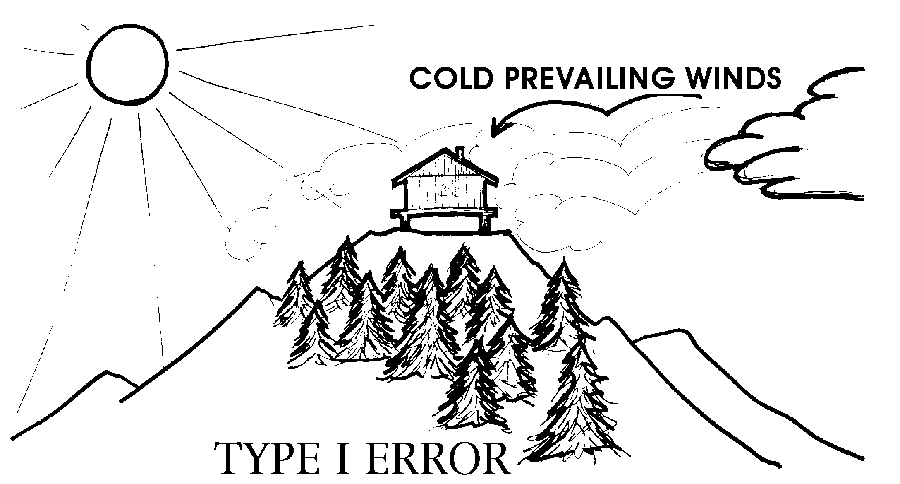

Your forest, properly, starts at the ridge top and comes down to the key point. This forested area has another factor going for it. It is your thermal belt. Let us look at the pattern of frost. If you can look at it from the air on a foggy day, you will see how it works, for the fog will imitate the frost. Here are your frosts moving across the ridge top. Occasionally a glob of it detaches and rolls downhill. Frost is not water; frost is treacle. Pour treacle on the landscape, and very stiff treacle at that. That is how frost and cold air behave. Frost does not behave like a stream flow; it behaves like fog. Frost moves out over the tree tops, pushing the warm air down. There is a warm thermal belt between the frost above the key point and the valley floor below.

As these gobs of frost move into the upper area of the forest that, even when it is a deciduous forest, still holds a lot of insulated water. It pushes the warm air out at the bottom. That air is several degrees warmer than the air entering at the top of the forest. Within this thermal belt, just below the key point, is where we tend to site our client. In that way, he has a racing start on thermal efficiency. It is the area where the first buds of spring break out, where the phenomenological calendar says that if you race up and down the hills, this is the best place to get started early in the spring. This is also the last area of autumn, where productivity disappears. So, it is a long season area. If you walk from there any night up to the crags above, you will go through a zone of decreasing temperature. With an evergreen forest above the keyline, even in snow, you will experience a warm down draft within the thermal belt.

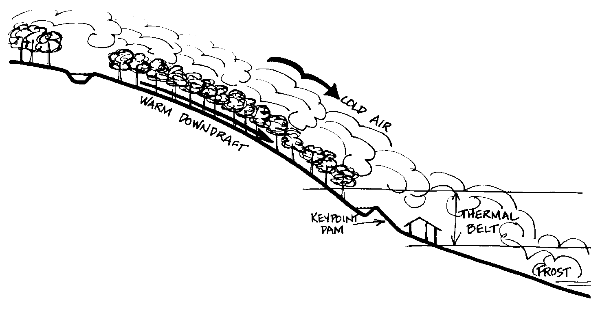

If we put in a high meadow up there, it will probably frost, and so will the trees up at that level. You will see the rime on them there. We won't get that degree of frost down here in the thermal belt. We will be several degrees warmer.

There are several thousand reasons for avoiding the temptation to site a dwelling way up on the ridge top. Down below the key point, the clean water is above us, and the house is below that water. Another thing, fire sweeps with fantastic rapidity uphill, and good-bye Berchtesgarten, because you have two fronts hitting you from both sides at once. You have nowhere to go. Fire moves quickly through the forest above us. Yet, we very easily controlled it at as this lower site.

Once we have set the water system, even if we never fully construct it, we retain the potential for its construction. The rest of the system is set, too.

Let us come down now to another area for water storage. This is where we start to really store the great bulk of the water we are going to store, and we don't store it in the dams, we store it in the soils.

We hop on a little light tractor attached to our Wallace soil conditioner and we start to comb parallel to the keyline. We comb the soils out. Of course, if you have forest below the keyline, this treatment won't be necessary, because the forest will be doing all that. The forest is driving down roots and they are rotting; it is putting little sticks on the landscape, and it is holding water up, and it is laying down duff. Let us say this is going to be agricultural land, so this is how we will proceed. If it is now agricultural and we are going to make it orchard or mixed forest, then we still proceed like this.

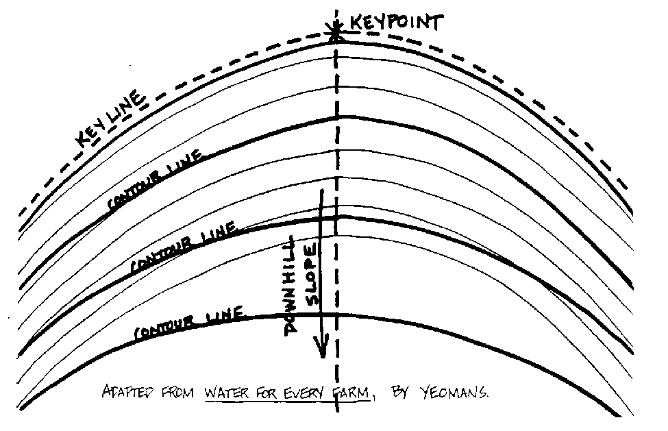

We now begin to create the greatest reservoir that we will have on the farm. This is the billion- gallon reservoir. It is the soil. You won't see any of this water, but it will be there. We just continue to comb the soil out, moving parallel to the keyline. As we do so, we provide greater soil storage of water closer to the ridges. This is just a technique to get the water out of the valley, back on to the high places.

The Wallace soil conditioner is a very simple farmer's machine, very rugged. It has a disc that runs along the soil and cuts it. It is very sharp, of excellent steel. This is followed by a shank that has a shoe at the base. You don't need to go more than 9 inches deep in the soil. The disc cuts through the soil, the shank follows the slit. The shoe widens the slit at its base. You shouldn't see more than a couple of teaspoonsful of Earth emerge along that opening. A very light tractor will do the job.

We are creating these thousands of grooves, running faintly across slope. Starting up on contour at one in two thousand, any water flowing on this landscape initially follows these million little drains. As heavy rain falls, these fill to capacity. Then, the water overflows and descends to also charge fully the grooves below. Water is very quickly absorbed. Just look at the amount of absorption surface in a conditioned soil as against the original soil. The original soil was sloping downhill, probably compacted by cattle, probably further compacted by tractors, and the water was running off. Now your little holes are absorbing that water. When it gets down here, it starts moving out underground. So it can't evaporate--the sun can't get at it.

Now we are starting to get soils which contain water to at least 9 inches depth. Those soils will absorb water roughly at about one inch per foot as interstitial water. So we start to hold the majority of normal rainfall within the farm. Interstitial water will continue on down and gradually go out the streams, but that may be at a very, very slow rate. Somewhere, you know, it may move out there at a distance of less than 10 feet a day, or in some areas, 20 feet in a year.

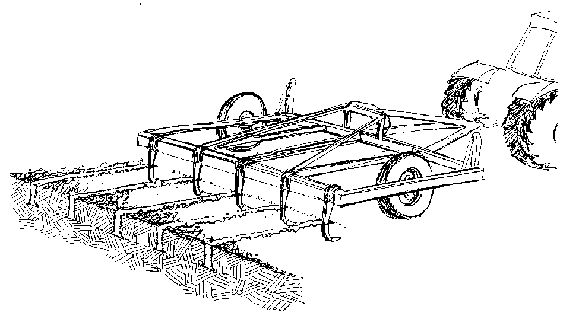

The Wallace soil conditioner is unlike a subsoiler, which is a tool of cultivation, and brings an enormous amount of Earth up on top. In spite of its ruggedness, the Wallace soil conditioner is very sophisticated, and it is designed to do exactly what I have described. It is designed to store water within the soil. Your subsoilers are not designed for this, neither are your chisel plows. We have done football fields with these soil conditioners and the next day then went out and played football.

What we are after is storing water. Once we treat the soil in this way, we never have to repeat it, unless we restock heavily with cattle for a couple of years, or run it over to and fro with tractors. It is the ideal tool to rehabilitate eroded soils, soils that we never intend to put back under cattle, soils that we want to devote to new uses, those places we want to reforest as quickly as possible with the highest chance of success.

Now there are a few conditions in which you don't use the soil conditioner. One is in very free sandy soils. Nor do you use it in forested landscapes, and of course you don't use it where maybe 90% of the soil is rock. Apart from that, in all other conditions, use it. Use your keyline as your base line to start your conditioning.

We will now describe how you start the keyline out. You use a Bunyip level, which is made up of about 80 feet of half inch hose. At either end it has clear, stiff plastic uprights inserted into it. These are rigidly fixed to two stakes. Fill the hose with water. Then bring these two stakes together and mark off a level point on them. Here they stand right together. We have the base of these stakes on a firm, level platform, and mark off the level. Drive a stake here at the keypoint. One now walks 80 feet around the hill and puts the stake up or down the hill until the water reaches that level, and drives in the marker. If we want a one in 2,000 contour drop, we bring it down in proportion to whatever distance we walked. Now all it takes is two kids to run keylines all over the landscape. They can do it in half an hour with this sophisticated bit of equipment invented by the ancient Chinese and originally made of pig's guts, but adaptable to modern materials. It is called the Bunyip level. You start at your knoll, or you descend across the landscape on your keyline. Or you strike a dead level thing for a swale, which we have not discussed yet.

If you don't have anyone around, and don't have any levels, you hop on your tractor, back as hard as you can into the valley, and then start driving gently around the hill, and continue on parallel to that situation. There is no need to fuss about it at all. We are not talking about anything very complicated, because all you want is for that water to travel maximum distance.

You can make wet spots on ridges. Geoff Wallace does a little half moon right up in a very steep little valley. He gets his tractor up there, combs out to the ridges, and puts a clump of trees on the ridge, so the trees are irrigated on the ridge points.

The results of the conditioning of soil are, first, a fantastic amount of water storage within the landscape; second, a soil temperature in winter that may be as much as 25 degrees Fahrenheit above that of the surrounding soils. Wet soil is an enormous heat mass, but you also have much air space in those soils. Conditioned soils commonly average 19 degrees Fahrenheit above the surrounding soil temperatures. It is frequent to see a field that has been soil conditioned unfrosted in a series of frosted fields, because very often it is just that 15 degrees to 19 degrees difference. So soil conditioning sharply decreases frost. Therefore it increases your growing season at both ends of the growing year. Trees will make a faster growth. Olives, that would maybe bear in 17 or 18 years, will normally bear within three years in conditioned soil. It pays to wait even two years or three years until this happened before you plant trees. You are still further ahead than if you planted first in compacted soils. You get roots following those lines right down into those little triangles, and then off themselves and going on further down, again making channels for water for even further penetration. We are not interested in going beyond a depth of nine inches. We can create that within a year from sub-soil. Seeds wash into those little crevices and germinate along those little ridges. The plow has an attachment, a little seed box that just drips seeds at pre-regulated rates into those crevices, and you can go from pasture into millet, or pasture into wheat right away. And you haven't cultivated. You can go from pasture into pumpkins, if you want to.

Before you do this, it is a good idea to mow or graze the area flat, then use your soil conditioner.

If it is a stubborn soil, really compacted, you only go down to four inches. Then you will see in these lines a very rigorous increased grass, which you let come out, and either take off as hay, or mow and lay flat, or graze off. Then you recondition down to about nine inches. After you proceed either directly into crop or into orchard, or you start normal grazing sequences, which you continue for two years, or until you dig down and find that the results of conditioning have disappeared and your pasture is starting to degrade. Then you recondition your pasture. In normally strong soil, you wouldn't need to do that more than once every three or four years under quite heavy grazing. On football fields, you only need to do it every two or three years, and that is heavy compaction. You can see it is not a frequent treatment. In orchards, you don't need to regraze your orchard, because you are getting root depth from trees and root channels deep down in the Earth.

In some soils, you get hard pan, mostly as the result of the application of superphosphate and a high evaporation rate. When you put superphosphate on top, the rain carries it down to certain depths; then summer comes and the moisture evaporates and an insoluble tri-calcium phosphate forms in a concrete block 15 inches down. It is all right to use phosphate rock on calcareous soils, but not superphosphate. Those soils should never have superphosphate applied to them. That is a no-no. We will get into that in the tropical section. Superphosphate is a no-no on tropical calcium soils. It is a type one error. Superphosphate your atoll and you will concrete it. We will try to point out these type one errors as we go along. We just did one. The Berchtesgarten syndrome is a type one error. Once you have made that error, everything else you attempt will remain difficult forever. You invite a high energy situation for your client in perpetuity. They are always going to be in trouble. A little camp in the woods is another type one error. You can feel those errors in your bones. You are asking, How about building a house on a valley floor? There is nothing wrong with it if you want to make a specialty of freezing things. If that is what you want, then just down the valley, put a big belt of pine trees across it, and you can live in a refrigerator all your life, summer and winter. It is Eskimo ideal. If you must adapt an Eskimo to southern Minnesota, that's where you put him. For us sunny people, that is not the place. There are valley sites, however, which we will get to later, which we deliberately choose.

Now back to the subject of water in landscape. We store most of our water in our soil. We can get it there in two ways. If you have poor clients who can't afford this soil conditioner, we can get water in there with radishes. I mean large radishes, the daikon radish. We use the same system. We slash, and we broadcast our daikon. The Daikon radishes spike our soil to about two feet. We never need to pull them because they are biennial and rot. If the area is too steep to use the soil conditioner, we use Daikon radish. We accomplish it biologically. Or we can plant real pioneer species of trees like your western red cedar, and they spike the soil. They are very good soil spikes. They start this process. If we have a very large area compacted, and we want to get into some crop or other, we can use that mechanical method. We might have to make a hole and put in a handful of compost with our radish so that it can get a start. If we are dealing with a very small area, we might dig holes and put little logs in and plant our vegetables where the logs are rotting under the ground. We can do all sorts of things like that. We can get it done.

What we are up to is opening the soil again, bringing it back to its forest absorption capacity, and we do it. Our main aim is to store the water in the soil. You can see now what happens when we let water drain, that irrigation drain, out across conditioned soil. It encounters a series of ribbed systems that run it out and store it up.

Now let us move on down to the lower slopes. As the grade decreases, so the amount of water stored per Earth moved starts to increase. Any impoundments we make lower down are very cheap, and, as you now know, there is no need to go into the valleys to make them on any level area. We can make them on the point of a ridge, and that may be flatter than the valley floor. This has an advantage in that we don't have a floodrush over our dam walls. It is an easy situation where we have a diversion drain running from higher up, pooling on the ridge, and maybe running back into the next valley.

There is only one rule about the efficiency of dams. That is, the flatter the floor that you are flooding, the more water you get for dollars spent. It doesn't matter where that is, on an open field, or on a ridge, or in a valley floor. So when you are looking to large storage, you walk the valley floor and find where it levels. At the point where it starts to level, you often find that it tightly constricts, and you will find the logical valley dam site. Again, you are the best tool in determining this.

It is a pleasant time of the year to do it now, because there is water trickling through the landscape.

Where it speeds up, that is where you are going to have to move a lot more dirt. Where it is moving slowly, that is the floor of your dam. Where it starts to speed up, that is where your dam wall will go. At this time of year, just when everything is melting, you can follow all the trickles across the landscape and work these little things out.

We will go now to your lower dams. They lie below your fields, below your animal houses, below your house, but maybe just below, because they are good for energy. They may be of very little use at all in this respect. Occasionally, though, they may be useful for turning mill wheels below. They may be useful in that with enough flow we can put a hydraulic pump, a hydraulic ram on, and lift domestic water up 10 feet for every foot of the fall. They may be useful for high volume, low flow energies, particularly if we are putting them across creeks. These are your old mill dams, mill ponds. They lie all around this district. There is one just up the road, and another one just down the road. They move big masses slowly by weight of water. However, for the most part, the energy low dams supply is not much good to us, so they are the last dams we install.

However, these are our production dams. Here we produce the highest amount of yield from water. They are the best dams for our fish and our wild life and water chestnuts, crayfish, all those little creatures. They do best down in these low dams because there is a nutrient flow into the dam of dissolved solids. Water that looks perfectly clear may carry a heavy weight of dissolved solids. You will find on analysis, more mass eroded from the hillside in clear water than you find in dirty water. Now the idea is to catch these nutrients in a biological net. We want to seize the nutrients, the dissolved solids in the water, the calcium, etc., without employing some high technology apparatus, and get these nutrients back on to the land.

You can do this by putting fodder plants in these ponds, algae, mussels, and snails. They will absorb that calcium and fix it, and you can get it back out again in the form of duck manure, fish, and wild rice. In this way, you are using very efficient little biological machines, working at the molecular level, straining out the nutrients before the nutrients leave your property.

The ideal situation is, starting with clean high dams, gradually dirty the water up with manurial nutrients-- keep your ducks on a slowing flow into some of these ponds, wash your pig manure into some of them--then start putting this water through your wetland plant systems. You will be getting a high plant growth, which you take off. Then run the water on through other systems, and let it grow clean again. The water that you finally release into streams, the water that leaves your property, will be clean water.

Now you may not have the space to do all that, but, believe me, you don't need much space. In a mini-system we can do all that from here to the window. In clump, clump, clump, I can take you through a rice patch or a very high nutrient demand patch, or the taro patch; next, and algae-eating fish; into a rice patch; into a mussel pond with watercress. Now what we have is fairly clean water running out. Then you can let it go off. You can do all that in a space the size of this room.

In many places, of course, the keyline system is not an applicable way to treat your water. These are places in the Ozarks where people are sitting up in little headwater valleys, away above any keyline. They are sitting on tiny plateaus. They call it a cove.

Now you ask me, "What is the least slope you can put this biological net to use on?" There is no such thing as a least slope. We have country at home that has a three inch fall in a quarter of a mile. That is a least slope, and you can still use this system perfectly well on that. At that point you can swale it. You can actually go below the surface, dig out ponds that are below grade, that do not perch on top of the ground at all. The main volume is below the surface.

Just to summarize, I will run through it again. We first gathered clean water at the highest point for domestic uses. We added nutrients to water that we ran through our plant system; then we ran it off into marsh, carrying food from the natural productivity system to the trout; after converting nutrients to biological forms, we release clean water back into the stream. We can accomplish all this within a vertical drop of six feet, going from zone to zone to zone. So we are not talking necessarily about giant systems--we can be talking about real little systems. Once you have worked out a technique for this form of landscape, you will find yourself hitting this situation repeatedly. It is the classical humid landscape. You will be recognizing it everywhere; you will be spotting saddle dams out of your car windows.

Right around here, and north and south of here, and increasingly as we go north toward Canada, you have very low grade landscapes with ice built bottoms, that have very slow water movement through them. They are basically marsh land. They are very cheap water storage systems, very cheap marsh systems. Very low walls give you very extensive ponds. Keep your eye out for that kind of landscape. It is often very cheap land because cattle can't move around in the marshes, and the hills may be quite dry. Where people can't run cattle, land is sometimes cheap. If you can buy that land, you can get miles of water for very little Earth moved. The best design decision, then, is to go into aquatic production, because the site suits to that, not to dry land production of cattle or corn. We spot those sites for clients who want to rear fish or trout or wild rice, or something else. There are also occasional sites where you have a basalt dike across the landscape, which in geological times formed an ancient lake. Then the waters broke through the dike at one point and the river went on out, and what you have left is an extensive marsh with a very narrow exit and very steep shallows to the exit.

The value of these high lake systems, saddle dams, and high meadows is well known. They afforded the traditional rich summer pastures used extensively in Switzerland and all cold climates as summer grazing meadows. Here is an excellent reason for opening up the flat ridges there. As you get closer to the coast, increasingly alkaline conditions commonly occur. Then you get a copper deficiency in animals. Their hoofs fall off; they aren't thrifty; they get lame quickly. Just shifting them temporarily up to those mountain pastures is good husbandry. All the young people go up with the herds to little huts. Everybody loves that move. These are really delightful times. If properly surrounded and broken up by trees, these are relatively warm. These are very valuable high meadows, and they are valuable for wild life. They break up the canopy of the forest and give essential edge conditions for high productivity.

So the landscape, I believe, dictates in a very logical fashion how you treat it. If you just ruminate on this profile and its thermal advantages, its water advantages, its seasonal advantages, then I don't see any difficulty at all in coming to a set of totally logical decisions about how you begin to treat it, or where you had best place your client within it, or where you would advise him to undertake various sorts of endeavors. As a designer, you will have one last set of resolutions to make, and that will be to increase or decrease the various elements of this landscape according to your client's wishes. If, as typically happens, he hasn't a clue, you dictate the proportional break-up, always maximizing water and forest, because that still leaves the opportunity open for him to decrease them at any later date.

I will now deal briefly with minor form of water storage at great heights that can be hand constructed, called dieu-pond. These are very interesting and semi-mystical small catchments, dotting the British landscape. Mainly monasteries constructed these little catchments. They are said to be fed by 'dieu." It is the god Himself that sends down the rain.

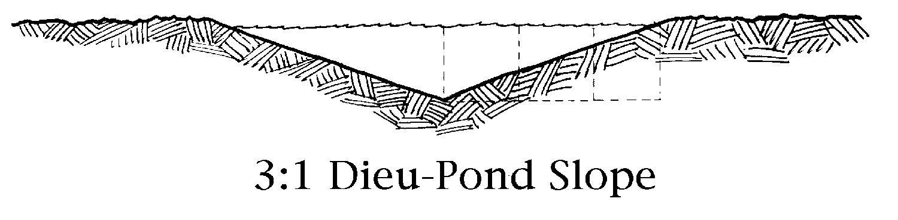

Now they are normally sited where there is a mini-catchment, maybe a little cup-shaped area in the hill. They are hand dug, and therefore not machine compacted. They are often clay tamped. But they need not be. They can be dug in perfectly good holding conditions. Moreover, the material removed from them is laid out on the catchment so that we have the least vegetation there, and consequently a greater run-off into the dieu-pond. Dieu-ponds never dry up. They can range from about three feet to a maximum of about 20 feet in diameter. Two or three people can dig a dieu-pond in a day. Nothing to digging holes. You are laughing? Well, anyPamphlet II Permaculture in Humid Landscapes Page 10. way, they dig this little hole so that its walls are three to one, which is about the resting angle of normally strong soil. Now the reason they don't dry up is that as they evaporate, the surface area decreases. They will always have some water. These ponds are the traditional high country watering points for stock. They do need cleaning out occasionally, because that little point at the bottom does fill with silt and leaves. It is an infrequent renewal. In very low summer periods, it pays to hop in there and drag the leaves out.

It is necessary to give the animals a stone access, or walk them into it on the low side. They will of themselves cause some collapse of the edges of it. For normally humid uplands, this is an eternal water supply, depending only on the number of stock watering it.

The builders of these dieu-ponds would never tell anybody how to build them. Old dieu-pond builders used to pass their secret one to the other.

The secret is, you taper it. I never knew how they worked until I took physics. I just knew they worked. I have seen them all around the worldlittle sloppy catchments. They work because they don't evaporate easily, and they fill from rainfall.

To the ordinary person, they look rather marvelous because there is no run-in, no streams, no springs, and here is a little pond of water. Today, we would hack one out with a backhoe, if not up to using a pick and shovel.

It is very likely that in future times low humid bottom lands, which have the lowest potential for soil loss, particularly if treated in some of the ways we will be discussing, will be the most valuable agricultural land. These areas may be in production long after we have lost all sorts of other soils. This is also where eroded soil accumulates. So those low-lying lands have a large amount of resilience. The only reason why we will be continuing to farm the lowlands is that we will probably be continuing to erode the uplands. Therefore, these are important areas. Very often, our design may keep them out of permanent uses into croplands. You may not see a tree crop that is appropriate to them; and you can often reserve them for main crop purposes. They are important areas, and becoming increasingly important.

We need to deal briefly now with mini-terraces. We may, at times have to site the client where we don't want to. You have clients, quite affluent people, who buy site unseen, subdivisional areas. It often becomes necessary to establish a terraced system for the garden. Design this in a series of planting areas of about waist height, two feet wide at the top, and maybe three or four feet at the base. The base of each tier is a walkway about 12 inches wide. Mulch the walkway and put mulch on the terraces as needed. We don't recommend more than three or four growing tiers in a series, and we don't recommend that they be any more than about forty feet long.

Your client is on this slope, digging in, living up there. He has his chickens above his garden, and the chickens are kicking the mulch downhill, giving him good mulch for his little terraces.

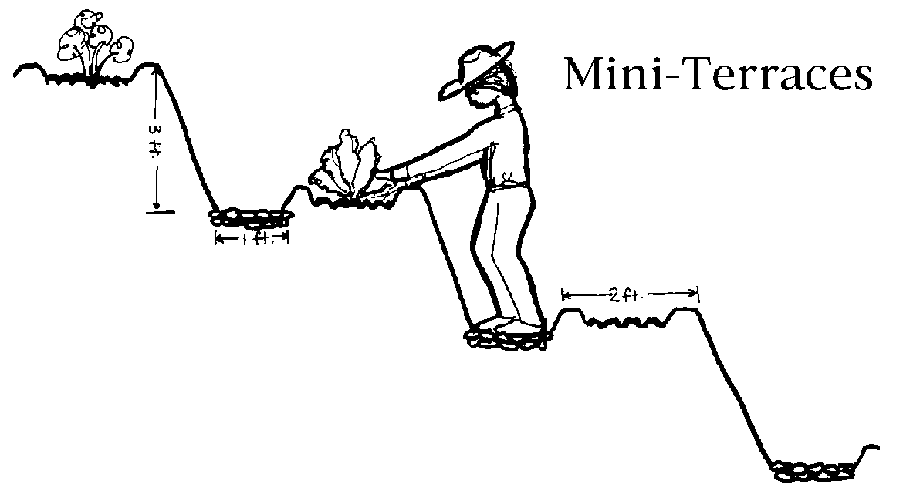

The terraces are along the hill. We let moisture flow down in very fine discharges on these paths. We only permit him three or four terraces, and we don't let them come in a line, we stagger them so that we get a staggering of runoff of excess water. It comes off at separate points, so we get several little runoffs spreading over quite an area of hillside. We will keep the area just below our three or four terraces vegetated with permanent shrubberies, small fruits, brambles, and pumpkins, and things like that. The little terraced ridges are hand-patted and shaped so that the water does not run out of this area very easily. Rain falls, and there is no runoff over these 40-foot ledges.

Now the client can still be in trouble, especially the lady client. The ladies carry all the water. They have to get water on to these high sites with no chance of a catchment up hill, unless they have a friend and neighbor. You, as a designer, can give them two water sources. You can provide for a catchment tank for water collected from the roof of his house.

Now from our water holding system we dig a little diversion drain and run it very gently across the hill, and maybe even drop a little bit of down pipe in it, directing the water on the trenches. We are not going to get a silt flow, because we have this area mulched, and when the water leaves, we make it run off on an uncultivated site. All the principles are exactly the same as in our keyline structure. We are still running little high keyline dams for him, but everything is small, and his garden is small, but it is productive, very productive!

There are two ways of managing chickens in this situation. You can put the chicken house down at the bottom near the terraces, or you can put it up at the top and the chickens will kick this mulch down to where it stops against this bottom fence. That will be the place from which we collect the mulch for the garden. This is what I call the kickdown system. We plant this area with chicken forage trees to hold the slope.

Now we will go to a relatively brief discussion of terraces and paddy field.

You can make those on slopes as steep as you like. You can do a Nepalese terrace, you know, in which you get a square foot for every 10 feet you terrace; but normally you make them on easy slopes. I looked out of our bus once in Nepal. We were turning a corner and the back wheels were hanging over here, and there was about a 3,000 foot drop. Out there were two little terraces. There was a gentleman standing on one foot, a hoe on his shoulder, looking up at me. Oh, God, I thought. All he has to do is to lean back! Also, not far away there was a tree growing up like that, and a big branch hanging out over empty space--no terrace below. There was a little girl on the road, and she ran up the trunk of the tree and sat on the branch without hanging on. My God! I can't stand to look at that! Forget those.

What we will discuss now are broad diversion and irrigation drains. You work right in them to see-saw your water across landscape. You usually have a little lip on the outer slope.

The drains fall across slope, and they may be very irregular in their width. There is no need to make them regular. We may be leading these diversion drains from a nearby creek, letting this trickle of water into them. We take this trickle of water and lead it into an agricultural situation.

This is not European gardening. You won't find anything about this in the British gardening book, because it is not straight, but has wavy edges on it; and it just isn't traditional.

Take a brisk look through world literature on the subject, and you will find 60 to 80 common, very high yielding plants that grow in marsh or water. One whole group that may be of interest is the bee forages that grow in or near water. We will deal with them later, when we go into aquaculture.

On more gentle slopes than those upon which we constructed our mini-terraces, we can indulge ourselves in water terraces, much more simply constructed. We can set up nutrient flow systems that are catching, introducing, and removing nutrients at different points in the cycle, using land animals for nutrient input, and the land plants to mop up the last of the nutrients in the water, while water plants and water animals do their parts in the cycle. We are into slightly different games here than those which we will talk about in aquaculture.

Another thing that you can recommend to clients as very pleasant work is water gardening. You can go into this form of terracing, or into dry terraces fairly fast. They are relatively easy to make and are very stable situations as far as soil loss goes.

Now we will consider the mechanics involved. On very low slopes, where we want to make diversion drains and channels, and in deserts, we make use of a thing called a spinner, which is simply a very large wheel ripping around behind a tractor. This wheel has little cups on it, and you just drive across the landscape and this wheel revolves and chews out a gentle channel and throws the dirt way up here, so there are no banks. The ultimate result is a sort of drain through which the water runs along, not really visible on the landscape except in low-lying conditions. You can drive vehicles and tractors across the landscape and they just enter and leave it without a great deal of fuss.

The width of the drain depends on how big your spinner wheel is, normally maybe four feet wide, and a foot deep. These are very gentle drains for low slope systems. On steeper slopes, the most common form of drain is made by using a tilted blade. The tractor goes on slope here, and blade is on tilt so that it will scrape with a very gentle back slope, and that gives a little wall of Earth on the outside. If it is wide enough, it is also your road, contour road, and it can be grassed. If you have much land and a great big project, and you are meeting all sorts of slopes, including steep slopes, you might even backhoe, or drag line one of these out.

It is handy to put a fence on the upper side, if you are going to fence, so that you can use relatively low fencing.

These are things called delvers, which resemble joined double plows, which can be towed behind bulldozers. They have two wings behind them, and they throw out a V-shaped drain, while the soil is spread out to the sides by the wings. They are low-slope systems. These delvers are sometimes mounted on graders, and you grade across the landscape, delving away at the same time. Graders can be used to grade out low profile drains. So, well, you use whatever machinery you have. For very small systems, you can use just a single furrow plow, turning out a turf; and you can double plow. The farmer can travel along the hillside with his chisel plow or his soil conditioner. Then, fixing a light blade on the tractor, follow along removing the loosened soil. This is a system that is useful when we are dealing with horticulture.

It is normal to grass the spinner drains, just as part of the field.

We will go to dam wall construction.

This is something you need to know, without ever having to do it.

For dams up to six or eight feet high--these are small walls--you don't fuss too much. You give it about two and one-half to one slope; on the rear side, three to one. You make a very broad crown. That's your dam. The broad top should enable whatever construction machinery you need to roll along it. It should be over a carwidth wide. You can have a little bulldozer running back and forth while the big one scrapes it up. Avoid including rocks in the soil you use to build your dam. Rocks don't shrink and expand like other materials, and they make for many leaks. So when you strike rocks, bump those to one side. Tamp every foot of your wall as you build it up, using your machines to roll backwards and forwards, so that you have a rammed Earth wall. Up to eight feet, nothing much is going to happen to that. So it is fairly non-fussy. 

What we have done is to remove the top soil, get rid of all the sticks and duff. If there is good clay soil underneath, we push this up, roll it down, push it up, roll it down, roll it backwards and forwards as we go. That's it! You can drive across these dams. You will normally use them as low valley crossings, or to drive across gullies.

Your spillways need to be broad. You have your dam across the valley. You cut a spillway into the solid part of the hill, wind it out along contour, letting it shallow out and fail. You don't bring it around down below. If you are going in towards a continuous stream flow, you might very well do one of two things. You can either bring it out and pipe it down here and give that a splash area, or you can put a pipe in the system, an overflow pipe, which you lead out. These are small systems that we can handle in several ways. That is your typical dam.

When you come to building a dam 200 feet long and 20 feet wide, you have to do all this very cautiously. You make a trench here at the base of your dam site. You go down four or five feet until you strike very good clay at the bottom, then you start rolling. You pack that and the whole core of the dam with selected clay.

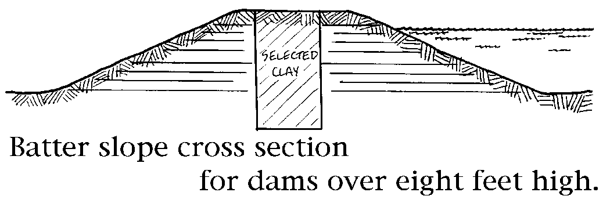

Otherwise, the procedure is the same as for smaller dams. You do this, and hope for the best! The larger dam is a more serious job. The height of the back of the slope may be about eight feet, with an eight foot down wall. If you run into dry rock, you can lay it on the wall where you would expect some wave splash, if it is a shallow containment. Keep rocks out of your dam structure. On larger dams, you don't want any leaks. Line the whole vertical center right to the top with good clay. That will be a totally impermeable dam. Most soils, however, will roll down to an impermeable soil. If we are working in a granitic country, with course sand, we are not going to get a dam unless we do this core. The core stops the water, and this is what gives the dam stability.

That is how you make dams that stand above the surface. Many dams don't. There are many different sorts of dams. This is a barrier dam that goes across the valley. These are dams that run along contours. They are usually rolled Earth dams, and they are called contour dams. These are the ones you build up on knolls and slopes. Then there are dams below grade. On very flat lands, the way to hold water that runs in is to excavate the dam out, and throw the soil up. They are more properly called tanks - Earth tanks. A spinner drain might lead into one of these Earth tanks, so that a very gentle flow is coming in below ground level. There is no way that these things will ever bust out.

Now when you are building Earth tanks, you can do all sorts of interesting things. You can sharply pile-up the removed soil to create a sun trap. When your pond fills, you have a good growing situation. Animals can come into this. You can pave that section with stone, if you want to. The deep edge is very abrupt, and you are unlikely to get much vegetation except right at the edge. The steep bank of Earth at the rear, which can be eight or nine feet high, can have trees in front of it. You are in a tropical climate there. If you want to be fancy, you can glass that off and you will have a fantastic situation, with winter reflection of sun giving maybe as much as 60% additional heat. You will have absorption of direct sunlight-- a good heat-up situation. If you want to put bamboo up on top of your Earth bank, you have maybe as much as 60% to 63% additional heat. The Earth bank itself stores heat.

There are two basic forms of bamboo. One is called monopodial, and one is called sympodial. Most of the bamboos are monopodial and form clumps. Sympodial bamboos are more or less runner bamboos. You can put them in here and they go out under the road and come out on the other side. Nobody uses sympodial bamboos because they are all small bamboos, seldom exceeding five feet in height. They are good for making arrows. So if you don't need arrows, forget them.

Now the monopodial bamboos are gigantic bamboos, sixty to eighty feet high. Some have big trunks on them. They are slow growing, with nice tender edible shoots. They never become rampant. A monopodial bamboo will form a clump as large as this room if no one is eating off it. If you are eating it, it won't be very big at all, because you eat the shoots.

If we are only going to grow plants in it, we can make our Earth tank about three to six feet deep. If we are going to hold fish in it, we need to kettle them out a little area, a fifteen foot hole somewhere, which you can backhoe in. It only needs to be a couple of feet wide and maybe six feet long for about fifty fish. Your pond does need that additional depth unless you are going to stock it with fish.

These Earth tanks fill from diversion drains. There's no need to find a spring for your water source. We just take a whole big runoff section. You can normally ignore springs in favor of an excellent, cheap site. Of course if a spring comes sited well, that is, if it is at the back of a plateau, we could run a very cheap contour dam and tie in the spring, and we would have a double hit. If the spring is on a steep slope, then you would need a contour plow. In that case, I would simply ignore the spring and bring the water round in contour to the dam. At the spring, you could do something quite different, which is the small, usual spring house with a small tank in it, something totally different from the large storage. If you are lucky, and your spring is above your diversion drain, you can bring it in to the dam. If you have a stream running through your Earth tank, it will just give a slow circulation to it.

Sometimes you will need to use pumps while the bulldozer is going, if you are down below the water surface. We have to use them intertidally, too, when you have to put in 12 hours of fast work--otherwise, glub. When you are digging these, you move your days around to night, if you are digging a big one. And sometimes it rains.

Lock pipes, you can purchase. Those flags you fit in the ditches, you can make them out of a bit of pipe and canvas, and a piece of dog chain. Sprinklers you can buy commercially.

On a flat site you can grade up a wall and get maybe 20 acres of water when it rains, which rapidly dries off.

You can put a little concrete sill in your wall and have a sliding door, called a floodgate, which you can pull up and let all those twenty acres of water out into a chiseled two or three acre area. The floodgate is just like a board in a groove, a simple little thing. You can make those by hand. They all leak a little bit. Expect everything to leak a little bit. Even those lock pipes leak a little. That is normal. Dams leak a little.

We may run this water through our irrigation channel only twice a year, or something like that. Most of the time we let the water go, and therefore we have a normal spillway over the dam.

A dam may have these four things: a diversion channel leading in, an irrigation channel leading away, some device for releasing the water - either a lock pipe or a siphon over the top - and a spillway.

Now when you come to look at the dams - and we will look at a few on this site - the spillway may not go past the dam at all. We might be working on a site in which we have undulating country. We might take a spillway from the back of the dam and lead it into the next valley. There are all sorts of games we can play.

Contour dams are very cheap, no-fuss dams. They are dams in which the actual dam follows the contour and then swings back to ground level.

Basically, the construction is the same as for other dams, but usually you put contour dams on pretty flat land, and you grade them up pretty quickly. They may be six feet high. It doesn't matter if you get a bit of grass or rock in them sometimes. They can be a little rougher. Just roll them down tightly and they will hold.

There are all sorts of reasons for little mini-ponds. Never neglect the little pond. When you are planting steep slopes with trees, you might put a little well at the end of your paths. On a steep slope, it pays to dig these little wells, and line them with plastic, or drop a tire in, which is the quickest. Then when you have to water the slope, you are always carrying a small amount of water down hill instead of a lot of water uphill.

Another use for mini-systems is when you go to broadscale quail or pheasants. You drop these little ponds through the landscape every 150 feet or so. Just make little holes.

If you have a lot of pear trees, you may want to rear frogs to get rid of pear slugs. You then place these little ponds all over the system.

Well, we have covered the keyline concept, and in with that falls all your lower slope control. And you have this bold idea of storing water right up on the top of the hills.

Only as a last resort do you dam the valleys. You only do that in emergencies, or for the creation of productive systems. Large-surface, relatively shallow, easily constructed, cheap lower productive dams are very good!

In dry areas, and in areas where you are growing very intensively, you might design some form of drip irrigation. Drip irrigation systems are very modest with water. For high value tree crops, they are critically important for establishment, but probably not thereafter.

There is another form of water control that is very interesting, given that we have some water uphill, and given that we have established an orchard on the hillside down below our glasshouse, which is bermed into the hillside directly above the orchard. We will grade little shelves almost on true contour all the way down, at about 40-foot spacing, which is about correct for orchard trees. Down the hill we go, grading these little platforms out and leaving the area in between them in grass. We will then plant our little trees in the outer edge of our swale. We have a pipe from our water source, which is uphill, and we bring it down and stop it.

We can lay a hose in these systems, or we can do another thing that is interesting. We can bury a pipe that comes up in the next system below for reverse siphoning. We can have these little reverse siphons going all the way down the slope. In that way we only need to run the hose in up here. The water enters the highest swale; it runs along and soaks up all the Earth, then enters the reverse siphon and runs down to the next level, and so on. One person can water hundreds of trees in about an hour.

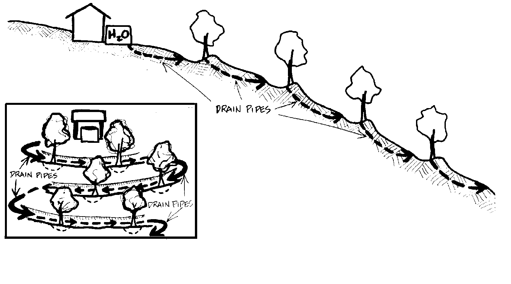

Then you can do something very interesting. You can plant this swale to a highly nutritious crop, such as white clover. Then you mow the grass strip and throw all the grass on the swale. When it is looking all rich and good, you run along and regrade it, bringing that rich top soil up to your trees. Your trees will get bigger. You grade again, cutting it back a little bit. You do it two or three times. By that time, you have a great mound of black Earth, tree roots growing in it, and a well-defined walking platform that you can walk along, and an easy watering system. No problem with that one.

You stagger your trees down slope. You should also alternate species, putting your narrow leafed species up at the top--peaches and apricots--and your broad leafed species down below, because it is getting wetter all the way down.

That is a very easy way to run an orchard, and a very easy way to set it up. That is real Chinese style, building up the richness in your paths, and then scrape your paths off and put that around your plants. But always keep your stems free. You also have a nice little garden path in which to set your ladders for picking. It's a generally sensible little set-up.

When you get to very flat land with hardly any fall, you can make a trench, a side channel down the side of the field. The side channel has a little fall to it. We block off the side channel at intervals, and through these blocks we put short pieces of four to six inch pipes. We have a plug with a handle on it that fits into those pipes. When we let the water go into this side channel, it fills up to the first block, which we have plugged so that the water cannot go beyond this barrier. We have also done something else. Leading out through the side wall of this main drain, we have many little two inch pipes directing water out into our field. Our side drain conducts water through these little pipes out into graded channels running down the lengths of that field. There are trees on little banks between the channels. Again, this area has been planted with grains, and can be graded up to either bank. So we have banks made up of loads of clover and topsoil, with trees on them.

When all those little pipes are conducting water down over the first section of our field, we pull the plugs from the first barrier, and plug the second barrier. When that section of the field saturates, we move our plugs down to the next area. There can be four or five or even six or seven of these little two inch pipes leading the water in an even flow from the main drain to the irrigation channel. We can irrigate hundreds of trees with very little effort. That's for flat lands.

If we want switching systems, we put in another one of these barriers, and we just pull the plugs and let the water go down. We can direct water around contours, and along to other flat fields. It is a cheap, simple system, consisting of many short lengths of pipe and plugs that you carry with you.

This is not a trickle-flow system. The whole thing is running like blazes. When we need to irrigate, we go up and open our floodgate, and the main water channel comes down and hits that little channel, and we stop it here and it fills up, floods out; then we move on and the next section fills up and floods out, and so on. You let a lot of water go, and you thoroughly soak it. Then you plug the whole thing up by closing down your floodgates.

You can dig those trenches with a little crawler tractor, just a small machine, or you can do it with shovels. The best way to dig a trench with shovels is to use two men. You get a very broad shovel, with one man on it. Around the neck of the shovel, just above the blade, you put a rope, and then you put a toggle on the end of the rope. One man puts the shovel in and the other pulls, and you get a rocking motion up. They can throw up banks about as fast as we can walk, very easily, no arm strain. One man is just moving sideways and putting the shovel in the ground, the other pulls, and away you go. Little Earth banks appear right across the country just like that. If you have to empty a load of gravel and have no dump truck, use that method, with one man standing on the ground pulling, and another just putting the shovel down in the middle. Painless. That is the way the Turks and Afghans contour enormous acreages of very shallow country. They will build and rebuild those contours every year, miles of them, just a couple of men. Ho! Ho! Ab-do!

One of the advantages of the keyline that very few persons see is that if you have a diversion drain above your fields and household systems, that works just as efficiently to remove excess water in winter as it does to direct water into your drains. A well-keylined and combed landscape that has been soil conditioned doesn't get boggy in winter and doesn't get dry in summer. People forget that the same drain that diverts water off the hillside also prevents bog situations and seepage situations below. Once your storages are full and your soil is charged, you can direct a winter runoff into a creek if you want to. You can take it off the landscape through this system, just as easily as putting it on. We often run a descending diversion around the valley slope just to keep the drain bottom dry in winter. The same diversion drain, plugged, will irrigate the valley in summer.

Now when you are wandering around with this diversion drain, bringing it down to your dam, and taking an irrigation canal out of your dam, if you come to a little gully or something, you can easily make a little pond there as you go. It is quite easy to do that.

Another way to go about bringing more water into the landscape, storing water on the land, is to run broad swales. This has a particular application in urban areas. A swale is a critical technology for winter-wet America that is not much used. It is also a very useful technology to use when laying out forests.

You cut shallow blade trenches on true contours, with no movement of water along the trenches. The trenches are quite broad, hardly ever less than four feet wide, and often much wider. You wouldn't do this on a steep slope, just a moderate to shallow slope system. You walk it out along the pegs; the bulldozer follows you. If you strike clay, leave it narrow, or else deepen it. As a rule, in clay, deepen your swale in profile, and in sandy and gravelly places, widen it.

Along the swale, where you think it will hold, you have little ponds in clay. Where you think it will soak into the ground, you widen the whole water system so the surface area is large. Rain, particularly storms, comes down the swales, too. The water finds your widened areas, which are free, and soaks in, and thus charges your ground water instead of going down the hill and off the property. In three or four years, you will have 17 to 20 feet of fully charged soil. Your forest, just above your swale, is alive and has access to this water. Your forest will be alive when your neighbor's ground water has flowed away out of sight.

If you ever have the chance to design a suburb in a place where there is a semi-dry climate and storms, particularly summer storms, sudden rain rushes, this is how you do it: You run a hard-top road, swales, little bridges, houses that are back to back, footpaths, down pipes. This whole system is swales, with double rows of houses sitting between the swales. All the roof run-off is going into the swales, and all the road run-off is going into the swales. There is no guttering, no curbs. The swales sometimes pass under the roads.

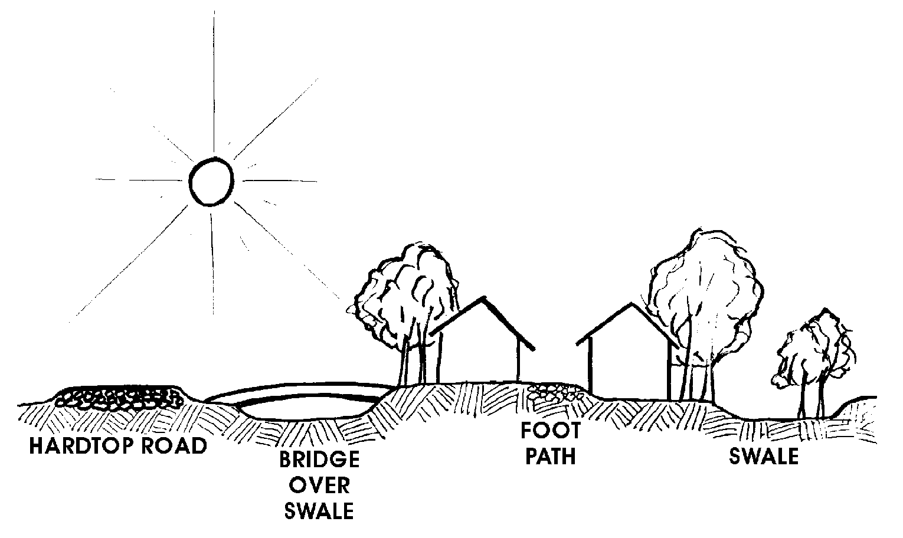

An immense variety of treatment is possible, such as little block stepping stones across swales, little rocks across swales, little graveled areas, little ponds in swales, frogs croaking. You set your trees out along the swale edge, but not in front of the house, not on the sunny side of the houses. It can be a remarkable environment! The swales are probably never less than two feet deep, very gently shoaled edges on them, great places for children to run in the storms and hop into them. Then when the storm ceases, the water, because you have broadened the swale at places, seeps away within a day or so. The swales will then contain water only in the over-deepened clay areas, the little ponds that we made.

This system exists nowhere that I know of except in the village project at Davis, California. Here they sit on a plain near Sacramento, and because of swales the place is an oasis in a desert of disaster. Nothing quite like Davis has ever happened in America, and is not likely to happen until we get out on the ground, 300 or 400 of us.

The trouble with America is that these things that people have been doing have been just with their own homes, keeping it to themselves. In Davis, you have the benefits of design orientation. A whole set of lowenergy systems are demonstrated there. More of your urban areas should be permeable to rain so your street trees would remain healthy.

Ordinarily these urban swales will end up nowhere--start nowhere and end up nowhere. However, if you do think there are going to be very catastrophic rains, then you can lead the end of the swale out of the situation into a more normal drainage system. But in moderate rainfalls, the swale can hold it all. The efficiency of the absorption in swales increases as they age and as trees grow along them, because the trees penetrate the subsurface and carry water down. I think Davis initially absorbed about 40% of its water, then 85%, and now 100%.

Now it is absorbing water from offsite into its swales. It collects run-off from off-site and gets rid of it on its site. So that is very good. The older the swales get, and the more the tree roots penetrate down into the swale, the better they get rid of water.

These swales do not have to be renewed. I think possibly if they decayed badly, you would probably have to just chew them a bit, but it is not a big job. You could do it with a couple of kids and a spade. No work repairing drainpipes; no pipes; no gutters; no curbs--cheap!

Swales can also be quite useful growing situations. You might be able to raise ginseng up here in the swales. Your swales are obviously ideal sites for certain useful plants that like this moist, rich, highly mulched situation. Blueberries! You swale below a pine forest, grow blueberries in the swales. There are many techniques you can use with water in landscapes.

There are other good reasons for constructing swales. In a forest, many leaves will arrive in that swale, and they rot quickly there. It is a moist site. Your little salamanders run around in there. You can deliberately add to the leaves in the swale. It is a long composting system on site. Occasionally, you can take from the swale for the garden.

Swales greatly decrease the risk of forest fire because they collect a lot of fuel and rot it very quickly. Swales make for a far more moist forest than existed before. It is amazing how few trees you have to remove to run a swale in an existing forest. However, it is a good idea to swale a forest before you plant it as a forest. Some trees can stand in the swales.

Another reason for swales is that you are in an isolated place and there is no chance that you are going to be able to go out with your Land Rover and bring in mulch material for your garden, you can swale out from your garden, and mulch into your swales.

Now you decide the sort of mulch you bring in, because you plant trees above the swale to give you the mulch you want. We get alkaline mulch from western cedar, acid mulch from oaks, and so on. So you treat your garden from a continuing input from the mature system, thus reversing the axiom that maturity exploits immaturity. We make immaturity exploit maturity, because maturity is exploitable. It is also a great accumulator. Left alone, the forest will exploit the garden; but with us in control, the garden can exploit the forest.

I will show you an unusual technique, just throw this one in. You will discover these situations. Here is a little house that looks like a granite boulder. Its occupant is a rock freak. We have rock freaks in Australia, houses that just disappear in the rocks, and they look like a rock. All around this great granitic dome there is 40 feet of course sand, so goodbye water. You also have all sorts of granitic slabs and surfaces. So you run chicken wire around your granite, and go around with some cement and sand, constructing gutters, and you lead them into tanks. We have done a lot of this. Some of those granite slabs are big. You bring the water down, and put your tank at the bottom. You have to be able to use your eyes. You look at that slab and say, "A roof! a roof! and it is uphill." No keyline is possible, but in these conditions building concrete works well.

Suppose you dig a little Earth dam up on a hill. It rains. Nothing happens. It keeps on raining. Nothing happens. You have a dry hole. Bad luck!

A friend of mine had an open underground stream that ran like fury. He hired contractors to dig a dam. It should have worked. But he went a foot too deep, and--glub. You can't predict these things.

Well, you now have two or three things you can do. What we have up here on the hillside is a big hole. We have a dry place. So we put a couple of sills there, and raise a roof, and pour a floor. We are in business. Nice place! Good barn, good storage, cheap! The only thing you have to make is a roof. It's a good place for cattle in winter. Haul in your hay. Trap door right up here, throw your hay down, wheel it out. Take advantage of having a dry hole.

Now, change the scene: The hole fills, either because you pump water in, or there comes a rainstorm. So it is not a real dry hole. Stand by the bank and throw in three packages of water dynamite. Boom! It bumps the bank, and any cracks in rocks are sealed with great water pressure.

You might do it two or three times. That is fast, and often works.

Next scene: You have a dry hole? Just leave it dry. There are all sorts uses for dry holes. In dry climates, you can hop down in them and mulch them, and they are shady, an extra good growing situation.

Or you can do something else. When you see you are getting a fair amount of leakage, you can strew rich hay all around the edges of your pond. When the water turns green with algae, if there is a leak through cracks in the clay, the algae glue it up. You are gleying it, but with algae.

But in midsummer it dries out. Didn't work. So now we are getting down toward the final solution. We put green sappy material right across it, six inches thick. We gather the mowings from the golf course, and anything we can obtain. We pack it down. We chip green leaves and sappy material, second cut hay. We cover all this with sand or plastic or old carpets or a combination of all of those. Then it starts to ferment. You can find out when it does, because it is slimy. As soon as it goes slimy, you fill it with water and it fills without any trouble, and will never leak again. It is called gley. The only reason why it might not work is if you didn't do it properly. So you then go at it again, and find the spots you didn't do properly, and do it properly right there, because the rest of it is permanent.

If it is a very big area and you have a very rich client, you run across it with bentonite, which is a clay that swells up to 14 times. You spread a bit and roll it in hard, and then you fill it. That seals it. But it is costly. This is by far the most satisfactory solution.

There are many solutions that plug small holes, such as a sheet of plastic, or concrete. But gley is the best solution. You can make a dam in a gravel pit with it.

You would be lucky to dig a very dry hole, because usually it is on a slope. You can ordinarily get an entry out at slope level. Roofing it is easy.

Nice and sound-proof in there. There was a big one that a friend of mine made. It should have worked, but it didn't. He stuck in sides to it and turned it into an indoor auditorium. You can get in there with a rock band and not annoy anybody.

Once you set the water systems, you also have set a lot of other systems. Wherever possible, your fencing and your access roads naturally follow your water systems, and can be well integrated. Both assist the water systems.

If you are wandering around with a curvilinear fence, you run a series of approximate short fences, because the only fence you can build is a straight fence. So your fences, and your tracks, your on-farm tracks, all follow that system. Then, if you do that, your animal tracks turn into keyline tracks because they follow the fences, and animals will also have beneficial effects on run-off. If you don't do that, then your animals always walk anti-keyline. They always walk ridge down to valley, and animals can become a major erosive influence. If you set your fences valley to slope, your animals walk your fences, and all their tracks will keyline where you can't get.

Everything follows from that. Your forests follow. Your forests grow above those channels. They are themselves very water-conserving and insure steady water-flow systems.

Your forests that are of high value, your constructed forests, are below those lines. You can irrigate these. There are special sets of trees that may go on the ridges, very hardy trees that don't need irrigation. You will need to determine for your area its ridge-top planting set of hardy, drought-proof trees.

So far, we have only been talking about the water characteristics of your system. I would like to look more closely now at any one dam that we build, and see what structures we need within it to have a biological input into the dam. There are only about three or four things we would need to do. Say that we put in a six foot valley dam for a lake. We pegged it all out before, so we knew exactly where that shoreline would be, and we may have logged it out before we built the dam.

We take some of our excavation material and make an island in our lake. If we have fierce winds across water, we make a barrier islands, so that we have a quiet patch of water in front of it. When we put our island in the lake, we have increased our shoreline. We may, if it is a bad fire site, in an area where people keep getting burned out every four years, put our client out here on a peninsula in the lake. We might do that for other reasons, too. We give him a deck out there and a little dinghy. Instead of leaving all our shoreline as a gradual shelving system, we might grade in here, making somewhat extensive, but constant-level marshes.

If we know that we are going to be drawing quite a lot of water down from this, if we know that we might pull four feet off it sometimes, then before we make the main dam, we throw up low dams across easily dammed sections that flood at high water. In this way, even when the other water is four feet down, these dams hold and preserve the shoreline flora. Many small animals that live along the shore continue to have refuge. As the water rises again, it covers the whole area.

What we have done in there is to play around with the edge of the catchment, make shallows and barriers and islands--all sorts of useful things. You can put little pillared cottages out on those islands, little contemplative places, quiet spots, little retreats. You can put little stepping stones out to those places. We have done that.

Put in some underwater stones. This makes it a very lively place. Water birds nest on those islands. They are fox-free, except in winter, when they are not nesting. The shelving along the edges gives a very broad planting spectrum. You can align those shelves at different levels, specifically for certain plants, eighteen inches to three feet for wild rice. You can make marshes by grading off, away from the edge of the dam. Those marshes come out of little low mud walls, so that they marsh up.

If your dam fails, you still have your marsh for arrowheads and other duck fodder. If you do all that first, then flood the situation, you have created something that looks very good.

When you draw off water, your island sticks out a bit higher. Your shallows are mud-dammed, almost at water level, so that the main water rises over them a bit, going through them in pipes near the surface, and when it falls, your little mud walls come out and hold the shallows. You don't bother about sub-surface dams where you have constant level productive water. Your larger fish can't get into some places that are too shallow and too weedy. They provide refuge for quite a lot of fry. We intend to make a biologically active system out of our water storages.

What we are giving you is classic solutions, ideas that you will have to adapt to individual circumstances.

Slopes give us a very great advantage, and I pay a lot of attention to slopes, to how a system can be laid out on slopes. When we have this gravitational advantage, it is possible to do all sorts of things.

This is a section of a ridge, and there is a ridge running along. We could put a little saddle dam here, and it would collect water from all around the higher area. People often go to hills and mountains because it is a romantic place where they can look out on the world down below. They want to be up there. You can use larger shelves to get people down a little below the ridge. You can get water to them from the saddle dam above. You can also use shelves for their garden.

Some of their wastes can add to that system. You can run off water to orchards further down. Then when you get down deep here into these valley systems, you can create wet forests, we will call them, that will block fire out, keep it from running up slope easily.

You have water control on slope, and you have fire control on slope. Get your clients to build their storage units up high, units that themselves do not use water, or use very little water--the garages and the barns and the workshops. We don't have to supply these buildings with water, but their roofs can supply very cheap tank water. Put all tanks up on the slope above house roof level, if you can get them up there. You never fill a tank from a house roof, if you can avoid doing so. Of course, on the other hand, a friendly neighbor might do that, add a tank to his roof for the benefit of somebody further down hill. That can happen. There might be some cases where we supply them with water better than they could supply themselves.

The diversion drain falls to the saddle; the road probably falls out to the slope; the garden should fall out from the saddle, so the water comes down from the saddle to the garden. So you must decide which inclination you give these various shelves as you work down the slope. It is obvious that if we can get water doing its work down slope and across slope, we are in a good position.

For reasons I could never fathom, you often see hot water or hot air collection systems on the roof. In level country, the good place for a hot water collector is below the sill level, so the thing thermo-siphons inside the system. You can clean it easily.

There is not much more chance of it being broken than the window itself. And it is low. Hot air systems also come down slope. I have friends who have set up large collectors on slope in front of their house, and bring hot air in low. Your hot air systems should go down slope, and low. Your water systems go up and run around.

You use all these techniques on slope. You must think it out, think which way the road will slant and for what reasons, and which way the gardens will slant, where your diversion drains must go in, what must come out, and so on.

If our slope is not an extreme slope, we can put a pond right here in front of the house. That is a great advantage. It is also a fire barrier, and it is a light reflector; it also makes for a pleasant environment. I think here we might attach glasshouses. We should examine each site to see if we couldn't also put a productive pond just in front of the attached glasshouse. The pond will provide additional heat buffering. It has the ability to absorb all but 15% of summer sunlight, while absorbing very little winter sunlight, and reflecting most of the winter sunlight into the living situation. A pond is a beautiful, automatic, self-regulating heating surface.

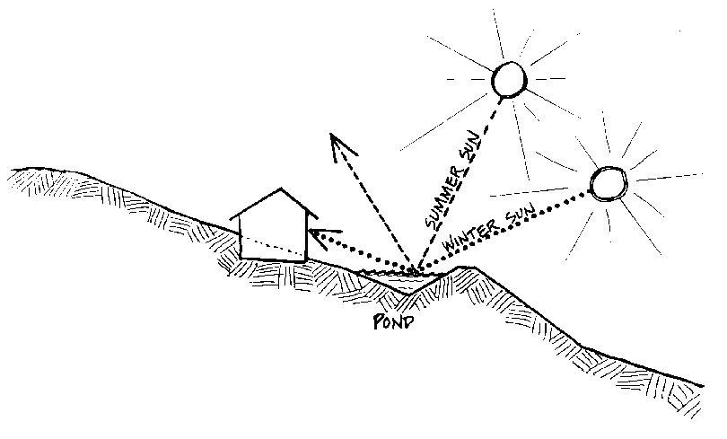

Where you can't get ponds, and you still want the effect of low winter light bounced up into the house, you can use white gravel, and highly reflective surfaces there. Snow is excellent!

On stony and steep slopes where you can't possibly run shelves along them, not even shallow shelves, you go to very small scale systems. Here is a slope that we will describe as net and pan. You set up very shallow guide lines for drainage. You can hand cut the drains. You clear the slope of vegetation at the junctions, and make little flat planting platforms.

The intervals between these little platforms are those that would normally separate trees, squashed up a bit, because the advantage of slope is that tree crowns stack much better towards the light. You will get a lot more trees on a steep slope than you will get on flat land. Dribbles of water come down these drains, gathering in these pans that are absorbing overflow. It is, again, a small scale system. You can't run it on a very large scale, and you will have to interrupt it with planting bands. It is particularly effective in very rocky country that you would normally not use for orchards.

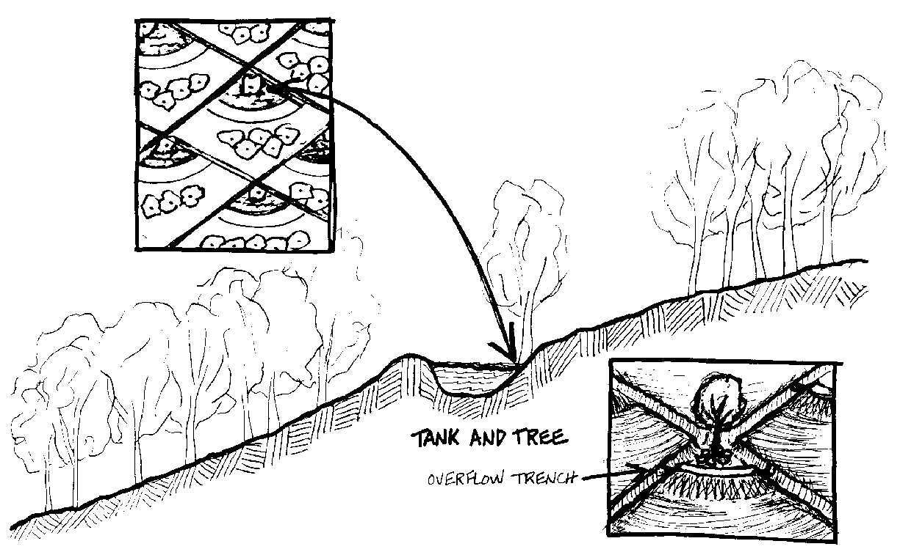

A group of five or six of us did a fairly large orchard in three days on a little system like this. We cut little flats in the slope, which we put a tree on, and we had a little water roll around it, soaking in. When it overflows, it comes down and soaks in.

Place your narrow leafed fruit trees here, and broader leafed species down there. There are exceptions to that. The fig is an exception. We put the fig higher because it is far more drought resistant. There are a few, but not many, narrow leafed trees that are high water demanding. You put the really drought resistant species up here. It has a secondary effect, too. Many of those drought resistant species are very good mulch providers. If you go high on the slope and put in tamarisks, and some of the pines that grow on the ridges, you get a good mulch layer to bring down hill.

After a few years, you can let your irrigation system decay, because your trees are established and probably don't need much water, or you can keep some of these maintained, depending upon conditions.

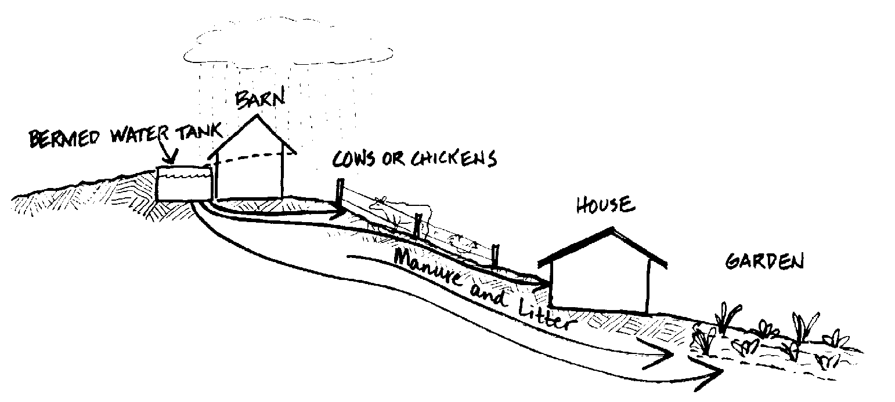

Arrange to have barn and loads coming into the barn on a level above the house. Have your animal accommodations up here. The wastes are thrown out here and rolled down to your annual garden system below. Your banks that are collecting water from the roof of your barn will provide a gravity flow system for the house and garden below.

Tanks themselves can be useful structurally. You can bury them to get them out of the way, or build over them; but you can also use them as quite bold structures. Often we trellis off them so that in summer you can be sitting under a trellis shade with a central ivy-covered tank that gives you a real cool place, real nice for hot climates.

Tanks can be structurally integrated into barns. In some areas, large tanks can be the base of the buildings. Buildings placed high on the slope can take tanks below them. The water will be used on lower areas, to which it runs down by gravity flow.
 One of the advantages of locating chickens above the garden site is that the chickens will provide mulch waste for your garden, which can be easily brought down. That mulch will be already shredded. Chickens are shredding machines, and they also remove the seeds. So by the time your mulch has come to your garden it has received added nutrient, the weed seeds have been removed, and it is shredded.

It is mainly used right in the garden. You can also take it through a water system below the garden again, or within the garden. The idea is to strip the nutrients out the way down, getting a product for it. In this kind of system, your nutrients are falling down. You use your slope. How often you go to places and see all of this completely in reverse, and people are working hard because of that, pushing wheelbarrows uphill and carrying mulch uphill, carrying water uphill.

On slopes, fire will always travel uphill fast. Water, roads, Earth walls, stone walls, and short grazing systems toward the downhill sector are all fire defenses. Only in rare circumstances do you need to be really worried about hot downhill fires.

The way that we set up all these systems also suits fire control. A dam with an Earth bank is good fire control. A high access road is also good fire control. So once you get people correctly placed on the slope, and the elements correctly placed around them, you again find that you have done a lot more for other conditions, such as fire safety, than you had originally planned.

You might have planned that dam just for biological production. It works also as a fire barrier. You might not have planned for it to work for fire except to provide water. You will find it has high radiation defense because of its Earth wall, and so on.

Start to get things right and they get real right. That is the reason we put that rain forest in right at the base of the slope in the valleys.

In steep valleys low down, very steep valleys that you are not going to get to work in, and in which you don't put dams, you can, nevertheless, bring small drains out of the creek. They are usually hand made, or light machine herringbone systems that pull water out of the creek and drop it down the banks. You can set up rain forests very fast if you can saturate that valley with ferns and mosses. Once your rain forest is established, it becomes self-perpetuating. It holds its own water. Again, you can let those little diversion systems decay. So try to get your major advantages out of slope; don't let a slope go without using it.

Engineers generally want to dam a valley, put in a monstrous pond. That is their solution. Yet we have been able to set up these high water gravity flow systems without any trouble at all. Electrical pumps are one of the first things to go in a fire. A characteristic of fire on site is that you have no water unless you have gravity flow.

We will leave the hills now and look at some house situations on very flat lands. We will move out into the plains--300 acres, two foot drop. There is no way out here that we can get all the advantages we had on the hills. I will describe a site plan that we designed. You could see all over that country for miles. Here, water is always stored below ground in tanks.

When I arrived on the scene, the excavating had already been done. The Earth was piled in four great heaps around the edges of the hole. That's a normal situation. It wasn't very aesthetic, not very pleasing. I said, "Where will we put the house?"

For a while, it didn't look very hopeful.

We first determined the directions from which summer cooling winds would be coming in, winter cold winds, and summer hot winds. In any westerly belt, the cold winds come from off sun, while hot winds come from on sun, from middle interior.

Depending on which side the continent lies, they will come from the Northeast or the Northwest. In your case, here in New England, hot winds come from the Southwest. Cooling winds will come in at about 45 degrees from the coastal summer winds. For each site, that set of characteristics is very easily determined. Any old timer will tell you. For the site itself, you then look for any deflection of that system.

So we brought the man back in, and got him to reorganize his Earth. We located his house so that it would have all the advantages of pond reflection, be sheltered from the south westerlies and from the hot winds, which would have to pass across water and through vegetation, because we planted the banks. For the cooling winds, we have a good brisk circulation going by Earth banks around the whole system. We don't have any noise on that site. It is very private.

So what I want to say about flat lands is that, rather than paying so much attention to the water and water surface, let us have a look at the Earth we move, at what we can do with Earth bank.

The fastest way to run a windbreak is to grade up Earth bank and swale. Rise a four to six foot Earth bank and start your planting work. The swale works perfectly well. The fall here was very minute across the site.

We did a diversion off our roadway. The water came in and around the pond and went out again. Part of the annual garden is water garden. Access from the living area to workshops and vehicle areas comes in through the bank.

We planned for a single story house surrounded by Earth bank, and a tall barn with water tank. That is the solution to the water problem in flat lands. You have to make your slopes, throw up your roofs, and throw up your tanks, while you keep your house low. Or, you can put up a high dwelling, but these upper rooms must be bedrooms, and the lower rooms, your service rooms. In that case, the house roof also becomes of uses as a water collector. That is an elegant site now, a highly admired site. 

Don't be frightened to use Earth bank in flat landscapes. You can use water effectively for cooling. Flat areas are often hot. In general, you can use Earth banks in two ways. They give you a racing start in windbreaks; and they provide a very good livestock shelter with quick growing plantings on top. Those plants can be things like pampas grass and bamboos.

Earth banks are excellent radiation shields from fire, and they will decrease noise, particularly traffic noise.

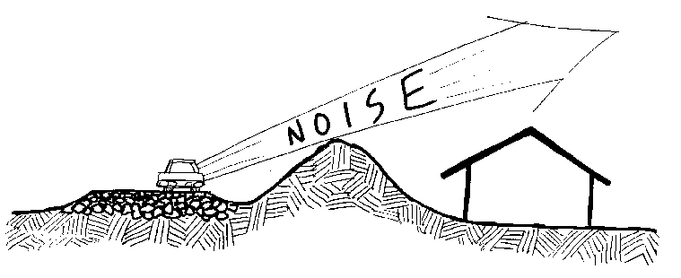

There is one main rule to follow. From the crown of the road to the top of the Earth bank, we want to deflect in a straight line so that we clear the roof of the house. Vegetation does not do a lot for noise reduction unless you can get a hundred meters of it. It takes a lot of vegetation to absorb noise. Street noise is just like that. A well-insulated house with an Earth bank protection can be near a fairly noisy system and be quite quiet. Achieving privacy and insulation against noise can really be a problem in some flat areas.

In flat land, you often find fairly eroded gullies with little steep banks. I will tell you of another real situation. It was a flat site, eroded gully. There is only one place to build here to get away from fairly noisy conditions. The client had made a dam across the gully with provision for draining it. What we did was use a backhoe to dig a cave under the house site. He built his house over the top of this cave. The cave extended beyond the house at both ends. It opened out to the pond at water level. We just trellised the top of it there.

Then at the other end of our cave, we glassed the top of it, making it integral with the house structure. It was very cheap to do, and very quickly done, because it was an alluvial plain. So he now has an underground glass house in which we also made a shower.

He is proposing to grow bananas there. The cave end next to the pond is his cold cave. So he has good heat control. He can bring heat up through the ducts anywhere within the structure. The cool end of the cave is good for storage of root vegetables.

The whole thing opens out on the deck above, under the trellis, overlooking the water. His cave is dry as a chip inside. It is about a foot above the dam level. It is a beautiful place in the summer time, down, out of everybody's sight, by your own little lake, on your own deck, which you enter through your cave.

So in flatlands, you can do excavation on site in all sorts of ways.

We had another site, an excellent wild site, with a lot of excellent trees and other growth. But it was a very bad site for water. After a rain, you could see little twigs and leaves up against things. We designed a belowgrade Earth tank, a lake. There was a lot of excavated dirt with which we made a peninsula into the water, about 9 feet above grade level.

We put his house, which was two story, up on this high peninsula. This is a high fire frequency site, with a fire about every fifth or eighth year. So we put the client on this peninsula. We got him up high enough so that from the second story he has a good view of the mountains. Surrounded on three sides by water, he has all the advantages of light reflection. As he is a good fisherman, we put fish in his pond.

We ran two very low Earth banks to deflect the down-flow of flooding rains away from the garden site. We directed all the water from off site into the dam site. When this water is flowing across landscape, it brings a lot of silt and mulch. These Earth banks we have thrown up accumulate leaf and silt that we transfer as mulch to the garden. That works very well. It is good mulching material and very cheap.

An enormous amount of water diverts through these Earth banks, flushing out the lake. Water diverts from the garden at the same time that silt and mulching materials deposit at the outside of the garden wall. The flotsam stops here and defends the dam from silting up.

The client has a couple of hundred acres. We restricted this whole thing to about two acres. He only wanted a small garden. He is a very good gardener. He is also the director of parks and gardens in Melbourne, and a landscape architect. He hired me to fix this place up.

This man wanted a windmill, a rather odd thing with all this water coming down across the site. Still, he wanted a windmill. He got a windmill. He was sort of fanatic about windmills.

I pointed out to him, though, that we could at any time raise the Earth bank with a tank in it, and we could run water off his roof for him. He knows that. He just wanted a windmill. He liked it. He sits and looks out of his window at his windmill.

His sole purpose in choosing a two story house was that he wanted to see mountains, which were on the shade side. So he had to get up above the trees. It gets very hot there in summer. We gave him a shaded veranda on his second story where he can sit and look at the mountains in the summertime. This gets him up above the trees, rather than clearing trees to obtain a view. A two-story house is a very efficient structure for insulation.

Here are three totally different solutions to flatland situations. One solution defends from noise, and does something for privacy and cooling. The second one deals with a situation near a gully in a flatland. We gave the client an interesting house with low heat and a cool place to go in the summer. In this last situation, we gave our client a very sophisticated system of water control, plus a mulch collecting system. I can't tell you how to deal with flatlands in any general way. Just study the flora and see what your client wants, and what the problems are, whether privacy, noise, water, whatever. You can build up a whole set of solutions, and you have plenty with which to do it.