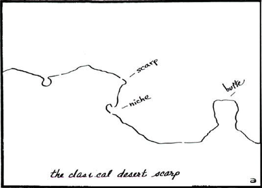
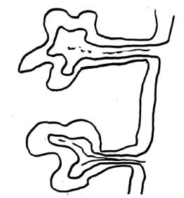

#PERMACULTURE IN ARID LANDSCAPES

##BY BILL MOLLISON

###Pamphlet III in the Permaculture Design Course Series

**PUBLISHED BY YANKEE PERMACULTURE**

**Publisher and Distributor of Permaculture Publications**

**Barking Frogs Permaculture Center**

**P.O. Box 69, Sparr FL 32192-0069 USA**

Email: <mailto:YankeePerm@aol.com>

<http://www.barkingfrogspermaculture.org>

**Edited from the Transcript of the Permaculture Design Course**

**The Rural Education Center, Wilton, NH USA 1981**

**Reproduction of this Pamphlet Is Free and Encouraged**

**Re-edited for Markdown and Ebooks by [Nathan Luedtke](mailto:luedtke@gmail.com) in 2014**

***

##PERMACULTURE IN ARID LANDSCAPES

In the classic arid landscape, there are two erosion levels. There is a receding scarp, traveling geologically backwards. There is a down-drop of the scarp, a back slope, and then a slope to the back-slope. Scarp is a very sharp place. Out in the desert we see buttes, residual bits of scarp left behind as the scarp retreats. Sometimes they connect to pediment. Sometimes they stand alone out in the plain. They may rise to a height of 40 to 400 feet. The Grand Canyon, a mile in depth, presents a big profile. These scarps and remains of scarps occur in sequences across the desert. It is the only profile you have in large areas of the desert.

There is only one place to live in the desert where the sun is beaming down on this whole situation. At the bottom of the scarp there is always a notch, just before the pediment descends, caused by the splash of water falling from the top of the scarp. When water hits the pediment, it splashes and cuts that notch in there at the base of the scarp. Scarps in deserts usually consist of fairly soft rock. No matter what the original rock was, they get down to aluminum oxides, ferric oxides, and as they erode, an iron crust forms a hard red laterite cap. This capping is usually only about six inches thick. It covers the top of the scarp across the desert uplands and buttes. The rest of the scarp is of fairly soft material. Most desert rocks carve easily. In Anatolia, Turkey, southern Iran and Egypt, people have carved their way into the desert rock. This is fairly soft rock that will harden on exposure to air. It is possible with quite primitive tools to hew out a reasonable lot of dwellings in these scarps. The American Indians of the southwest desert areas have long made their homes in these scarps, and in those little niches at the foot of the scarp. Their dwellings may nestle right in under the summer overhang, but the winter sun can get in. Regardless, once you are 16 feet into the rock, your temperature variation is practically nil. So that is where you live.

The dwelling in the desert properly sits under the cliff. In hot deserts, it will always be on the shade side. In cold deserts, situate dwellings where the summer sun will miss the dwellings and winter sun will enter.

It is very dry in under there, even in rain. The only rain that comes over, comes off that runoff at the front of the cliff. You can cut gutters along the top of the cliff to redirect the rain, to stop the rain running off the front of the cliffs.

When it rains in the desert, it usually rains cats and dogs. It rains fishes and toads, too, and the water holes fill up with frogs and fish. Where rain water pours off those escarpments, there may be waterfalls, and the water pours down into a sort of swale that runs behind the scarp and then pours over the wadis, picking up an enormous load of sand, especially in the  2 floors of these wadis. The water then surges out onto the desert floor. Obviously, it very quickly disperses. Yet, when coming down the constricted wadis, it is often three to six feet high.

This water soaks into the wadi soil. For a little while the surrounding vegetation reflects that. These places often support a quite reasonable vegetation, with trees growing in there, desert pines and hardy acacias. These will be quite green and quite large trees.

The most satisfactory place to locate a village is in these box canyons, up in cliffs within the box canyons. The advantage of this location is that a single fence across the entrance to the canyon often will keep out all large feral animals.

In the Australian desert there are camels that came in with a group of people we called Afghans. They actually weren’t Afghans; they came from the Pakistani side of the Khyber pass. These people brought camels in to carry packs inland to the miners. Eventually they put a train in, which they named the Afghan. It runs up to Alice Springs. This train put all the Afghans out of business, so they settled down and married aboriginal women. You now find these Arabian aborigines all over the desert. They have all gone wild, too. Likewise, the camels went wild. There are thousands of those camels, and the bad ones are big bulls. They are dangerous animals. There are many dangerous animals in the desert, but the bull camels -- and there are thousands of them out there -- are very short tempered things.

So you put a fence across the entrance to the wadi. The people live inside, within the safety zone. All around the wadi rise these very abrupt cliffs. Canyons are usually rather narrow. Those box canyons may be 300 to 400 yards wide. The pediments come up off the floor and slope up to meet the cliffs. One box canyon will often have little box canyons going off it. At the bottom is a little trickle of water and the pediments meeting almost like a "V". The original drainage would have been coming to the front, where it found weakness lines, cutting back from the front and drawing the drainage into these weakness lines. They are often like that, almost like right angle fractures to each other. The process starts to cut the pediment up and eventually cuts off these residuals. They get detached and start to get lower and lower until they crumble to pieces. Most of the rock loosens up during the freezing and heating that goes on in the desert. Then it rains, and a whole lot of the loose stuff just rushes off out and distributes on the plain. The water in the desert shifts immense tonnages, because it falls as sudden and very heavy showers.

One time 12 hippies persuaded me under duress to go with them out to an area in West Australia. We went out there in a gigantic old van. We were 700 miles away from the last outpost, which wasn’t much anyhow. It was a windmill. They reckoned they were going to settle out there. They were getting 700 square miles for $30,000, and they thought it was a good bargain. So here we were, running around in those trackless wastes in this old van. We settled in and probed around trying to find water.

The doves and the seed eating birds of the desert must drink and, if you follow them, you may find water. They were flying out of this particular wadi one day and we went back. Instead of finding water down in the wadi, where we spent a day or two looking, we found it when we got up in the scarp, at the place just before where these streams during the rain will fall over the edge. They swirl. That makes these water holes up on the scarp. That is the rule for this sort of desert. It is characteristic of the American desert as well. The water is up here just before the drop off. Sometimes you find holes full of sand up there that you can dig out, and there will be water in them. Sand will store water about 50% of its bulk. In sand, it is possible to store water without it evaporating. You can make a tank and fill it up with sand, and the water in between the sand grains is quite good. It can’t evaporate, and other things can’t get to it to drink it, so it is a good safe way to store water.

We found free water on that escarpment. We spent most of the day sitting in this water. After 11 o’clock in the morning, the desert is a very hostile environment for man.

Nevertheless, desert vegetation grows very quickly if it is possible to get water to the plants. The soils are unexploited; they are all fresh mineral, every sort of mineral, tons of it. When you get water, the growth response is very fast. Out there, you would get fruiting grapes from a cutting within 15 months, and large amounts too. The sorts of things to grow out there are citrus and grapes. Apricots are typical desert plants; so are pistachios and almonds. Most of the normal vegetable crops can grow in the desert, particularly the melon crops. All deserts have natural melons. The Australian desert has one called the paddy melon. Within two miles of settlements, where people have been growing watermelons and cantaloupes, you find things that are half paddy melon and half cantaloupe. They get to be all sorts of sizes and shapes, but whatever they look like, they taste like paddy melons -- bitter!

So, given water, the growth potential is great. When the water comes into the wadis, it soaks away very quickly after its initial rush. For a while, the soils are very saturated, and that water lasts a long time. There may be damp soils there for a couple of years after a rain. That is the place to grow dates. In such soaked desert sands, vegetation reaches its maximum.

In the American southwest, pinion pines provide a staple food for the Indians. In a good year, a family of Indians can gather 60 bushels of pine nuts a day.

There are only certain situations in which the water is sufficient, the catchment large enough to be sufficiently reliable to support a small group of people and a modest agriculture. The limiting factor in the desert is not food. By no means is it food; it is water. You can’t increase water where people don’t believe in making drastic changes to the environment.

However, it is very simple to cut drain systems here on these high mesas and get the water at head, above the wadi floor. Or water very easily siphons over the edge of the wadi. Or one can just drill down to the water and turn a tap on. Even with a limited amount of escarpment above the house height, clean water can be collected for showers.

I think the only way you could collect enough water to maintain an extensive agriculture would be by a set of silt traps, and a fairly formal dam that would make possible a small permanent lagoon. I have seen a couple of places that have developed permanent lagoons, naturally, in very large wadis. They have been quite permanent, because the trees look as though they have been there for a long time. So it is necessary to take advantage of all the natural features of the desert.

You get your client up off the wadi floor, but down off the escarpment. The escarpment is just not agriculture country; it is hard iron rock. Any gardening that can take place must take place here at a lower level, and it has to be walled against flood. The small gardens must be walled. The trees are all right. Trees don’t mind flood. A limited tree agriculture, with a great number of species, is possible here.

All desert peoples dry their food. On the opposite scarp, catching the hot sun, drying rooms can be cut, and things desiccate very quickly. Dates, dried apricots, and other long storage items like desert nuts are mainstays of desert people.

There are some very simple ecologies in deserts. In the North African desert the whole ecology is basically the date, the melon, the goat, and coffee, with the goat eating the melon, the date and the desert scrub. That is a total life system. It is a sort of six species ecology, and it will run for thousands of years. Everything you need is there. You have to ferment a few things, make a goat cheese.

Also plentiful in the desert is a whole group of seed eating birds, mainly pigeons and doves, but also an interesting set of quail. The desert will go to rest for years as seed and capsules. There is a huge production of seed.

There is one other storage form in deserts, and that is enormous tubers. The desert produces huge tubers, often from legumes. There is an enormous storage organ on a legume called -- I don’t know if it even has a botanical name -- and it weighs 300 to 400 pounds. It lives in the dunes. Maybe for seven years nothing happens. Then it rains, and the yala pushes up and spreads out perhaps 200 yards of desert, a great green plant. It is a green legume with a pea flower. It has abundant seed. It dies back, pulls in and disappears about six feet under the sand. The aborigines find them by psychic divination. I think it has to be psychic divination. Anyhow, if I can get them to look for a yala for me, they will look around a dune and sing and edge about, edge about, edge about. Then they will dig a hole and hit it. Whether it is memory as to where the vine was, or whether there is some trace of it in the surface patterns of the dune, I can’t find out, because I can’t talk to them except in broken English. They eat these tubers, but they don’t eat them very often. There are not many of them, and they tend to leave them for hard times. In the meantime, they eat many other things, including insects. There is a lot of food in the desert. You never run short of food. The essential scarce ingredient is water.

If we bore in the desert, we find good water when we bore close to the pediment. There is still activity through it, though perhaps very slow, and not much salinity. The further out in the plain we bore, salinity increases. Typically, you may go from about 200 or 300 parts per million of salt, which is quite low and non-detectable, to 1,100 parts per million, even only a mile off the scarp. You can’t use that water. So with modern gear, we can put in windmills somewhere close to the scarp, so that the threat of absolute lack of water is fairly easily removed from those local areas. However, you would not bother much with windmills unless the natural water systems were exhausted. It is not a thing we could use continuously. We should not use it for making lawns or flushing toilets.

You must do a lot of water conservation. You can make brushwood fences, slightly reinforced, and plant low diversion banks across the wadi and out on to the desert so that you get absorption pans set up.

In Permaculture II we have shown a different form of desert, with siphons going from one of these absorption pans to another. In rain, when one area fills, it will siphon to the next, and in this way, when we have fully charged the soils within one impoundment, any surplus water will siphon to the next, and charge it until that place is finished. In light rains, we might only get three of those impoundments fully soaked. When I went out there on a particular trip, we had 27 inches of rain, of which we got four inches in one day. That desert has a 10 inch average rainfall. So there is no meaning to desert rainfall. It hadn’t rained for three years before that, and then 27 inches. That is how you get an average of 10 inches.

You can take those systems out as far as you like, so that some of them are infrequently irrigated. You would then put your hardiest plants at the furthest distance, and your softest, most water-demanding plants toward the water source. The great secret of growing plants in the desert is some form of drip irrigation, which can be very primitive, or very sophisticated. The primitive form is something like an ostrich egg with a single hole bored in it very near the plant. Water leaks from the bottom in little drips. It can also be as primitive as an old one-gallon wine flagon, of which many litter the desert around the camps. This is filled and inverted. The water drips through a small hole in the cap. It can be as sophisticated as a modern Israeli drip irrigation line.

If you listen carefully to St. Barbe Baker, you will hear him say that even three or four stones around a tree in the desert make a difference between survival and non-survival. Nobody quite knows why stone-mulch works. There are two schools of thought. I agree with both. If you put a pile of stones in the desert, it is often moist below them. The aborigines use stones in pits to collect moisture. They have little clay basins under them. Aborigines don’t often reveal their desert sources, particularly of emergency water. You have to know exactly where they are, and push a straw down them and suck the water. Never is this water stored as visible water. Down in these pits below the rocks, it is usually moist. Two reasons have been given. One is that the rocks gain heat rapidly by day, becoming relatively hotter than the soil. They draw up water from the surrounding soil, creating a more rapid evaporation of the soil at that place. By night, they chill more rapidly than the surrounding sand. They are measurably cooler. Sometimes in the desert nights there is a positive humidity, and any moisture at all condenses within these rocks and drips into the sand. So probably both factors are operating. It is possible to plant a fig or some other tree and rock mulch it, and the tree seems to do very well. The desert figs, in their natural habitat, are always in these loose rock or boulder piles. Citrus also does very well in rock piles. So stone mulch is a valuable strategy.

Mulch of any sort is very plentiful in the desert. The aborigines thatch the water holes with quite a thick spinifex cover, just free of the water surface, just above it. They also thatch their desert day shelters thickly with spinifex. There is an enormous amount of mulch in all deserts except the dune deserts, which are rare anyway. Most deserts have a lot of vegetation. Mostly, it breaks up and blows around. You can trap it easily on fences. Many desert plants distribute themselves by releasing whole seed heads that ball across the desert. These settle against fences. You can easily accumulate very large quantities of mulch this way. All desert plants, notably the casuarinas and many of the pines, also deposit very large quantities of mulch. There is no getting out of mulching in the deserts. If you don’t mulch, the pH of the soil on which you drip or put minute quan- Permaculture Design Course Pamphlet III - Permaculture in Arid Landscapes 4 tities of water rapidly rises and becomes toxic to plants. If you are dripping into mulch, there is a buffering from humic acids that indefinitely prevents that fast pH rise.

You have to have a relatively large area of desert -- maybe three acres -- to furnish a sufficient quantity of mulch for a tenth of an acre, or a quarter of an acre. One of the tactics employed in deserts is to plant high mulch production species as barrier plants in windbreaks on banks. It is necessary to plant these banks to hold them all. One of the best plants for that is the tamarisk. This produces a very large amount of mulch. Other mulch producing plants are casuarinas and, of course, the desert pines. You can set tamarisk in the desert as live sticks, after three days soaking in water. Just push the sticks in and away they grow. Many of the casuarinas propagate in this way. They have very deep rooting systems. A whole group of useful plants is the mesquites. Roots may penetrate to over a hundred feet, which, near wadis, is really below the permanent water table. So many of the really deep rooted desert plants have no lack of water, and could probably transpire quite freely. The mesquites give a very heavy pod production.

A neglected group of plants that the western world hasn’t looked at is the cacti. Some of the cacti have long been in cultivation, and produce very high quality agricultural products. Some of them have probably been continuously selected for at least four or five thousand years. This is true of the fruiting cacti. There is another group of cacti that produce abundant small fruits, very like strawberries. There is a cactus that produces little edible buttons. There are the prickly pears, which belong to the Opuntia group. They came by way of the Spanish into Southern Europe, and are now common elements in Italian and Greek gardens, often used as hedgerows. They are variable in quality, but if you poke around in traditional Italian settlements, as we have in Adelaide, Australia, and Melbourne suburbs, you will find a whole range of seed-growing opuntia that produces a large fig-like fruit in the hundreds. The plates of the opuntia are perfectly good vegetables, rapidly propagated. They also make quite good barrier plants. This is one of the barrier plants you recommend for deserts. Both the opuntia and the mesquite will stop large, hoofed animals.

We have actually used the desert burrs, which are manifold. Every time you come out of the desert, you have to throw your thongs away. They are interpenetrated by sharp spines that eventually work through. You can use those burrs to carpet around isolated plantings, to prevent things like jackrabbits from approaching trees. You can plant desert defenses in what I call guerrilla planting strategies, a rock crevice defended by burrs and other spiny plants.

We have a series of adapted plants and animals and people who get along well in these conditions. All the desert peoples have developed quite specific vegetables. There is no lack of plant life and animal life for a restricted settlement. But there is an absolute lack of water, and you must look forward to three year storages.

Like other environments, it is very easy to rapidly increase the animal resources in the desert. For every one of these caves that we artificially construct, we will get an occupant. Homing pigeons and even domesticated pigeons are originally desert rock pigeons. You will see them at home in dry India and in dry Iran, living in those little holes in the rocks. You will see them on sea coasts and wherever there are any eroded rock holes. All you have to do is chisel more rock holes to get more pigeons, because there is just any amount of seeds in the desert, and there is enough water for animals with such light demand. So pigeons are number one desert domestic livestock.

Some of you may have seen pictures of the pigeon habitats built in Egypt. They are grandiose things, like little castles, all penetrated with thousands of holes, and enormous quantities of pigeons live in these pigeon castles. Pigeon manure is the best desert fertilizer. It is the highest market value manure we know. The Egyptians make the nesting hole big enough to lay two eggs, but to hold one young, so as they grow, one is pushed out and falls. Anyone can go and pick up all the fallen one. The other one grows. So the nests also are self-cleaning systems. All the wastes and the spare pigeons drop outside. There are also the eggs that may be harvested. One great advantage of growing pigeons in the desert is that, because of their nesting habits, they are almost predator-free, except for some hawks, and hawks are not very plentiful. So pigeons are a good and useful resource.

Another food source of the desert is the reptiles. They are to the desert what fish are to the coastal dwellers. Many names in the desert reflect this. We have things called sand mullets; but they are reptiles. Reptiles are large and plentiful because the second thing that is enormously common and widespread in deserts is insects, some of them nocturnal, but many are diurnal. So you have a lot of insectivorous animals. Again, the number of reptiles per unit area is determined by the scant shade provided by chance perched rocks or crevices. It is not determined by available food. So just by providing rock shelter, you can step up the number of reptiles. In some deserts the shade is so restricted, and crevices are so restricted, that thousands of reptiles may gather to over-winter in single rock piles. For instance, the rock piles are notorious places for rattlers to hibernate, maybe hundreds of them, into single crevice situations.

In Australia, we have very large lizards. They will sit and look at you for a long time, and if you make a move, they take off and hit 40 miles an hour on their hind legs. The road runner has nothing on them. They just blur. You can’t believe it. All you see is just a little trail of sand sinking back into the desert.

The problems of the desert are obvious. One of those problems is the transportation of cargo. Camels are obvious pack animals, but nobody with any knowledge of camels wants anything much to do with them. They dribble on you, and nibble at you, run away, kick you, kneel on you, grab you by your appurtenances and shake you about. Bull camels are very savage animals, seldom very tame; and although the females are quite good, the bulls can get interested in them, and just when you are off on the female camel, the bull charges in and you get mixed up in the whole business. No place to be, I can tell you.

So one way out of that, I think, is to sail the deserts. I proposed to my hippie friends that we build an enormous trampoline with wheels, very large wheels, and hoist ourselves and roll softly across the desert under sail. Most deserts have steady winds, low, but steady. We worked out the actual proposal, but never found the $30,000, or we might have been off and gone. Bad luck. Not a good design. We worked out a route that we could sail cross-wind, and I was looking forward to rolling down the desert under a great desert moon with a gang of hippies and aborigines and drinking cactus juice. But it never happened. It might happen yet. We could reactivate the idea when we grow rich.

I don’t know of a desert that doesn’t have a termite problem. The termite is to the desert what the worm is to the humid lands. The termite is your primary decomposer. Termites can be a major problem in the deserts. There are very few major problems. Lack of water and termites would be your two foremost problems. Termites must exist in covert ways. Chickens may be a useful factor in allowing us to grow some things because they scratch around, uncover and eagerly seek out termites. The termites are usually in little mud tunnels that the chickens very easily kick to pieces. We also think that this flooding system, no matter how infrequent, will do a lot to destroy termites in the cultivated area. We have observed that they are not very plentiful where we have had a couple of inundations. We think this may have collapsed their little mud tunnels and drowned a few of them. However, they do reinfest, because they are flying adults. There are certain trees we can’t grow because they destroy them. This is rather sad, in that some of the suitable trees such as carob are choice termite food. They love carob. They attack the living tree. So termite resistance in the desert is a primary factor to work for.

If you look at dry gardens, the marigold is a prime feature of those gardens. In even semi-arid situations, throughout Southwest Asia and in the Indian Deccan, you will see marigolds in the native gardens where they serve as a protection against eelworms (nematodes).

These things of very ancient usage sometimes become customs, incorporated into the religions of people. The cow in India is treated as a holy animal, for only the cow can convert the monsoon grasses into cooking fuels. The people of India simply cannot afford to eat the cow. Nearly 90% of the domestic fuel in rural India is dried cow manure. Throughout the whole nation, perhaps as much as 70% of the total cooking fuel is cow dung. So the cow has to be kept alive until it drops. In India, you have to be kind to the cow.

We might depend on the termites for a general turnover in the system from which we are drawing mulch and seed, but we must keep them out of our garden, and out of our orange trees. So we could run chickens around the marigolds. All these strategies are very simple. We mulch, and we rock mulch, and we are very conservative about water, and we don’t stretch our system beyond the capacity of our water supply to carry through a three year drought.

Around our little tight life-capsule, our wadi, we also have a more widely distributed, easily available set of food, like the sand pines and the dates. Sometimes dates will grow for two or three miles out.

In very dry areas, we must give a lot of attention to the high shade. We can construct high trellises with termite proof wood like black locust or honey locust. We can trellis all our grapes, melons, and vine crops, using a lot of mulch at the base. Under the trellis we can grow our normal vegetables, because they won’t stand the summer heat, and they get plenty of light through the trellis.

In the ground, we can put a moisture barrier, vertical plastic sheets dug into trenches that are refilled. It would be best if these penetrate at least three feet or even more. It could also be a clay tamped barrier, if you could have no plastic. Then the drip irrigation that we use has no lateral transfer out of that small system. That is critical. Put this barrier right around the garden. Then the water we put on here stays within the garden and travels up and down.

The barrier around, mulch within, and a trellis over it -- that is the desert garden.

The aborigines make little shelters that are heavily thatched, shade shelters that they can sit beneath. When they renew their thatch, the old thatch serves as mulch -- a sort of thatch to mulch, thatch to mulch situation. They also sweep the desert, using brooms, and run up little lines of these sweepings in the form of mounds. Around all aboriginal camps there is a little mounded mulch line. Discarded seeds lie under that mulch. So when it rains, food comes up in the mulch lines. They also sweep under their favorite trees, bringing mulch to the drip lines. They thatch and mulch over water; and they mulch over damp sand to retain moisture within it.

There are only two sorts of deserts in which people live. Only in rains do people cross the great expanses of flat deserts to oases. The oases are mainly wind deflected hollows. People don’t live out there much. They live in these niches in the desert, as does almost everything else. These niches may go for seven or eight hundred miles across the desert. There is no lack of them.

The second form of desert is the desert with residuals. Great rocks stick out of the desert, great domes, very hard, and in this case not all soft, usually granite, almost nonerodible. Also, slabs come out and plunge under. There are many of these deserts throughout the world.

The desert with perhaps an average 10 inch irregular rainfall, if you have 400 acres of granite slab, the 40 acres directly surrounding it gets the equivalent of one hundred inches of rain, because none of that rain can soak onto the granite; it just runs straight off, and for hours after a rain it will just go on pouring off these slabs. Often there are depressions in these slabs in which to create little rock dams which can be very clean water dams.

At the edges of the mountain sections of these deserts, the hard rock mountains, there are innumerable opportunities to erect small dams. Desert dams are built of rock and cement. We don’t build with earth wall in the desert. You can also blast out rock holes. These little rock wall dams get you right out of trouble. It is not difficult to store 100,000 gallons in these rock dams. You can build little rock diversion drains out of just a few inches of molded concrete, or little low stonewalls, and bring two or three of those cross channels into one.

You want a run-off area twenty times the area cultivated. So if you want to live on an acre, you will need a 20-acre run-off. It is possible also to create that run-off by sealing surface, to bituminize, or concrete a surface area, for run-off.

The desert is a pleasant but tight environment. The basic requirements are really very simple; the results very rewarding; the growth and production of plants are excellent.

As a designer, you are involved in strategy planning. You are going to sit at home for maybe eight weeks and work out a single truckload of provisions for three hippies, to last them about 18 months. These hippies will be moving out into the desert with a radio. They are a small pioneer group of hippies. They will be eating their dates and getting their plants in, and long before 15 months, they will have a solid vegetable garden base. Then they will be ready for more permanent people to move in to manage the heavier work systems. You, as a designer, impart the strategy and management, which is as important as the end result.

Increasingly, these days you will find yourself designing for a client group. Most people don’t want that very solitary existence out on the land, just two of you sitting there, maybe scrapping and tearing each other to pieces. Many people enjoy a social relationship to others. So when a person gets a 200 acre section of land, he is looking for ways to share that land. That is what we often get involved in, designing where others would go, what functions they would take up, and how they would relate as a group. There are many non-sensical strategies like, "Let’s all come together and live in this house and share everything." ...a recipe for disaster for most of us.

Observation is essential to good designing. Look around in the desert for trees that have a lot of drop. Then move this kind of tree in as your windbreak and mulch provider. Look at how water itself is stored in nature. If you find a two mile lagoon, ask what made that lagoon. If you look hard, you might find that it was a single rock intruding into a sandy river bed. The river has to whistle around it and carry a heavier load. It is possible to copy that very simple strategy for scour-hole production, just by building those dikes to make water self-deflect. It is also possible to make winds deflate a hollow.

When you have a full water table, that is permanent water. On the edges of arid lands, some of these simple strategies encourage natural forces to do the digging. The Papago Indians, instead of using walls across the wadis, have used guard walls and brushwood to hold the flood waters on the flood plain until it soaks in, instead of just coming across the plain and then running away. The Egyptians also did this, allowing flood waters to lay silt across their fields. It was a disaster for Egypt that the Aswan high dam was built. It is a temporary event. It will fill up and turn into marsh and the water will come over the top again. But while it is there, it is a nuisance. Dams in deserts that are not at headwaters will fill up. The normal valley dams simply fill with silt because there is no vegetation to hold the country. The very definition of arid lands is that there is bare soil between plants. So you can use deflection walls, light dams to make scour holes. Observe what happens in nature and then imitate it, adapt strategies that have already evolved accidentally.

With your windmill, you return water to the system. Desert winds are seldom storms; they are always soft winds because of the immense buffering of the continent, and always fairly constant winds. A 20 to 25 foot-diameter windmill will return 25,000 gallons of water a day. That supplies a settlement of about five hundred people.

On escarpments and on any residual hills you have a very abrupt frost cut-off line, and it does not fluctuate more than six feet. It will frost up to that line, and above it, it won’t. So put a little tank up there and do drip irrigation around the area below. Within a vertical distance of 20 feet you can go from water lilies to walnuts. Shade can adjust the intensity of the frosts. You can run all sorts of little mini-systems from hard frosting, which some plants require, to no-frost tropical environments, right on the same hillside. On some of the hills around central Australia where we deliberately did this, we had our perennial tomatoes up above the frost line, and the normal annuals, the peppers and melons down below.

The broadscale strategies of desert planting interest us, because one of our big jobs in the world is to start to replant the deserts. The largest area of global degradation that occurs each year is the increase in deserts. Therefore, it would seem to me that the biggest job we have as a group of environmental designers, is to start to decrease that effect. Even small belts of trees have an amazing down-wind effect in the desert, and you don’t have to be grandiose. Five hundred yards or a thousand yards of tree belt, if we can get it established, will moisturize the air down-wind for quite a distance. I think this is partly due to down-wind transpiring, and partly because we are getting a better return to atmosphere of some of the ground water. Certainly the effects become manifest soon after you start a system going.

Obviously, we should start from up-wind. We look at the constancy of the wind, and we start from the up-wind sector, carrying moisture before us into the desert. That is what is happening in Morocco and other areas. That is the strategy.

Another strategy is to seize these headwaters and stop much of the water from running off and disappearing into evaporation pans, alkali flats. Alkali is the Arabic term for sodium, potassium, potash. We start at the top of the headwaters with our system, up in the hills. You might follow the desert streams back and find yourself in an exotic, semi-humid environment. That is where you start, and you start reafforesting down from there. That rapidly chases the water out into the desert, clean water, flowing water. It can happen quite rapidly. Reafforest the watershed and follow the water that is generated out into the desert.

A third and obvious ploy is to use your oasis and these scattered and multitudinous settlements along escarpments as nucleated areas from which we start zoning out. Here, the main problem is the control of feral and hoofed animals. Settle a few hippies around the water holes. Keep hoofed animals away from the general plantings. The excessive number of goats, camels, donkeys, pigs, and cattle contributes to the spread of deserts. Twenty thousand horses is an enormous load for the landscape to carry.

Just the factor of having built a camp will often create an almost closed forest around the camp. We see these settlements with camp dogs that chase away wild animals, and around them there is a green patch.

So there are your three attack systems that you can use as broad strategies.

There is one other strategy. Papanek made a thing that was an imitation of a desert plant in plastic. He invented a plastic spiral with an encapsulated seed, along with some nutrient. This is designed to be dropped from airplanes. It imitates the desert seed as it hits the sand. As the wind blows, it bores in. Papanek has made thousands of these, which he proposes to fly over the desert with planes and bore all these seeds into the sand so the animals don’t get them. Then when it rains, they germinate. Most desert seeds have a little thing like a bit of blotting paper on them that shrivels down. When you put water on it, it fills up. This is a little seed reservoir for water; and it is enough for the radical of the seed to start on down. While that is a great idea, its success would depend on there being a way to control browsers that would come in to destroy that new growth.

So you use a dog-hippie approach, a broadscale approach, an up-wind approach, and a headwater approach. All of these are quite valid approaches. All can generate water and vegetation locally, which also seems to generate water downhill. There is plenty of room out there in the desert, for all of us.

As the desert encroaches, the farmer starts to fail. You can see this right before your eyes, right across the whole area from Yugoslavia right through to Thailand and southward through Africa. The agriculturist is fighting a battle he can’t win. As the water starts to dry up, and the animals encroach on the gardens, the poorer people who cannot fence start to lose ground to the animals. It is then that the herdsmen increase. As the herdsmen increase, so does the number of animals. When the herding economy becomes the main economy, that is just before the flash-out. After that, there is nothing but long migration and extinction and thin animals, and dying herdsmen staring towards the sunset. This is happening in front of your eyes in Africa. Herds are not appropriate in semiarid regions. Hoofed animals in particular are totally inappropriate.

Let us look at another feature of the desert, dunes and dune country. Dunes have water tables in them. Dune bases and dune heights are good places to start vegetation. The problem is that dunes move. By patterning your vegetation, you can increase or decrease your sand movement. The Chinese approach is typically Chinese. They bring rice mats into the desert. Back in the rice fields there are thousands of people weaving mats. They roll them up in enormous rolls and load them onto the railway carriages, and the carriages move them into the desert. There they cover the desert with rice mats. Through these mats they plant large trees, tamarisks and some of the Australian acacias. They have these trees growing in baskets full of humus -- big four man baskets. They cut holes in the mats and drop these enormous baskets in -- instant forest in the desert. These are desert trees and all they want is this racing start. Then they begin to generate water. It looks good. They probably have all these trees on standby, and then when there is a heavy rain, then they take them out, stick them in, and the trees follow the water table down.

Fences and basketry barriers are essential to stop the drifting of sand, particularly at the oasis. They need not be big fences. The essential thing is that the enclosures be small. Keep the enclosures down to about 100 feet square. You can’t have very large enclosed areas or the sand will start moving. Keep the kids home from school and get them sticking little stick fences on 50 foot squares, then you rapidly can stabilize sand across hundreds of yards around a settlement, and start to work into forest, which will be totally stable. These little stick fences should be about 60% penetrable. They can be made out of thorn branches just stuck in little squares. They will stop sand advance. You shouldn’t make very tight fences. They should have 40% or more gap.

Deserts may be peculiarly suited to aquaculture. A settlement in a desert is basically an island. The Australian continent is basically an atoll. People live on its perimeter. Its central lagoon is desert, and the oases within the lagoon are islands. So it is possible to do rather bold things in the desert, to experiment with plants and animal species in an aquaculture in ways that you probably wouldn’t dare to try within general river systems. In these isolated desert situations there is no way they are going to get out of there. If you have a five mile lagoon within a landscape of desert, it is probably one of the richest potential aquaculture areas, given a sufficient volume of water.

There is a thorny mesquite that the Western Australians have proclaimed a noxious plant. The reason for this is that it is successful in the desert. It has started to carpet parts of Western Australia. Now we wouldn’t look on it as noxious. It has been declared noxious because out there the cattle holdings are so large that nobody ever has really domesticated stock. There are no fences. You might say to a grazier, "How many cattle have you got?"

"Well, I dunno. Had a couple of fairly good years, could be 27,000 in there."

They try to round them up with helicopters. But the cattle have got used to the helicopters, and they stand under trees. So they try to get them with hard-biting dogs. The cattle have gotten used to the dogs and horses. They are hard to move. When they get into this thorny mesquite, there is no way you are going to muster them at all. You can’t get horses in there, and the dogs won’t bring them out, and the helicopters won’t bring them out. So the reason that this desert growth is noxious is that you can’t get the cattle out of it. All this is ridiculous. It has a good foliage drop and a stabilizing influence on the desert. As long as your attention is on cattle, it is noxious. But it is really good for the landscape, while cattle are not good for the landscape. Anyhow, the graziers are dying out, because they can’t afford the petrol to keep helicopters running.

We can introduce things into the desert that are rampant. Initially, what we want in the desert is a state of rampancy, and what we should go for is rampancy of plant materials in the desert -- rampant, fast-breeding things. We had a prickly pear invasion in North Queensland in the dry-summer area, and the whole understory turned to prickly pear. The cattle were shut out by the prickly pear, so a second good forest started up in the prickly pears. But they got rid of the prickly pear so that the cattle could get back in. People just don’t think out the very long range effects of rampancy. The long term effects of plant rampancy have been beneficial.

Well, we could experiment with many aquacultures in there. The desert is poor in aquatic species. All desert aquatic species are highly adapted. The frogs and the fish aestivate. They fill themselves up with water, dive into the mud, make a little mud bowl and live in it. You can dig them up and carry them around. There are many of these little bowls. The aboriginals stick a sharp-pointed straw in and suck the water from them. You can cut a little red brick out of an old water pan, take it home with you in a plastic bag and put it an aquarium and everything breaks out. Great lakes fill up, temporarily. It may be a five year lake. The lake fills up with fish, too. In the water holes there will be gigantic tadpoles, because when they turn into frogs, they have to be pretty big frogs. A little frog would dry up. At these water holes there are all sorts of birds. Sea birds will be arriving and sort of looking at you and waiting before they start walking down to the water and drinking.

So you can move in lagoon rushes; you can move in water lilies; you can move in root crop in marshes; you can move in fish; you can move in mussels; you can move in crayfish; and you can try all sorts of experiments and mixtures and get away with it in there. So when we come to our section on aquaculture, all things we will be saying there will really apply to permanent desert holes.

***

###THE INTERNATIONAL PERMACULTURE SOLUTIONS JOURNAL

####P.O. Box 69, Sparr FL 32192-0069 USA

#####DAN HEMENWAY, EDITOR & PUBLISHER

#####CYNTHIA BAXTER HEMENWAY ASSOCIATE EDITOR

Many of us are painfully aware of the severity of catastrophic ecological decline worldwide. **The International Permaculture Solutions Journal** delivers information, ideas and discussion to provide Earth-healing tools or to promote their development. Information that is practical, detailed and hard to find elsewhere often turns up on "TIPS" pages.

*Who Writes for TIPS?*

Many TIPS writers are tops in the movement: Bill Mollison, Jim Duke, Bill McLarney, and our editor Dan Hemenway, for example. Others are people who have been quietly working on their own. They all have something important to say.

*What Does TIPS Cover?*

TIPS issues often follow a specific theme. Presently we have a series of issues on aspects of developing sustainable food systems. After that will be a series on "Permaculture Design: The Process and the Product," and then a series on appropriate technology in permaculture. And of course each issue contains articles outside the theme as well--matters too important to wait. Eclectic book reviews, fascinating letters to the editor, informative illustrations, & easy-to-use format are hallmarks of our publication. 

*What Does TIPS Cost?*

Subscriptions postpaid are US$27.50 for USA addresses and US$30.00 elsewhere. Each volume includes about 100 pages, typically delivered in four issues. 

A Yankee Permaculture Publication.

*** 
