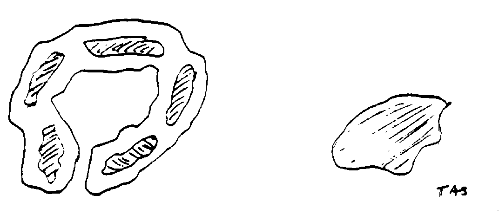
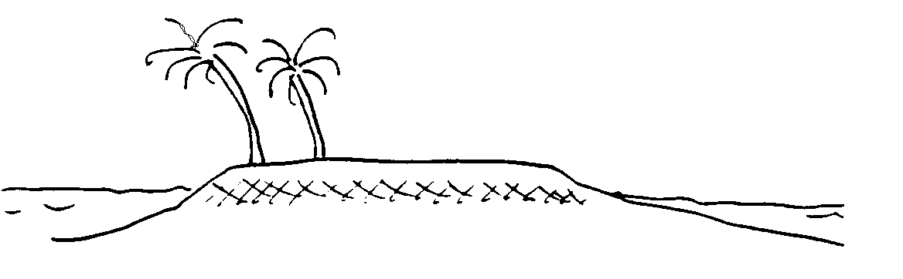
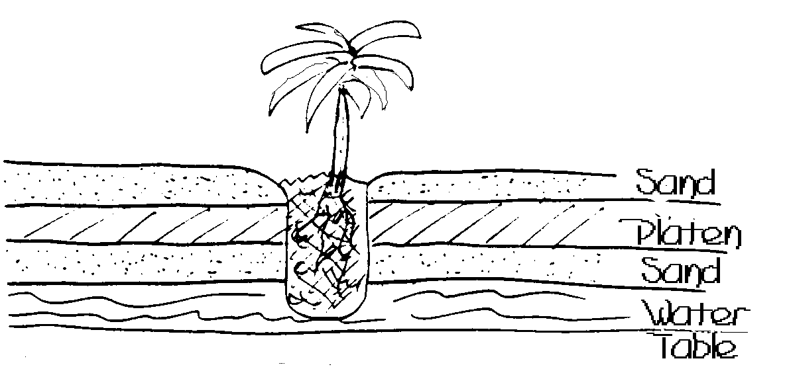
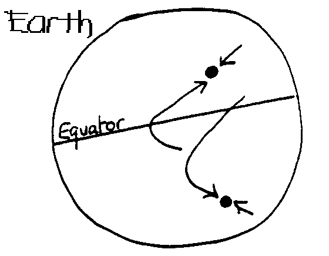
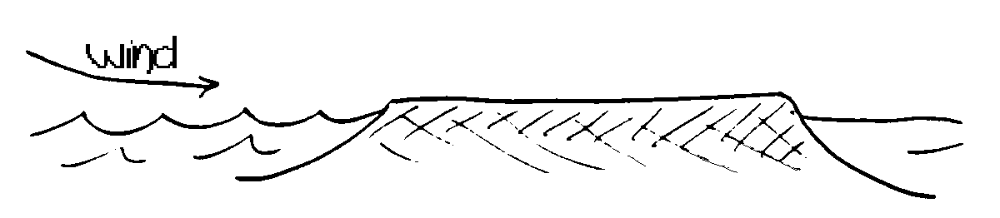
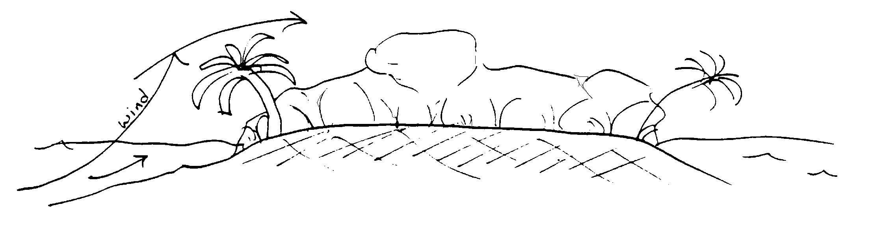

#PERMACULTURE ON LOW ISLANDS

##BY BILL MOLLISON

###Pamphlet IV in the Permaculture Design Course Series

**PUBLISHED BY YANKEE PERMACULTURE**

**Publisher and Distributor of Permaculture Publications**

**Barking Frogs Permaculture Center**

**P.O. Box 69, Sparr FL 32192-0069 USA**

Email: <mailto:YankeePerm@aol.com>

<http://www.barkingfrogspermaculture.org>

**Edited from the Transcript of the Permaculture Design Course**

**The Rural Education Center, Wilton, NH USA 1981**

**Reproduction of this Pamphlet Is Free and Encouraged**

**Re-edited for Markdown and Ebooks by [Nathan Luedtke](mailto:luedtke@gmail.com) in 2014**

***

###PERMACULTURE ON LOW ISLANDS

A special arid condition exists on low islands. This is because islands, small islands in particular, even the islands in Boston Harbor, have very little water catchment and finite water storage. Of course, all water storage is finite, but some storages are more limited than others.

There are two classes of islands. These are low islands and high islands. Their origins are totally different. The low islands are residual islands. The high islands are volcanic islands or they are granitic islands, either resulting from recent volcanic activity or from folding of the ocean bed, bringing up granites.

All islands are in process of development and change. Often volcanoes come up, making new islands, islands marching off down the slopes and back into the sea again. Islands are appearing and disappearing in those volcanic areas. Many people have actually seen islands appear and disappear. It has happened in recent times Islands are temporary events, and for a variety of reasons. But some islands have more permanence than others.

Inasmuch as islands have a limited catchment, what really happens in the low islands is that the fresh water sits on top of a saltwater base. You can actually measure the available fresh water. The top level of the water is often only three to five feet below the surface, and its bottom level only four or five feet below that. If you know the area of the island, you can work out the actual number of gallons of fresh water coming in, and the storage within the water table. Islands can be tropical paradises if a lot of people don't go piling in on them. If they do, it will soon be necessary to use seawater to drink, or start bringing in water. And the plants will die if the fresh water within the water table is drawn off and the water table is allowed to fill up with salt water.

You must not pollute this water table. Here, the dry toilet becomes a real necessity. You can't run even two or three septic tanks into that water table on a small island.

Conditions of aridity exist mainly on the low islands with a finite water storage. There, one must be very efficient about using water. You must employ a whole set of strategies. I have worked as a designer in these particular conditions. The demand for designers in the atoll marine islands is very, very high. We can't begin to fill that demand.

The atoll is basically a series of small islands around a closed lagoon; and the cay, which may be right beside it, is a small island surrounded by ocean. The atolls are circular islands and a few little sand patches, just starting to be islands.

Atolls are composed of coral and sand, with an accumulation of biomass brought in by sea birds and migratory animals. The sea makes the island, really. These are calcareous islands, mainly calcium, either ground up shell, or coral, or both. Many of these islands are mined for phosphates In fact, all phosphates, no matter in what mineral structure they occur, have this derivation. They are accumulations of the manure of sea birds that have been feeding on sea animals.

 

The combination of those phosphates and the calcareous sands forms the soil, which is free sand, and somewhat of a layer of "concrete" about 18 inches down. This concrete (calcium triphosphate) layer has various names. We will call it platen to differentiate it from another layer we will be discussing later in our study of tropical areas. This layer of platen varies in depth from maybe nine inches to two or three feet thick. It is often quite level on top, but of variable depth below. This has an effect on the water table Rain penetrates very little. The rain tends to follow this platen layer out and run off, and is thereby lost to storage on the island. Thus,only a very shallow-rooted agriculture is possible.

So how did all these low islands get these big trees, like coconut, growing on them? The answer is, almost exclusively, by human intervention. The coconuts have no trouble establishing on the high islands, which often lack platen because they do not have the calcium build-up that the low islands have. But, nearly always, whenever these trees appear on the low islands, they get there by human agency. Both the ancient and the modern Polynesian sagas document this well.

To start getting a foothold on these islands, it is necessary to shovel away the layer of sand and break up the platen below it, getting through to what is a rather brackish groundwater. Then, everything you can get in the way of humus, you put in that hole. When your hole is filling up, you put a tree in, preferably a coconut. The tree keeps the platen open. So, down from the tree trunk and around it's circumference, the platen is cracked and permeable to rain. The tree sets up its own little ground water system. Then, to establish more trees, you go about this again and again. Within twenty years, your trees are in production.

Start the process of vegetation on these islands in this way. A lot of vegetation occurs naturally, such as various grasses, and queer little twisted plants, which can sometimes be peculiar to the island. However, to get a productive forest started, you are in for this platen smashing.

Now we will move to the magical ring garden. You all know that circles, like pyramids, have tremendous life forces and surges of energy. Here is the ideal place to use them. Break up the platen and take it away. Heap up the sand around the edge. Fill up your circle with mulch and plant your vegetable crop in the mulch, putting a single drip system into the center. This makes a very successful island garden -- circle gardening. The fairies can dance around it.

Because drip-water normally will extend laterally about two to two and a half feet, you would probably have a maximum effective diameter of about four to five feet. If we make our hole deep enough -- and it need not be a deep hole -- it is also touching the water table at the base of the humus, and there is a "wick watering" system as well.

It is no good removing all the top sand, smashing up the platen and throwing it away, replacing the platen with mulch, and putting sand back over the mulch. A new layer of platen will reform above the mulch within twelve months. If you want to make a lot of concrete, that would be the way. You could smash it up every 12 months, take it away and make stone walls out of it.

Once you have started these drainage holes through the platen, the water rapidly turns quite fresh. When you first come on a calcareous island that has never been inhabited, then it is your trees and your first few plants that start the fresh water process. It will pay to put a lot of effort into those. Make some quite large holes, bring in canoe loads of mulch. The whole process, once you have started it off, will continue on its own.

We plant the inner edge of our ring garden with cabbages and peas and beans. We might put in a few more arid plants just on the outside or, we would put a circle of reinforcing wire into it, and grow cucumbers and beans up on this.

If we look at the geometry of what we have done, we may find that we have been pretty clever. Within a four foot circle we may have put twelve running feet of row crop within reach of a single drip point. That would be smart work, very efficient use of space.

What we don't want to do on an arid coral atoll is to set up a system of sprinklers. Before the water hit the ground, we would lose much of it to the hot wind We would also lose water in surface evaporation. In addition, this would accelerate the formation of platen below the surface. So instead of using sprinkler systems, we make what is basically a large wick, composed of fibrous organic material. Then we start a small pipe or tap just going drip, drip, drip into our wick at the top. And we drip, drip at the center. By adjusting the drip rate, we can get this area fairly saturated. That water reaches out to the roots of the plants.

The center of your little ring garden is a very pleasant place to sit, so leave a few empty spots. You can sit surrounded by plants. Nobody can see you, and you are eating well.

Then it is up to you, for I have never really analyzed this -- I don't know whether you would go on making circle patterns, or whether you would make some linear patterns. The main thing, though, is to decrease the area of pathway, and concentrate the number of linear feet you are going to get in around the least number of drip points. It may be a matter of hose efficiency. I don't know; It is a subject that might require spending a couple of hours just working out a pattern.

However you design it, it is a garden that still needs application of mulch, and it needs watering. So, look at the linear efficiencies, and look at the fairies running around the edge of your rings, and the power surges going on around there!

Whether we are looking at an island in the bay out here, or at a calcareous island, we can't use septic tanks. The reason is that we are dealing with a very small water catchment system. We can't pump industrial wastes into an island water table. You have to govern the use of the surface with respect for the storages. On atoll systems, you have to store water as surface water.

It is possible to make small gley ponds, lined with leaves of papaw, grapes, banana -- anything that ferments very fast. Then pump it full of water from the ground well. You can thus double the amount of water that you have in that particular profile.

To keep sandy banks from collapsing, take coconut logs and line the banks with them. Once you have vegetation in this system, you are not so worried about instability of the banks.

A question that intrigued me was, "What would you ever grow in a pond on a coral atoll?" Because here is your fringing reef. You already have crayfish, fish - any amount of good seafood. I think probably the best thing to grow would be some aquatic plant food, something not common to the islands, also some rather exotic fresh water food such as prawns. Raise some ducks to feed the prawns via the algae cycle. If you are going to recommend water holes to seashore people who are already eating a lot of fish food, they probably don't want to grow fish in that area. I think if there are plenty of fish and plenty of shell fish, perhaps I would like some prawns and some of the very many varieties of tropical water crop that are high nutrient.

We can do something else. We can take the water out of our water hole. Go down very close to the water table, and you can grow semi-aquatics here, while growing plants of different root penetration just off the banks. That looks good and works well. Put some tubers up there on the bank, and other plants of different water demand down here.

It is quite possible for a pond to grow its own gley. Then allow it to fill gradually and grade the banks up, so that you turn it from a dry hole to a sealed pond by the, process of a crop, which you grow within the pond and roll down.

Another obvious and very plentiful source of water is any and all small roofs. Some of the water can be stored high up off the ground in above-ground tanks.

If your client insists on having septic tanks, the best thing to do is to put them right at the perimeter of the island. The general flow of water is outward, unless your water usage is exceeding the fresh water fall.

Arrange your settlement on the periphery of the island, and draw water from central areas. Even so, if you use an excessive amount of water, the sea enters the edges, quickly signified by the death of trees from the effects of salt. You will also have a reverse flow of those pollutants. If there are too many people on an island, then the beaches become unusable because of the pollutants dashing up in the sparkling green waters.

So for these low islands, you have grow-hole technology: there is a pit, wick-watering gardening technology; there is gley technology for collecting free surface water, and for creating a growing situation. There is a roof catchment, and surface storage in tanks. And with this peripheral housing idea, you will be keeping your waste from the main water lanes. But to build up a large village at the center of your island could be a disastrous technique. You have to think your way through these situations all the time.

On all oceanic islands, whether low islands or high islands, we have two sets of wind, and two periods of calm. We have spring-autumn periods of calm, and we have winter-summer winds. For the most part, these winds are either northeast-southwest, or northwest-southeast. Winds of many land situations don't differ a great deal, but islands are usually of this nature. So you have wind-break problems and erosion problems.

You have to be careful not to lose your island to erosion. It is quite possible to lose islands in this way. From the air, I have observed in these bays out here that waves are in the process of wiping out islands. Waves never cease to attack. Where the winds sweep on shore with waves, the process of erosion proceeds very rapidly. We can lose these islands because we let this wind attack directly.

This process can be diverted by some change, like a little tree on the shoreline deflecting the winds upward. As the number of trees increases, the wind deflects and the trees begin to win out against the sea. A whole set of plants can become established along the shoreline, actually stopping the force of wave erosion.

The highest that vegetation can build an island is to about six feet -- vegetation alone -- so don't tamper with this shoreline vegetation. Or, if you tamper with it, you better have other defenses ready. You could deliberately tamper with this vegetation, let the sea come inside your island, create a harbor effect, but then you should have very good, previously-built defenses around your harbor area. If you remove a strip of this deflecting vegetation, you have much broader wave running inland and coming with much greater force, because it is in a streamlined wind. Whenever the force of the wind lifts over vegetation, you get a low pressure coming in and the waves break further out and run much less up the beach. Don't muck around on these two very critical shorelines.

Remove the trees to make an airstrip, and you will have the sea come marching in across your airstrip, cutting it to pieces. Disaster. It will be hard to put that island back again. Contain an airstrip within vegetation, preferably at an angle to the winds. It is good to have trees alongside the airstrip and to keep your coastline intact. Then, when you drop below your tree level, you can land. The main thing is to preserve coastline vegetation at the ends of the air strip.

Atolls mainly need windbreaks on the outside areas. Atolls and cays have very different conditions of sea surrounding them. Cays have fairly turbulent seas around them; while the atolls have very quiet and shallow seas within them. Large regions of the internal lagoons are shallow, and are revealed at high tide. These are very rich growing areas; they have some land nutrient input from rainfall. So they are very productive. They have large fish -- sharks, rays, barracuda, schools of fish, mullet. Some atolls are really in a fish farm situation.

Mangroves occur within those atolls, though in some they are absent, because they have been utilized as firewood, or perhaps they just never got established there. But you can bring them in and they will quickly carry out the island into the lagoon. You can accomplish this in two ways. You can either put mangroves along raised barriers, which you make from logs and sand, forming further fish-trap enclosures, which may increase the fish population. There are plants that stand right here on the shoreline on which the waves break. Basically, there are three genera -- Pemphis, Tournefortia, and Scaevola. These are plants that will stand there in the sea, maybe growing about fifteen feet high. Behind them, you put a set of very tall plants. Where climate permits, you would use one of the palms. And it is possible to use the date palm. You don't ordinarily think of the date palm as being an island palm, but rather an oasis palm. But when you re-think the matter, you will see the basic conditions are very similar. We should be trying a lot more things, such as mangroves inland in the deserts. We should try many of our coastal species in the desert, and a lot more of our desert species on the coast.

It was an accidental occurrence that started some date palms growing on the Hawaiian coast. A Catholic priest on the Hawaiian Islands was eating a package of dates sent by a supporter. He discarded the pits, which sprouted and grew and took off along the coast just as well as the coconut palm.

You are not going to get much bearing from the front line trees on an island coast. They are principally useful as a windbreak. The next line will give some yield; and from the third line of trees -- that's within fifty feet -- you will start to get a normal yield. The palms are very good along the coastline.

In cold climates, you may be setting out Coprosma. They will stand right on the coast. Coprosma repens, bayberries, will stand well towards the forefront, but not quite as far forward as these others. The New Zealand mirrorbush is another one. There is the beach plum, Prunus maritima. There are others such as Prunus catalonica, Rosa rugosa. They grow right on the beach. Just make sure, though, that the trees you bring in are growing on oceanic beaches. Many things will grow on the coastline of sheltered water, but will not take that front-line oceanic assault.

Now there is another set of front line plants that are for the main part needle-leaf plants. There is the whole group of Casuarina, tamarix, Monterey pine, and a great plant with wide climatic range, the Norfolk Island pine, and the Monterey cypress.

You are not looking for yield here. You are looking more to the mulch potential of this set of trees, because these trees stand front on the ocean, the first to receive the winds from the sea. They are the front-line species. Of course, you can mix them up. You can put a row of palms and needle leafs and broad leaves. There are a very few thick-leafed plants. The sea grape is one.

There is a very small group of plants that will not take any salt at all on their leaves. Some of these seem to be large nut trees. Chestnut does not like salt at all; and I don't think walnuts are real fond of salt on their leaves. Almonds, peaches, apricots, apples, have to be somewhat sheltered. The pistachio doesn't want salt at all.

Of all the vegetables I know of, none of them suffer badly from salt. Many grow near the sea. So you put in a coastal defense system and maybe extend your island into your lagoon system. You might as well use these extensions for other reasons. They might incidentally be fish traps, rearing systems. Warn your client of the drastic results of hacking off the foreshore vegetation to get a better view. Reestablishing a coastline is very difficult once erosion has started. Watch your water balances. Recommend minimal use, and see that you get maximum surface storage. Maintain potential surface storage at all times.

Islands can be interesting experimental stations. Some weird animals have developed on island, such as the giant tortoises, the big ones that you can sit on. They are great lawn mowers, and very good at converting table scraps into fertilizer. A herd of giant tortoises is an excellent thing to have lumbering about in the undergrowth, cleaning up the old fallen coconuts. There is a whole series of land crabs that do quite a lot of work on islands as compost shredders and insectivores. They find insect larvae and consume them. They lessen wood beetle infestation. Pigs can be useful on islands, and they are fairly easily controlled. Ducks do well, and chickens.

You have to look at your nitrogen turnover on islands. Put in some nitrogenous species. There are many island legumes. Some of them are vines, ground vines; some are little trees; some are tall trees.

You can eat the leaves, the flowers, and the pods.of the horseradish tree, the Moringa. It is nice to have in the garden -- a vegetable hedge. It is quite a tall little tree. It grows to 20 or 30 feet. So you look after the nutrients within the garden systems, you look after the windbreaks. You set out central gardening, and, on low islands, peripheral occupational zones to decrease the risk of contamination of the water table.

We would probably have to bring in worms, and bring in a handful of compost to get all our little bacterial and fungal and algae forms onto the island, because we can be starting from a sterile environment. We should bring in a handful of soil with almost every plant we bring in. These plants have soil associates. The nitrogen-fixing bacteria for legumes are not necessarily going to be there. There are also some varieties of trees that won't grow from seed unless started in their own soil.

Finally, a further word on mangroves with respect to their importance for the whole global nutrient cycle… Mangrove is a generic term for estuarial forest plants and the genera are drawn for the main part from sub-tropical and tropical rain plants, such as Sonnerata, Rhizopodia, Aegiceras and Nipa, in the palms. The Nipa palms are mangroves. Avicenna is another mangrove -- one that comes all the way to latitude forty. All of these have twisty stems and leathery leaves, and they stand out in these quiet tidal waters. As a system, they are very productive. I think perhaps the mangroves have the highest biomass turnover of any system. Aegicera is a superb honey plant, responsible for most of the tropical honey of good quality.

They all lay a very thick leaf mulch in the sea amongst their roots, which turns into a nice loose mud which people detest. So they cut down the mangroves, and get washed away when they do it. You can always put little walkways out into the mangroves, two planks wide, you know, if you have to walk through there.

You say that the bald cypress will tolerate tidal water? Well, then, there you have another mangrove. More species come in as you go up river in mixtures of sea and fresh water.

They all lay down this really rich leaf mulch, which goes through several animals like shrimps, little anthropoids, diatoms. That leaf is really used. The whole food chain starts within these seas. It is an area that is responsible for most of the offshore shrimp fisheries. The mangrove jacks and quite specific fish are associated with the mangrove stands. Mangroves are very enriching systems. They should be heavily encouraged and widely distributed. Instead, they are everywhere being degraded and filled in and drained and chopped. Then everyone wonders why fish are getting scarce.

The mangrove palms are useful, too. They have either some useful fruits, some honey yields, or some stem products. Some of the mangroves have very durable woods and timbers. Some have edible, if not particularly delicious, fruits. However, their real value is in the enormous life-turnover in the system. The mangroves are great places for crocodiles. There is nothing quite comparable to moving through the mangroves in a canoe at two miles an hour, with a 40 foot crocodile bellowing behind, who can touch 30 miles an hour if he speeds up. There are alligators in mangroves, and little fish that spit at you and bug their eyes. There are whole hosts of organisms ripping around in there, all of enormous value to the nutrient cycle.

And there we will leave the low islands, the atoll with its quiet lagoon, and the sun sinking slowly in the West.