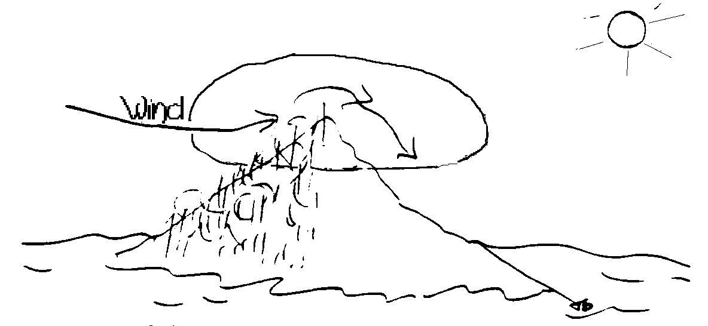

#PERMACULTURE ON HIGH ISLANDS

##BY BILL MOLLISON

###Pamphlet V in the Permaculture Design Course Series

**PUBLISHED BY YANKEE PERMACULTURE**

**Publisher and Distributor of Permaculture Publications**

**Barking Frogs Permaculture Center**

**P.O. Box 69, Sparr FL 32192-0069 USA**

Email: <mailto:YankeePerm@aol.com>

<http://www.barkingfrogspermaculture.org>

**Edited from the Transcript of the Permaculture Design Course**

**The Rural Education Center, Wilton, NH USA 1981**

**Reproduction of this Pamphlet Is Free and Encouraged**

**Re-edited for Markdown and Ebooks by [Nathan Luedtke](mailto:luedtke@gmail.com) in 2014**

***

###PERMACULTURE ON HIGH ISLANDS

Islands, whether or not they are volcanic, if they are over a thousand feet high, often have clouds. They will have a very humid top on them, and sub-humid slopes. There will be a wet slope and a dry slope, because seasonally you get winds -- summer winds and winter winds.

If the island is more than five degrees off the equator, it will have a dry and a wet side. The wet side will be pretty wet, so that the humid area comes down slope on one side, while the dry side may be quite dry. The water table is high; the catchment potentially good.

Fresh water often travels out beyond the island and bubbles up in the sea. Typically, around the island and off the coasts, there are fresh water springs below sea level. They are quite visible; they look like sort of shimmer in the water as it bubbles out of crevices, and you can drink from these springs. They are known to the peoples who do much diving.

We will take a look now at a high island in Hawaii. This island is half volcano. The other half blew up. Because of the high humidity of the air passing across all islands, there is quite a heavy rainfall over this area where winds rise, peak and fall. As the winds pass across and come down the opposite side of the island, they assist in the drying-out of that side. The winds, lose moisture as they entered the wet side of the island, heat up as they descend, and then have greater evaporative power. They are also working on a lower pressure system.

Back to the wet side, this is a wet area, and will be rain forest. If we do not intervene, the rain forest will slowly extend down, and so will the clouds, to lower and lower levels, in some cases, extend to the water line, even on the dry side. The whole island then becomes totally wet. What really happens is the wetness descends in the trees at ground level.

I have a little book, given to me by someone as I left Hawaii, called "Memories of Molokai", written by one of the descendants of the missionaries. This man grew up there. He says that fields that were dry grasslands when he was a boy are now wet and marshy forested areas. People now alive can remember the descent of the mists as the forest has extended. They remember when the mist was one thousand feet high, higher than it is today. You really observe a positive, fast response when forests take over. The amount of water generated on high islands is relevant to the amount of forest on those islands. Historically, springs have either dried up, or recommenced to flow, depending on whether the forest is extending, or being removed.

You can play around with the water, play around with forests, on these high islands. High islands lend to high-ridge storage of water, following the model we studied in the keyline system. We can direct water from catchment to catchment to catchment.

High islands are also good sources of wind and sun and water power. The ancient Hawaiians applied these principles.

Now we will look at the ancient Hawaiian land division. As we look down on the island, we can see that there are natural volcanic run-off patterns, and river systems. The Hawaiian land subdivision followed the ridges between the valleys. It followed the natural division of the island, which was from the mountain ridge to the surrounding reef, including the section of lagoon between the shoreline and the river, and, in fact, extending over the reef. This was the Ohana division of the islands. It was a good division, arrived at, no doubt, after a whole series of extinctions and reinvasions, over some thousands of years. These very logical districts imparted control of the entire watershed from its origins to its discharge into the sea and beyond.

The Hawaiians independently invented the keyline system. They put a massive stonewall at the keyline and led the water from the upper valleys out to the ridges. They took it back to the valleys and out to the ridges at a lower level, then back to the valleys, and that was their taro lands. These keyline systems still exist. You can walk out the keyline and examine those terraces, sometimes cyclopean, built of enormous stones.

They are forested from keyline up, and they confined foot traffic to the ridge tops -- very sensible people.

Forests were taboo areas, because they were the source of water. They were used very carefully for essential purposes. Where the human and forest nutrient eventually reached the sea, they enclosed the area with rock wall. Within this enclosure, in three days' time, the sea will grab all nutrients and somehow fix them. In that case, it is the form of algae. In those enclosed ponds they raised millions of pounds of mullet. So they turned run-off nutrients into fish and ate the fish. Then, back up on the hillside, in the paddy field, the process started all over again. Real good. That quite stable ecology supported many thousands of people.

Well, we soon fixed that. A few missionaries and a few cattle, a touch of disease -- we set it all to rights, cutting up the system, building condominiums. The whole nutrient flow now goes into the sea. All the fish traps filled and became solid earth systems. There may be fewer people living on the islands now, and the islands themselves are far less able to afford them a living. Production is starting to decline rapidly. Righteous, but not smart.

We could re-institute the Ohana division, except that Ohana is a word in which the people are an integral part of the division. If you belonged to an Ohana, you belonged to a valley and a set of fields and a fish pond and a reef section. They guarded right out to the reef and over the reef by building underwater structures. Thus they created reef structures for additional fish shelter. The people were an integral part of this whole system. The Ohana is a totality. I think it to be a nice concept. Its watershed, its people, its nutrient flow, its animals, everything, is a single, indivisible unit. Perhaps we could seize the headwaters here and start Ohanaing downhill.

That is a very nice system. You can go and examine what remains of it. Amazingly, there are those taro patches right on the nose of the ridges because they keylined right out to there. They keylined a little steeper than we do, because they did it by hand, and their little gutters were often stone lined. These gutters run out to quite amazingly steep ridges, right out to the points of the ridges where it was flatter. They grew taro in the paddy fields on those ridge points. You really can't better their system. You might change the elements of it. Taro is not for all of us. Poi is not an ideal food. It is pink and gluey, and tastes frankly of acid. But I have friends who dearly love it.

They did extraordinarily well in establishing the integrity and the nutrient flow in that system. It is all there, just waiting to be revived. On very exposed dry sites, they used tiny rock walls, little rock mulch walls in amazingly intricate cross-wind patterns, sometimes only ten feet apart. Behind those they grew dryland crop, like sweet potato. They also grew a dryland fern out there for mulch.

You can do no better than to study the ancient technology of the Hawaiian gardener. For what limited species he had at his command, he was a superb technician and an excellent designer. I wonder at and admire his works, which are totally ignored by the current population. This patterning is all over the landscape. When you look at it with a permaculture eye, it doesn't take you long to work out what they are up to.

Not that the modern Hawaiian can reinterpret that. While some of the old Hawaiians still use it, they are very old. If we could have really looked at the culture before we converted it, we could have learned a lot. There is only one bit of hope. The Hawaiians are buying back the islands. I think they might win if we keep marijuana illegal.

Now this is your technique in the high islands. Keep your upland slopes forested. Your island dictates the sort of forest. If your island is high enough -- two thousand feet high -- you have gained (in latitude) maybe seven to twelve degrees. So you can descend from plum and deciduous species, which have sufficient chilling up there, to ultra-tropical, equatorial species at sea level. You can play all sorts of climate games downhill. Low light tolerance trees go up here, too, because they are almost always mists around the higher area.

Mist often curiously reproduces the whole shape of the island in the air above it. This is typical of all islands. Often, coming from the sea, you can see the cloud that belongs to your island; you can recognize that cloud straight-away. That is the island you are approaching. After a while, you come upon its solid counterpart. The Maori described New Zealand as the land of the long white cloud. It is a long island.

In certain of the Hawaiian Islands, and many other high islands, it is quite typical to find valleys that have no sunlight all day. Those valleys are in eternal shadow. There is no solar evaporation in there, only transpiration by plants. The vegetation on that side, away from the sun, steeply descends to sea level as a rain forest. It is not much good fighting that. You might as well turn it into the sort of rain forest that you approve of. The rain forest works its way down the hillside by means of soil storage of water. It creates really wet soil conditions. As the forest comes down, it creates additional precipitation. The forest really sends its own water down at ground level, regardless of transpiration. The forest condensation and its protection of the soil from evaporation win over transpiration. Given that we have constant humidity, the forest always beats rainfall in terms of water storage.

But when the loggers headed into these forests for sandalwood, when the graziers came and burned up to the ridges, the clouds were pushed right up those ridges. Then they attacked the growth on the ridges for charcoal, and the ridges are drying up. They further propose to attack the higher levels, to clear the area off for their electric generators!

There are special problems related to the placement of housing on islands. These problems are currently, but temporarily, overlooked by the new island people. Opposite to streams, on tropical islands, fringing coral reefs will disappear, because the coral won't stand fresh water. Therefore, these openings in the fringing reef are normal entries for vessels into the harbors. They occur naturally. Or you can blast some out, if you feel brave enough to see what happens after that.

Oceanic islands, inevitably, at some period in their history, experience tidal waves. If the tidal wave doesn't slow up on the reef, the valley with no reef offshore acts as a funnel, and the tidal wave sweeps into it with ever-increasing velocity and ever increasing bore. These are particularly dangerous valleys for settlement in the lower parts of the valley, and the Hawaiians treated them as not even cultivation areas. They grew tree crop in them, mainly coconut. The coconut trees did a lot to decrease the wave velocity up the valley. So you must keep your client out of there.

Unfortunately, Sheraton Hotels and a few other people don't know about that. They are sitting right there. The periodicity of tidal waves is about twelve to fifteen years. So we will see a lot of disappearance of white America on the Hawaiian Islands before too long.

Going inland from the shoreline, you are safe enough at the first elevation, if you have a sub-ridge within the major valley. It is usual for a tidal wave to penetrate more than a half mile inshore. The Hawaiians also perch themselves up off the valley floor, on the sides of the valleys in case of reawakening volcanism. Volcanism is always accompanied by torrential rains and enormous and very rapid mud flows. People don't want to be in the path of that flow, which may descend with a speed of four hundred miles an hour. So they build their homes up here off the valley floor, and in from the valley mouth. Where there is a fringing reef, you can creep closer to the coast. You just might get a twelve foot wave instead of a hundred foot wave. Europeans settled tightly on the coast. They are just in between two tidal wave episodes. One happened not long back, and very probably there will be another one soon.

Ash flows, mud flows, flows down wadis, landslides, which come down these volcanic hillsides, dictate that you get on a point of a lower ridge. While this is a nice place in any locality, it is almost dictated by necessity on oceanic islands.

The other factor to be considered on oceanic islands is the cyclone. Therefore wind shelter becomes important, and particular attention must be paid to house construction. Earthquakes and mud slides, but particularly earthquakes, dictate that you reduce the mass of your house to the minimal. It would be best, particularly in tropical islands, if the house were made out of paper or light matting.

As a designer, the last thing you check out before you leave is to be certain that you haven't left some unfortunate client to a certain death. The paths of mud flows, the paths of tidal waves, the paths of cyclone damage, are all known if you make local inquiries. Look for traces and effects that show you where not to be when these events occur. So, having done all the rest of your planning, you had best be sure that you have put your client where he will have a maximum chance of getting out of any of these situations.

Permaculture on Granitic Landscapes - VI

Granitic landscapes are somewhat like the residual desert -- slab landscapes with a lot of rocks. This landscape presents peculiar problems. Typically, there may be a hundred feet of permeable sand. Your chances of any significant storage of water anywhere in that landscape is very slight.

Yet millions of people live on those landscapes. The entire Perth plain of Australia is of this nature. It has about a two hundred foot depth of clean sand. You can't keep water on it. You may water it forever and the water just goes down and down. You can mulch it and the mulch is gone. A thick mulch is gone in six months. It just gets washed down into the sand. There is nothing to stop it. Mulch just breaks down into little particles and acids and flows on down between sand. It washes right down to wherever the water table happens to be at the time. All organic materials are washed down.

Near ancient rivers you will find people living on these plains -- plains extending out from large granitic areas, not subject to glaciation, and along major rivers that have receded, drying up a bit.

The water source is often bored wells. But that water is finite, and the usual story applies. Once you might have needed to bore to a depth of 20 feet. Now it is necessary to make a 2,000-foot bore, while the water is getting saltier and saltier the further you go down, because there is a natural stratification. There are different salt layers that have hard alkali.The ground water, the fresh water is flowing over the top of saltier water. As the fresh water is pumped off, the bore must go ever deeper and the water gets more expensive and saltier.

So small gley ponds, tanks, and very modest bore water use are requirements for the survival situation. Your garden area should probably be completely lined with plastic sheeting. You then can mulch, and humic acid at least will reach the roots of your plants. Your garden will then be sort of an underground tank.

It is necessary to treat the granitic landscape very much like the desert situation, even though the area may be reasonably humid.

Trees do well in this landscape, though I don't quite know why. So place a big accent on tree crop as a replacement for annual crop.

There can be no lawns. Lawns are total disasters. It takes 90 inches of water a year to maintain a lawn on siliceous sands. You may put on eight feet of water to keep your lawn alive, but there will be huge evaporative loss of water.

Around these rocks and dunes there may be numerous microclimates. You may be able to go from dates to strawberries.

Because of the reflectivity of granite, there are light and heat benefits. Incorporating the mass of these granite rocks into buildings is good strategy. It can be either under glass, or just incorporated under shade houses and used as evaporative cooling systems. It is sometimes possible to dig a rock out and incorporate that rock in the house.

There was a woman in Sydney who got sick of builders, and she set about designing her own house -- typical woman. So she headed for the rocks. What she has is nice rocks coming out in the bedroom, rock coming up through the walls into the living room. She has good evaporating cooling systems, little keylines running all over, covered with moss and ferns -- good permaculture design. It is a good idea, you see, to accept these natural features as part of the house. Glassed in, rocks are amazingly efficient heat stores, very cheap.

FIG "You can mulch right on top of rocks."

Working your way around this rocky landscape, you come upon all kinds of run-offs. You can put little blocks on the shelving areas and mulch there, right on the rock. You can mulch right on top of rocks and right beside the rock below, and get good little run-off systems going into those pockets. In the crevices, granite flakes off, and you find large sheets of that which you can lay out with a bit of assistance from a crowbar, and you can fill that area with mulch and make a growing area there.

You can grow on both sides of your rock in the shade, and in the semi-shade, in the morning sun and in the afternoon sun. Morning sun is the sun for the production of leaf; afternoon sun ripens. These are really interestingly detailed habitats, and you can almost sense what plants will grow in any of these pockets of mulch on rock, just by moving around in the system.

I have a friend who had about four acres of this granitic soil and four acres of dirt that he started to play with. His granitic area is slowly becoming far more productive than the other four acres of promising agricultural soil. He was using the stones for ripening and all sorts of things.

By playing around in there, you can have a lot of fun, and create a really attractive environment. You see a pile of rocks down here, a lot of niches in there, good tomato and cucumber spots, places for vines to grow and climb on rock instead of fencing. There are banks and little shaded areas for strawberries, and on and on and on and on.

But it is hard to deal with that area out where there is no rock base. A modest gley pond, run-off tanks, bores, windmills. Deep siliceous sands are hard to deal with, and shouldn't be crowded up and settled. Tree crops are a vital factor in sustaining agriculture on siliceous sands. Nearly all the palms, many of the fruits, figs, grapes -- all those do quite well there with minimal work.

I have often wondered about the potential of a below-garden gley system. Dig off the earth, put a green mat layer in, and then return the earth. I don't know whether it would work. It might.

I'm not saying exactly what you can do around a situation of this sort. When you walk in there, you should be able to work out quite a lot that you can do. I would stick in little olives and date palms and grapes and raspberries and strawberries and marigolds all around in amongst these rocks, and direct little runnels to places -- lots of detail work. Nice! There is nothing like an old rocky river bed or a pile of stones to work in! A pile of logs is great -- big logs, I mean, a huge amount of niches, and a great potential. Just start people cleaning up the country.