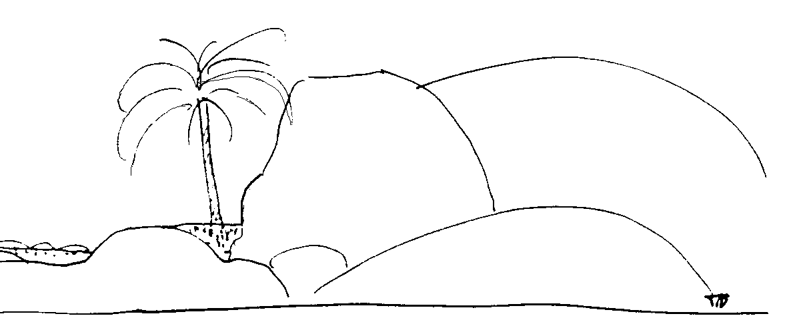

#PERMACULTURE ON GRANITIC LANDSCAPES

##BY BILL MOLLISON

###Pamphlet VI in the Permaculture Design Course Series

**PUBLISHED BY YANKEE PERMACULTURE**

**Publisher and Distributor of Permaculture Publications**

**Barking Frogs Permaculture Center**

**P.O. Box 69, Sparr FL 32192-0069 USA**

Email: <mailto:YankeePerm@aol.com>

<http://www.barkingfrogspermaculture.org>

**Edited from the Transcript of the Permaculture Design Course**

**The Rural Education Center, Wilton, NH USA 1981**

**Reproduction of this Pamphlet Is Free and Encouraged**

**Re-edited for Markdown and Ebooks by [Nathan Luedtke](mailto:luedtke@gmail.com) in 2014**

***

###PERMACULTURE ON GRANITIC LANDSCAPES

Granitic landscapes are somewhat like the residual desert -- slab landscapes with a lot of rocks. This landscape presents peculiar problems. Typically, there may be a hundred feet of permeable sand. Your chances of any significant storage of water anywhere in that landscape is very slight.

Yet millions of people live on those landscapes. The entire Perth plain of Australia is of this nature. It has about a two hundred foot depth of clean sand. You can't keep water on it. You may water it forever and the water just goes down and down. You can mulch it and the mulch is gone. A thick mulch is gone in six months. It just gets washed down into the sand. There is nothing to stop it. Mulch just breaks down into little particles and acids and flows on down between sand. It washes right down to wherever the water table happens to be at the time. All organic materials are washed down.

Near ancient rivers you will find people living on these plains -- plains extending out from large granitic areas, not subject to glaciation, and along major rivers that have receded, drying up a bit.

The water source is often bored wells. But that water is finite, and the usual story applies. Once you might have needed to bore to a depth of 20 feet. Now it is necessary to make a 2,000-foot bore, while the water is getting saltier and saltier the further you go down, because there is a natural stratification. There are different salt layers that have hard alkali.The ground water, the fresh water is flowing over the top of saltier water. As the fresh water is pumped off, the bore must go ever deeper and the water gets more expensive and saltier.

So small gley ponds, tanks, and very modest bore water use are requirements for the survival situation. Your garden area should probably be completely lined with plastic sheeting. You then can mulch, and humic acid at least will reach the roots of your plants. Your garden will then be sort of an underground tank.

It is necessary to treat the granitic landscape very much like the desert situation, even though the area may be reasonably humid.

Trees do well in this landscape, though I don't quite know why. So place a big accent on tree crop as a replacement for annual crop.

There can be no lawns. Lawns are total disasters. It takes 90 inches of water a year to maintain a lawn on siliceous sands. You may put on eight feet of water to keep your lawn alive, but there will be huge evaporative loss of water.

Around these rocks and dunes there may be numerous microclimates. You may be able to go from dates to strawberries.

Because of the reflectivity of granite, there are light and heat benefits. Incorporating the mass of these granite rocks into buildings is good strategy. It can be either under glass, or just incorporated under shade houses and used as evaporative cooling systems. It is sometimes possible to dig a rock out and incorporate that rock in the house.

There was a woman in Sydney who got sick of builders, and she set about designing her own house -- typical woman. So she headed for the rocks. What she has is nice rocks coming out in the bedroom, rock coming up through the walls into the living room. She has good evaporating cooling systems, little keylines running all over, covered with moss and ferns -- good permaculture design. It is a good idea, you see, to accept these natural features as part of the house. Glassed in, rocks are amazingly efficient heat stores, very cheap.

Working your way around this rocky landscape, you come upon all kinds of run-offs. You can put little blocks on the shelving areas and mulch there, right on the rock. You can mulch right on top of rocks and right beside the rock below, and get good little run-off systems going into those pockets. In the crevices, granite flakes off, and you find large sheets of that which you can lay out with a bit of assistance from a crowbar, and you can fill that area with mulch and make a growing area there.

You can grow on both sides of your rock in the shade, and in the semi-shade, in the morning sun and in the afternoon sun. Morning sun is the sun for the production of leaf; afternoon sun ripens. These are really interestingly detailed habitats, and you can almost sense what plants will grow in any of these pockets of mulch on rock, just by moving around in the system.

I have a friend who had about four acres of this granitic soil and four acres of dirt that he started to play with. His granitic area is slowly becoming far more productive than the other four acres of promising agricultural soil. He was using the stones for ripening and all sorts of things.

By playing around in there, you can have a lot of fun, and create a really attractive environment. You see a pile of rocks down here, a lot of niches in there, good tomato and cucumber spots, places for vines to grow and climb on rock instead of fencing. There are banks and little shaded areas for strawberries, and on and on and on and on.

But it is hard to deal with that area out where there is no rock base. A modest gley pond, run-off tanks, bores, windmills. Deep siliceous sands are hard to deal with, and shouldn't be crowded up and settled. Tree crops are a vital factor in sustaining agriculture on siliceous sands. Nearly all the palms, many of the fruits, figs, grapes -- all those do quite well there with minimal work.

I have often wondered about the potential of a below-garden gley system. Dig off the earth, put a green mat layer in, and then return the earth. I don't know whether it would work. It might.

I'm not saying exactly what you can do around a situation of this sort. When you walk in there, you should be able to work out quite a lot that you can do. I would stick in little olives and date palms and grapes and raspberries and strawberries and marigolds all around in amongst these rocks, and direct little runnels to places -- lots of detail work. Nice! There is nothing like an old rocky river bed or a pile of stones to work in! A pile of logs is great -- big logs, I mean, a huge amount of niches, and a great potential. Just start people cleaning up the country.