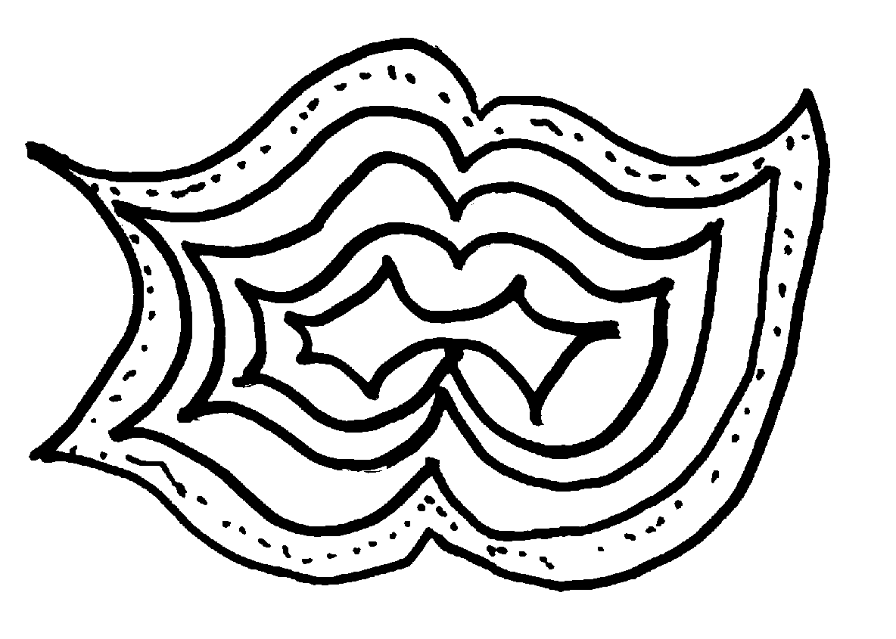
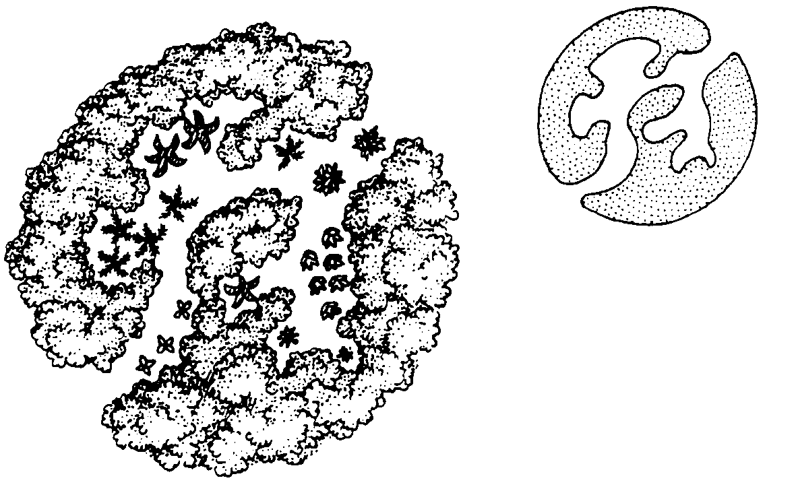

#DESIGNING FOR PERMACULTURE

##BY BILL MOLLISON

###Pamphlet VIII in the Permaculture Design Course Series

**PUBLISHED BY YANKEE PERMACULTURE**

**Publisher and Distributor of Permaculture Publications**

**Barking Frogs Permaculture Center**

**P.O. Box 69, Sparr FL 32192-0069 USA**

Email: <mailto:YankeePerm@aol.com>

<http://www.barkingfrogspermaculture.org>

**Edited from the Transcript of the Permaculture Design Course**

**The Rural Education Center, Wilton, NH USA 1981**

**Reproduction of this Pamphlet Is Free and Encouraged**

**Re-edited for Markdown and Ebooks by [Nathan Luedtke](mailto:luedtke@gmail.com) in 2014**

***

###DESIGNING FOR PERMACULTURE

In this paper, Bill Mollison talks about training people to produce permaculture designs for others. This is an important approach. My own priority is to train people to produce their own designs and to train particularly gifted people to teach this skill to others. Permaculture can, potentially, solve the world environmental crisis. However, I believe that this can happen only if people everywhere integrate perma**culture** into what stands for their own culture and apply permaculture principles daily. Specialists who charge professional fees (rightly in my view) can be a small part of the solution. However, if that is what permaculture becomes predominantly, then permaculture will become, alas, part of the problem. Empowerment, not control, should be our goal. I believe that diversity of strategies, both empowering people directly to produce their own permaculture designs and providing professional assistance for more difficult design problems, are necessary for permaculture to reach its objective - a nurturing human habitation **within** the Earth's ecosystems. -Dan Hemenway

###PROFESSIONAL PERMACULTURE DESIGNERS’ ETHICS

1. As a group of designers, we cooperate; we do not compete.
2. We do not duplicate each other’s work. As far as possible, we create and use individual designs. 
3. We care for our clients and are responsible to them. 
4. The end to which we are working is the reforestation of the Earth and the restoration of its soils to health. 
5. We care for the environment and wildlife. In all our design work, we side with that "super client," Gaia, which is an old Greek word for the Mother Earth Goddess. Earth was conceived of then as a living, thinking organism, a biological entity. 
6. We seek the best, the most appropriate energy paths, utilizing appropriate energy. 
7. We recycle at the highest level possible. Everything can be a resource. You must know how to use it. Use what you have. Try to make the least change produce the most effect. 
8. A final ethic that we practice in our community in Tasmania is that we divest ourselves of everything surplus to our needs. But we don’t ask you to do that.

####THE ROLE OF THE PROFESSIONAL DESIGNER

As designers, your function is to know where to place things, and why. It is not your function to tell people how to garden, or how to build a house, or how to build a dam, although you may comment on all those things. Your function as a designer is to place things in the environment, and place them in such a way that you use their multiple functions, that you create low energy inputs for high yield and stability.

At the same time, your role is that of a creative observer. You must learn to observe nature, to recognize how to develop potential uses so that humans may benefit.

As designers, we try to build implementation groups, regional people who we can recommend to carry out the designs.

BUSINESS PRACTICES

We ask you to work for a year or two before you submit an application to the Permaculture Institute for a design diploma. [1]

####Design Course Training

We hope that, within a couple of years, teams from these design groups will get together and train more designers and implementers and run workshops to involve more people. We offer scholarships in every course, and they are of this nature: If a person wants to work as a designer without charge, we do not charge him for the course; but he still has to pay the host group their basic cost. We will take one or two of those persons in every course. However, should the person start to charge for his work he should pay the fee to the people who trained him. We expect you to contact indigenous groups to inform them that such a course is scheduled, and that one or two scholarships are offered. If the course includes as many as 30 people, you can afford to take four people on a scholarship basis.

Presently, we are short of women as designers, and we need to compensate that deficiency, so half of design course participants must be women. Make it perfectly clear to all applicants that you are running the course for people who intend to become designers. Otherwise, you are wasting your time and theirs. This is heavy stuff; it is critical. While rural backgrounds are not necessary, it is essential that people have discipline and experience. Leave it to the hosting group to select from the applicants, making their selection on this basis.

I believe it is wisest to open some design courses to postgraduate students only; so in that way you will get economists and business management people. We are going to need all those skills. [2]

I want to emphasize that we should not be expecting our children to change the world. Unless we do it, our children do not have a world to change.

####Finding Work

Conduct weekend workshops, from which jobs will come. Lecture. Write articles for local journals. Only when you are established, with a back-up team, should you advertise as permaculture designers. Start modestly and gain experience before you find yourself with more work than you can handle!

####Charges for Design Jobs

In general, we suggest that you charge for any work. However, almost without exception, you can organize a free job in the context of a paid job. Do the free work when you are in the area for paid job, thereby keeping your own cost down.

We tie our rates to those of local landscape architects. You have the individual right to set your fees. This discussion comes from our own past experience. It is usual to quote a price for a job, unless it is a job involving much work over a long time, in which case you might want to work on an hourly basis. Set down exactly what and how you do charge.

We have charged a daily rate for a normal job, which is up to about 40 acres, one day on site, and a typed, documented, and illustrated report later. The report would run about 15 to 20 pages. [3] The text should contain numerous small pictures, little details. Refer to books. We always finish every report with an invitation to the client to inquire further at no cost. Whenever we have second thoughts on our design, we inform the client in a letter.

When you get into a big job, over 100 acres, and they want a detailed design, you have to start quoting on a time basis. You may find that you want to do group work on the larger properties.

A pre-design report on any big job consists of outlining what is generally possible, and how you can be of help in the future doing intensive designs for specific areas. Never go into a big job and attempt to do the total design immediately. Give the client a brief from which he can decide how to proceed. You can figure the design cost at 1 1/2% to 2% of the total investment that the client will need to make in implementing design. Determine how much the client proposes to spend on improvements, and figure your fee at 1% to 2% of that amount. You can quote on that basis. You usually charge about $35 per hour for professional permaculture design work. [4]

You may develop village projects, such as in Davis, California. Perhaps you can do a pre-design for the group, pre-directions for people moving into the settlement. Later, you might produce individual designs for the people moving in. [5]

There is another service that we can offer: a sheet of principles for people to hand to the architect who is planning to build their house. Also, we may assist the client in finding an architect to handle a special kind of structure.

Start a network, linking resource people--horticulture, architecture, agricultural engineering, realty agent, public relations, office people.

####Finding Property for a Client

You may be asked to find property for a client. The first criterion, and extremely important, is that the client have his own water supply potential on site. The second criterion is that the site suits what the client wants to do. The third criterion is that the site in its present usage has been undervalued. The fourth criterion is that the site preferably be multi-titled, or without limitations on the kind of structures you can build, and the number of people you can accommodate. Sometimes you can get property that runs into town sites that will permit you to place 20 or more people on an area. The fifth criterion is that you must know that for your client you can improve that property to a high level. Land that has been strip-mined is a good example. The sixth criterion is that we do not select land for a client that has been valued for sub-division, because that is the highest price, unless you see a particular resource there that has been overlooked in assessing the land’s value. Finally, when you look for land for a client, you want to persuade the client to share your concern for the rehabilitation of the property.

There is a further reason why multiple titles are useful. The area may need a nursery. We might then site the nursery on a small title, so that somebody is in there involved in improving the place.

The charge for finding land is usually 1/2% of the purchase price of the property, just to find the property, plus an additional 1 1/2% on purchase, if they buy the property. You can figure the cost at about $400 a week plus expenses.[6]

Keep a very keen eye on the local labor condition and the local market for particular land uses. This is different from the service offered by a real estate agent. You will be finding for a particular client a particular property, and cheaper than he can do it on his own. You charge the client, rather than, as in the case or a real estate agent, the seller of the property. It is not necessary to deal with a real estate agent, if you find the property and are able to contract for the purchase of it yourself. However, if you start to deal through a real estate agent, ethically, you continue to do so.

We have just begun to work as developers. There are villages that we are developing now; but our priority is to train more designers, because we do not have enough people to cope with all that work.

Energy budgeting and resource inventory are other services that you can offer. You will have to investigate your own price structure. I can think of many other services into which we could go. Soon, we should be the developers. We just don’t have that power yet.

We want to acquire and preserve wild areas. whenever you travel and work and read, think of how to change large areas, such as dry lands, from cattle and sheep usage, which is destroying the land, to really productive areas. It might be as simple as the growing of aloe vera, which on a hundred acres is of greater value than sheep raising on 10,000 acres. When you get an idea, then you start to look for a client with the land, or you may start to look for someone who will buy the land to demonstrate such a revolutionary usage. You want to establish much of your design work as a demonstration site in some manner.

Have a good relationship with real estate people. I believe least 80% of the real estate agents support what we are doing. It would be good to print hand-outs for real estate agents, telling them about permaculture.

####Managing Land

The management of land may require a couple of months a year. We charge $2,000 to $5,000 a year, depending on the amount of work required. Many people own land on which they do not live, and which may be in some use. They want somebody just to keep an eye on the property. Real estate people in Australia earn an income from managing maybe as many as 50 local properties. They perform services such as buying in and selling stock. They arrange harvests; arrange markets. They charge a flat rate for these services. Often you might oversee five properties for one client. He would have to pay a resident manager a salary of about $15,000 a year. You can offer a frequent visit proposition where your fares are paid, at a charge of perhaps only $5,000 a year, and you can oversee three, four, or five of those properties.

But as a trained designer, that takes you right out. As fast as we train designers, we lose designers. If we act as managers, we will never have enough designers in the district! Some will go into long term urban development; some will be taken into management, and there are many other places where designers are disappearing, fixed into some on-going situation. Education is one of these.

###REPORT WRITING

####Methodology

1. Collect all data: the client’s requirements, maps, local regulations. 2. Analyze the client’s problems. 3. Recognize those permaculture principles that fit this particular situation and can be applied to the problems. 4. Apply permaculture principles specifically to the problems involved. 5. Design solutions in the form of edges, patterning, increased functional relationships. 6. Check everything over to make sure this solution adequately meets all the client’s needs, takes care of all problems. Once you have covered everything, you can write the report.

####The Report

#####General Description of Site

Begin with a brief general description of the site and its placement in the region. This includes a very brief description of orientation of site, existing vegetation, existing water, soils.

Then draw a main map, with site broken into identifiable areas to be treated in detail later.

#####Themes that Affect the Whole Site

It would be logical next to deal with themes such as **Fire Protection**, for example, describing steps the client will need to take to protect against the hazards of fire.

Another theme might have to do with **Legal Issues** pertaining to the client: as an example, the possible advantages of trusts, land trusts, a non-profit organization.

**Community Involvement** would be a theme in the case of a client who would like to start a community on the site and needs help getting things together. You can recommend ways and means for getting people there, and for involving the local community.

Another theme, for a client contemplating going into a commercial crop, would be the **Local Market Situation**.

In some cases, **Wild Life Control** or **Mosquito Control** might be applicable themes.

After having dealt with general themes, proceed to:

#####Details of the Areas

You have, at the outset, defined the site as to zones. In writing your report, do not refer to specific zones in the same way that we refer to them in this course. Simply locate the areas, such as house site, intensive garden, etc. First, define each site by name. Then you may give to each separately identified site a location number, so that you have a map with each of these little areas numbered.

In your report, starting at the location you have numbered (1), work through each area, developing your design in depth. The first one will nearly always be the house site and the intensive garden area, because that is where the client ordinarily should be working first.

#####Principles of House Design

If the client does not have a house already built, this section should include a quick description of energy requirements and recommendations of certain types of architecture. If you know a good builder, you could recommend one.

If there is an existing structure, you can make retrofit recommendations, involving climate amelioration with glass houses, shade houses, trellising, vines, earth banks, windbreaks, perhaps ponds in the garden.

Define where the garden goes, including space for small fruits. However, you do not need to go into specific gardening technique. You can refer to books on the subject and suggest that there are methods of gardening which save energy. List all book references in a **Bibliography** at the end of the report.

You may need to discuss the possibility of collecting rain water from the roof, and therefore suggest locating a tank or barn roof at a higher level so water can move by gravity flow downhill to the house and garden area.

Again, treat water as a theme, if your design includes many issues throughout the site pertaining to water.

You then go to the next area, which may be the orchard, or a small chicken forest forage system. If it is an orchard, you describe the planting systems, the management systems, and how to bring animals into the orchard.

In this way, you go through each area, dealing in detail with each of the problems the area involves.

You will find that drawings probably will help people to understand what you want to describe. You may need drawings similar to those in **Permaculture II** illustrating horseshoe-shaped windbreaks. You should define the species in the windbreak. It may be useful to make some drawings of fencing layouts. You may want to do an enlarged drawing of a specific area, such as zone 1 and the intensive garden.

#####Standard Designs

You will probably can slip some standard designs into your report, writing bridging pieces. You often can develop your own standard designs for a variety of situations. If you send them in to us, we will print them.[7] You will get an author’s margin for each one sold. If you are a good designer, you might go into the business of doing standard designs for a living [8]. Standard designs can deal which architectural themes as well as landscaping and agricultural design. Construction of an icehouse could be one example.

You will be getting towards the end of your report.

#####Bibliography

When you have treated in detail all the themes and each of the individual areas, compile a bibliography. This will include all books that you have referred to in the report, plus others that may be relevant to the design.

You will need to become familiar with these books and keep abreast of new ones. It would help if some person in the consultancy group could be an information collector, making it a practice to run through the latest books.

#####A Plant List

Your report should include a documented plant list. You will need to be careful in your recommendations, avoid including plants that are illegal in that region or that could become rampant on the site.

Initially you will need to get together a personal filing system for plants and animals, with information about each. You may need, on occasion, to make a specific list for a specific job, which may take a fair amount of research. You should familiarize yourself with local people who are a source of information on plant and animal species.

#####A Resource List

This should include a list of people in the area who perhaps can help the client. This might include other clients for whom you have completed design jobs, whose properties they might visit, just to see what is happening.

You will need a list of resources for hardware, with reference to tools and technologies they will be need.

It is well to remember, as you do initial designs in an area, that it would be useful to establish people as suppliers of materials for further design jobs. A nursery would be very useful in this way.

#####Priority Staging/Cost Analysis

You will need to know how much money the client has to spend, and what he wants to ultimately accomplish. You will show him where to start, and approximately what it is going to cost, and work through everything in that way. You must never omit this, never hand this report to the client with all these lovely ideas, while he has no idea where to start, what to do first. You need to outline the best way to go about things.

There is something else that you may want to do, though it isn’t always necessary: that is, to outline a management policy specific to permaculture, dealing with the succession of plants, succession, and how the client can speed things by time stacking. This is something that usually fits in at the end of the a report.

In your conclusion, make it clear that you do not guarantee anything in this report since many conditions can change because you are dealing with natural phenomena and changing environmental and market situations.

Assure the client that you will answer further questions at no extra charge. Ask him to feel free to write at any time, and indicate also that you will try to visit him occasionally, just to see how things are going.

####Type-One Errors

Even an experienced designer can make errors. Keep a check-list and go over it frequently.

* Error 1: Undertaking a design job for people whose aims are environmentally destructive, for example, a group that wants to hack out a hole in the forest for themselves. When approached by such people, you should always side with the super-client--the environment. More often than not, though, the people you are dealing with are really good people. * Error 2: Not telling your client the reasons for your recommendations. You must always explain why you have recommended, for example, putting this drain in there, which you may have designed to carry grey water to some particular secondary use. * Error 3: The recommendation of a difficult technology, beyond the client’s ability to handle. * Error 4: Not supplying adequate management data, sufficient directions about how to run the place after the client gets it going. For example, the orchard needs specific management strategy, as does changing over from one system to another. * Error 5: Writing a report with a depersonalized approach. Your reporting style should be direct, friendly, and fairly personal. * Error 6: Failing to be specific, employing expressions that are loose and vague, like "fairly large." * Error 7: Poor patterning. Very carefully think through those edges and the link-ups between the different patterns incorporated in your design. * Error 8: Failing to recommend essential pre-treatments. For example, explain how the client should condition his soil for the uses that you recommend. * Error 9: Recommending the use of plant species illegal in that area. * Error 10: Failing to fully define the resources that are on site, and to explain how they can be useful. That, of course, involves your ability to see them.

####DESIGN WORK

Though our immediate interest is the client, people are merely a temporary event on the site. Our real, underlying interest is the site itself, though we may not choose to **tell** everyone that. So we try to persuade our client to use good management principles. We have a marriage to make between the client and the site, by means of the design itself. What we are trying to do, really, is to design for the **site itself** a reasonable future.

It is essential to find out what your client’s resources are. There are two or three categories of resources to which we need to attend. The client has skill resources, and experience resources. He has material resource and capital. We need to know the client fairly well, to sit down with the client or client group, and find out all about them, and specifically what they want. It is probable that they want a certain set of things, which might be cows, pigs, turkeys, chickens, and orchards. Try to find out all those things.[9]

Learn about the lifestyle that the client group envisage. It may be one of partial self-reliance; or of some form or production on site; or simply some degree of self-reliance, which may be food only. Determine whether they want economic independence, or whether they are quite happy with their jobs, or whether they have the capacity to make an income on the site, even in a remote location. There are people who have this capacity. A good example is a potter. The client’s main income, then, would be from an activity not really related to the site. The client’s skills, then, comprise one set of resources.

Another set of resources are on the site itself. Many of these may not have been seen by the client to be resources. This is where you come in. This is where you have the opportunity to earn your fee, perhaps repaying your client several times over. If you are good at seeing the site’s resources, then you have earned your fee.

Those resources vary. There may be rampant plant species on the site, as in the case of a city farm of 18 acres that is covered with fennel. Your client could clear the fennel and start doing something on the site. But if you read up on fennel, as I did when I encountered such a site, you will find that just a simple steam distillation process makes fennel valuable. Fennel has a fraction, very easily separated, which is the basis for licorice. The site was already "planted" to a very high value crop that would finance the development of the rest of the site. If you fail to see that, then you have missed your opportunity; you have just thrown most of your income away at the outset. If you do see it, not only can the client process his fennel, but he can buy more, and become a fennel processing center for the area. While there is nothing wrong with clearing the fennel to start an orchard, he might as well use it as he clears it. You, as an employed designer, need to show this to the client.[10]

There are varied categories of resources on site. This is where your field observations come in. Are there grasshoppers? Are they a resource?

You need to have at least some basic knowledge of herbs. Perhaps there is a resource there.

Sometimes below swamps and marshes there is a high value, bluish clay. The peats themselves in swamps are a product of high value. If you are going to dam an area, you might decide whether you are going to leave six inches of peat on the bottom, or three feet of it. What is the point of leaving three feet of peat in a dam site? You might as well take two feet of it out and leave six inches as your pond floor.

So you observe the property, looking for mosses and peat, for weeds and herbs and insect life. The site might even contain some salable seed. These are your **Earth Resources**

Look for unlimited resources with profit potential. Are there sources of salable energy on the site? Is there a 100-foot all-year round flow of falls, or can you give your client that? Can your client sit at home munching his self-reliance carrots while the electric meter ticks in the opposite direction and the money flows in? Can he sell clean water, which is fast becoming the world’s rarest mineral? Is there water on site that can be metered down-hill to other groups? Does your client have an excellent wind site? Is it worthwhile to forget farming and erect a wind energy system that enables him to sell power at wholesale? Is usable wood rotting or going to burn in the next bush fire?

If any of these things is there, then you give your clients their living. So be careful that you do not overlook the energy potential of the site.

We have found that in four years we can grow commercial balsa from seedlings. This was the first balsa plantation in Australia. A three-year old balsa tree is worth about $5,000.

Aloe vera is a burn ointment that retails in pots.

Get your client to put a little bit of capital that he was perhaps planning to put into a fence, or something else which he doesn’t need, into the development of some income-producing enterprise.

This is the way you report. You talk with the clients, examine the site, then go home and spent a few days looking through literature or writing to a research librarian for information, for example, on fennel.

Another resource may be eucalyptus oil, which is worth $100 a gallon. But within that gallon there are three one-ounce fractions worth $1,000 an ounce. So with a second small step of fractional distillation in a tiny amount, using a one gallon still, you are $3,000 ahead. An apparatus that costs you $600 will pay for itself in the first distillation.

I had a client in India, the state government piggery, which raises pigs on 64 acres, spreading manure all over those 64 acres. There is so much of it that it kills everything. Yet they had a huge pig feed bill, for they fed the pigs grain. As I walked down the road, I could see breadfruit falling from the trees. They needed to plant those 64 acres to breadfruit and feed the breadfruit to the pigs, increasing the amount of valuable food for the neighborhood. Moreover, the government gets a cheap hog. I also suggested that they give the local farmers breadfruit trees and a pig, on a buy-back basis.

Look at forest management. If ever a fire sweeps across the site, it will remove hundreds of tons of biomass. Whether we remove it for some use, or whether we let it lie there to burn in a catastrophic fire, that is a debate. When you take out dead wood, you don’t drop the soil 12 inches, as a fire will. It is well to remember also that we will be doing other forest management things: swaleing, and providing for the growing of more biomass, a lot more biomass. We will be putting a lot more energy through this forest than before. You can allow the forest to remain, as at present, at a crowded standstill, with a slight accretion value; or you can manage it to produce much more biomass.

The client may not see some of the site’s resources., Meanwhile, he employs himself with little enterprises that bring him only a few dollars a year.

There are Earth resources: there are plant resources; and there are energy resources on the site. Water is a mineral that is salable. You see all the city health freaks staggering upstairs with two great bottles of water that they bought from some farmer. So if your client has a source of good water, he may be able to sell the water. He can analyze the water before he sells it. Around here, where you get all this acid rain, to sell water would be selling acid.

The site may hold yet other resources. You have to keep your eyes open. They could be animal resources, invertebrate or vertebrate. You must keep an eye out for what might be good there that isn’t presently there. That site might be the greatest unplanted goldenseal farm in the country.

I characterize another set of resources as social resources. Does the site lend itself to seminar and teaching work? - To recreation? This depends on the location of the site and on available facilities.

So what can the site produce? All the better if that is a unique production. As a tropical crop, quinine, particularly that cultivated quinine from Java, with about 8% actual quinine in the bark, can be a valuable crop because all other forms of malarial control are failing, and quinine is coming back with a thump.

If the site suits some particular easily processed plant species of unique value, then maybe your client can grow a different cash crop than he had originally planned.

As an example, I turned the site of one client into water. I didn’t leave much land surface except the area where he set his house. He went into Australia’s first aquatic nursery. He can sell seed and plants and people can come and look at it.

Don’t worry about being able to identify each of these plants. The world is full of botanists and horticulturists. All you have to do is design. You don’t have to be a botanist; you don’t have to be a bulldozer driver; you don’t have to be a fence builder; you don’t have to be an architect. What the designer has to do is look at the relationships.

This is a big job, becoming aware of site resources. I warn you, it is better to go around the site and contemplate it on your own. Make it absolutely plain to people that you must have a few hours on your own. You might use a spade. Look at the quality of the peat. You might find a bit of good clay. If you do, recommend to your client that he show it to a potter. The potter will give him the characteristics of the clay. That is what happened to us. We bought a 40-acre swamp, and we found that we had two feet of peat, and under the peat was a blue clay. We took it to a potter. He spun it on the wheel and it produced beautiful urns. He said, "I will pay you $6 a bag for that, and so will anybody." We had a clay mine that we didn’t buy as a clay mine.

Make sure that if some resource is there, particularly wind power, that your client takes out a permit to exploit the resource on his own land. In America, the multinationals are getting wind power into the same category as mining resources. So if you have a good wind site and they find it, they could stake it out. So get your client to stake it out. It costs little to do this. The same goes for his clay. Get him to take out the miner’s rights to his clay. That is part of your report work. It is your job to find out what has to be licensed in order to exploit it. Does he need a license to sell water from his land? I doubt it. If he is on his own hillside, he probably owns that water. Be sure to find out. If he doesn’t, he had better take out a right to the water on his land before he gets bypassed. Clients on the seashore need special rights to collect seaweeds or driftwood, or shells. That is why you should have a good lawyer to see that there are no covenants on land when you buy it, or when your client buys it, or when you recommend that he buys it.

A recent client of mine found that he had a gold mine as well as another mine on his property that he thought was just a hole in the ground. They were chartered by the mines department and he had been subject to leases in past times; but the leases had lapsed. Your client might care to do a little part time gold mining, while making his pond. Or he might make a hanging garden in his quarry--another wonder of Ninevah.

Assemble your various resources--Earth resources; biological resources--plants, animals, and insect life; the energy resources of wind, water, wood, oil, and gas; and the social resources that might need rights. You will earn your fee.

If people choose not to live from their land, just point out the value of the available resources, and that somebody else might care to lease them. The client, in any event, might care to take out the rights to the resources on his property.

We have another category to look at, and that is a category frequently missed by consultants--resources extrinsic to the site, resources that lie in the district. There are the resources of market, or maybe the resources of waste products, or the resources of certain unfulfilled demands in the area. There might be a need for such an item as a soil conditioner. You must point out these resources to your client.

A district may lack various things, such as hardware for which there may already be a demand. Obviously, this country around here is short of tanks. If it is a question of agency instead of manufacture, next year anyone selling tanks could be well off. Just print a pamphlet and leave one here and there; you don’t have to have a tank. Sell three, then you get one free. The same arrangement may be responsible for selling certain other equipment useful for permaculture establishment. At least, have the distributor’s rights; also, if possible, the manufacturing rights.

The district may produce wastes useful to your client. As you come and go to the job, you ask about these matters.

If you have done all that, you really have earned your fee without any design work at all. We are looking out for the site, increasing the number of ways in which the site stores energy, increasing soil productivity, and building soil fertility, rather than taking it out. If you make a client happy while you are doing that, good. If your client won’t go along with some of these things, you can tell him that he wants somebody else, like the agriculture department, or a forestry commissioner, who will tell him how to cut his forest. You are not about to tell him how to cut his forest down. We have an ethic. We work on certain ethical basis.

If you get a rich client, watch it! Keep your mouth shut until you get things together and can present your report properly, and that’s very good advice!

I went with one of my friends, who was a designer, to look at a design he had been working on only a few days before. He said to his client, "You should really have a diversion drain down here to increase this water output." His client immediately got out his bulldozer and charged uphill at about 25 degrees and put an incredibly bad canal around the hill. Keep your mouth shut. If it is a rich client, it must be done instantly! Just keep quiet until you get out of there and tell him how to do it properly. Otherwise, he may do it badly.

So you are ready for designing, and where do you start? First, you get your property boundaries set. On a big property, you might have to fly the bounds. Photography isn’t much good to you. Maps aren’t really, either, except to find out where you are going, or if you want records. It is really just a matter of playing around on your own. The most important step is to experience the site. You are your own best compound tool. You have senses for judging wind and temperature and evaporation and slope. You have eyes. Observation is your best tool. Experience is your second best tool. After that, apply other tools. It might be useful to suggest to your client that he start to make his own plans and decide upon some priorities.

Having determined the property boundaries, you may be in one of two positions. There may be certain things in place, in which case you have to work around them. You are then into a retrofit design. Your most difficult retrofit job is often right around dwellings and buildings, where most of the energy is burned. If you are asked to design a farm, you might point out to your client that you could save him much more money by starting around his house. Spend a day crawling under the foundations and poking about, and leave his farm alone, because his house is costing him much more than his farm. This case is typical.

But if you find yourself in the second position, where nothing has yet happened, it is a very happy state of affairs.

If nothing has yet happened, focus on to how to bring access into the site [11]. Where there are already access roads, determine who maintains them, whether, if you make a road, it will be publicly maintained. Design the access to minimize upkeep. A misplaced road into the site will cost more over time than almost anything else, including the house itself. If you design access according to keyline principles, even if you have another mile to go in your initial road, the maintenance of the road will be so light that you may save thousands of dollars. A road should run very gently across slope and do little turns on plateaus. The access road should run up the center of ridges, right on the top of ridges, so that it can drain. Often this is the only possible place to locate a road in rough country. There are occasionally good valley roads, running along rivers, but they need fairly high maintenance. The designer must pay much attention to access. It is there that you can save your client much money. Be sure to explain to the client why you are doing it that way.

Always finish your access upgrade to the dwelling, no matter if you have to drop it a little to run it upgrade to the house. There are various reasons for this. Most access roads that descend to the house carry water down around the house area, and it is always a nuisance. When your car battery is flat, there is nothing like being able to get a gravity roll. In a winter climate, it is good to have a road in the sun. You will have less shoveling to do. An access road can do all those things and still protect against fire. You can plant to stop snow drifting. Those are small points to which you must attend.

Placing access is your first move.

Then you locate the house site, or sites, if this involves a group of people. In a community design, stress in your report that the free selection of the house sites is just not acceptable. When a mob of hippies moves into a colony, half of them head for the ridge-top and sit right in the saddle dam, and the rest of them move into the bush. These two sites are type-one errors.

If several houses be constructed on a site, as in the case of a land trust where possibly 10 people will build homes, advise them that a designer should select those sites and connect them with access roads. Otherwise, the results will be the sort of thing we typically strike. I can give you a real example. A mob of hippies bought a big valley a few miles long. There was public access to the site. Every hippie either headed for the ridge, or else down below somewhere, and there were a succession of roads going up and down the slope. They should have built on a mid-slope position, with a single access road only about a third as long and indefinitely sustainable. All these roads that they built are already starting to gully out. You don’t have the right to do that to land. Nobody has the right to do that to land.

We would designate sun-facing sites all the way along this road, sites that are totally private and totally serviceable from single water, single road systems. You must suggest to clients that these house spots be marked, and people have only to select from the marked sites.

There are criteria for the selection of the house site.

Consider the thermal position. Keep the house site away from the fire tunnels. A house on a ridge in a valley is very badly situated . The valley funnels wind, and the ridge catches it. Get your client off that ridge--just below the ridge. He will lose very little in view. Just get him from that top. On the other hand, it is not a bad site on a ridge where there is a minor ridge between two major ridges. When you are backing into the mountains looking out to the sun, you know, sitting on a little ridge between two ridges is ideal. That is a typical Appalachian site. You will see that time and again.

Look at these figures. Sixty per cent of the energy efficiency is lost just by being exposed. That applies even to your solar heat collector. It is only 40% efficient when high winds blow across it. Most of the heat simply blows away. Don’t position a giant house on a bare ridge top. A place like that changes hands every four years, because nobody can stand the misery and the energy expense. If a place is a happy place, it very rarely changes hands, maybe three or four times in 200 years. The miserably sited place turns over very quickly. As a rule, the fewer trees around it, the oftener it resells. Lack of trees is a miserable thing for cattle and people.

So map out your access, pick your house site, and then look at your client’s list of things the he wants to do. After you have pointed out resources, people might want to abandon some of these choices in favor of some new enterprise.

Now lay out the water systems. Try to lay out the water, access, and house sites as a single entity. Everything else will fit into that. You need not worry much about the details if you get this right.

There are two type-one errors--very bad errors--to avoid. One is to site your client on these ridges, or in wind tunnels, or in fire funnels. The other one is to put people in the bush, to make a tiny clearing in the bush and locate a house in there. From the moment people move to the site, they experience terrible conflict.

Our clients are usually very conservation minded people. They like squirrels and chipmunks and beavers. They don’t ordinarily shoot them all day long. As soon as we locate a client in the scrub, we make him a very attractive target for all the local animal and bird population. They are racing for his pumpkins.

What happens? The woodchucks go there. So he has to kill the woodchucks. He didn’t want to do that. What’s more, he will kill woodchucks all his life. It’s true. He has to shoot wallabies, kill woodchucks, go out with a club and beat possums on the head. Yet he is a gentle vegetarian soul. The animals are badly killed and mangled so the client gets a guilt complex. He heads back to town because he can’t stand it. He has to leave it to somebody else to carry out this bloodthirsty business, all because you put him in the bush!

Perhaps he has a nice white pine by the fence, and he can’t grow anything within 40 feet of it. So is he going to starve or kill the white pine? He is going to kill the white pine. Gradually, the site begins to look like a bit of penicillin in the middle of bacteria. Everything around gets murdered. The client turns into the usual redneck. For what turns a person into a redneck is constant killing. You can turn a gentle conservationist into a real rough person. **You** did it. That’s **your** fault. Or, if it was somebody else who did it, then you have a retrofit job on your hands.

While it is a type-one error to site a client on a ridge top, subject to fire and cold, and often without water, you must also be careful not to put him where the next catastrophe is going to destroy him--mud flows, or volcanoes. Verify that you didn’t do that. You should have this check-list before you when you write reports. These errors are very serious.

If you are asked to design for a site that is completely wooded, first have a long heart-to-heart talk with the client. See if it wouldn’t be more sensible for him to buy certain foods from neighbors. See whether he really wants to clear garden space there. If he does, you might as well clear it. But point out to him that he can provide all his food from a very tight situation, such as a large attached glasshouse plus a fully enclosed and electric-fenced eighth of an acre. Suggest that he go in for highly intensive gardening.

There are places in Australia called conservation areas. In one, all 385 titles in the area are owned by groups with a single aim. They limit themselves to one eighth of an acre to live by, and they do it. So it means the whole area is a gigantic wildlife area with thousands of kangaroo and wallaby and possum. Each person who comes there--now by law--has to exist on an eighth of an acre. It can be done. Much food may be produced under glass. There are then no worries about bears and raccoons. Indeed, a tight situation may not be much more expensive than an extensive one.

You might also try to persuade the client to make money out of the forest and buy in his food. If not, go ahead and clear an acre of forest, and make sure the material cleared is used to the highest advantage.

####Zones

The human dwelling is the core of the design. That design might be for a settlement, a village, a town, a house, or a modest cave under the rock.

Around that core, we specify zones. These zones are not really concentric circles. You can indicate them as you like, but what I want to point out is that they are not bounded. It is a convenient, abstract way to deal with distances from the core of the design. Zones in a permaculture design represent places where you are more frequently or less frequently present. I call them zone one, two, three, etc., for purposes of identification. While I have seen people attempt to build those zones with circular fences, we did not do the design like that! Of course, it works perfectly well that way. But that is not really what we do.

I am talking about the distance from the core of the design. That which is farthest should require the least number of visits. The least-visited place around this house may be just below this window. It is more distant than the place in front of the barn. We go to the barn every day, twice a day, to milk cows. We probably go there for two or three other reasons as well. So, really, that patch of country in front of the barn is much closer to us than that bit of ground under this window. There is often a little bit of your house somewhere that you hardly ever see. Any of you who own a quarter of an acre can define maybe an eighth of it that you hardly ever visit. You may go there once a year. If you own 200 acres, there will be a large amount of it on which your foot never falls.

Zone one is the place where you are always present, where you make daily visits. It is around the entries to your house, and along the pathways between your house and any other object that you visit frequently. Clearly define those zone one areas. You place in them small plants, small animals, and those high energy, high production units that comprise the most important elements of self-reliance. The annuals there are in constant turnover, high demand, and the perennials there yield constantly. Keep there small animals that require care--the calves, chickens and ducklings. The more attention they must have, the closer you bring them. It’s that simple. If you design this consciously, it is amazing how much more the site produces.

I often tell people to just imagine a big clump of parsley 20 feet away. You’ve made soup. You look out, it is raining, and you are in your floppy slippers, curlers in your hair. There is no way you are setting out to cover those 20 feet out and 20 feet back. So you do not get the harvest. That happens frequently. You plant so many things that you never harvest, and that do not get the attention they require because they are not under your eye.

It is true with the greenhouse. It is a bright morning. The day is just beginning to warm, and nobody has opened the vents. The seedlings start to cook, all because the greenhouse is way down there, a hundred yards from where anybody walks. This zone one area doesn’t really extend any more than 20 or 30 feet from the foundation of the house, and not from all the foundation. What we are really talking about is a little area that does not ever reach around to the back of the house. It’s very close. From that, you get most of your food. If you have any sense, you get all your food except a couple of items from there.

It is nice to have a couple of little ponds in zone one, little four foot ponds, and one of those very close to a path. That’s the one with the watercress. That is a pond from which you can take pounds and pounds of food.

It is full of tadpoles. This is frog city. Five or six gallons of tadpoles, and brother, you have many friends. It is really easy too, to select the frog you want. If you want frogs in the top of the trees, you take the frog eggs from the water surface. If you want frogs in the cabbages, you take eggs from mid-water; and if you want frogs running around in your mulch eating slugs, you have to scrape your pond bottom.

The reason is this: Your high life tadpoles, your tree frog tadpoles, are those tadpoles that are free swimmers, and tadpoles stratify in the water as the frogs stratify in the environment. Those tree frog tadpoles are buoyant, they will not sink. The frogs that burrow and scrub around in the leaf litter, have sinking tadpoles [12]. They have to swim hard to rise in the water, and don’t very often do so. They live in the pond as the frogs live on land, down in the mulch. So you just make your decisions.

If you send children out after tadpoles, they only bring in high-living frogs, because they never get down to these bottom tadpoles. Those tadpoles in the base have heavily pigmented tails, and the frogs also are heavily pigmented frogs. These tadpoles have changeable colors and so do the frogs. They adopt the color of their surroundings. Big tree frogs climb maybe 80 feet from the ground. Medium size tree frogs occupy the shrubs and bushes, and little tree frogs are the ones that sit in your cabbages.

Within zone one, if you are doing mulch gardening, it is fully mulched. There is no bare soil. If you are a triple deep digger, it is fully made into beds. All those methods produce good vegetables. We will not make you choose a method. It depends upon what suits you. I’m lazy--full mulch suits me. You are vigorous, triple digging suits you. Triple digging suits you now because you are young. Full mulching, you will grow into. So technique is not a fixed thing. It is something appropriate to occasion, to sources, to age, inclination and conviction. Mostly, it’s a case of conviction. Well, it doesn’t hurt to let people have their convictions sometimes--if they are harmless convictions.

That’s the annual garden. There are really two classes of plants in the annual garden--those that you continually pick, or pick frequently and those that you harvest once or just a few times. The first group includes mainly the soft herbs, and the things that are yielding frequently, like broccoli, parsley, and most of the salad greens. If you don’t cut the heads from broccoli, you lose production. If you have a broccoli around the corner, often half of it goes to seed before you get to it.

The other class of vegetable you eliminate when you do harvest them. They are your tubers, roots, head vegetables. Celery falls in between, depending on your habits. We always put celery on the paths, because we always just take two stalks. I never in my life used more than two stalks of celery at a time. I know people who grow celery in bunches and cut it right off. To them, celery is a head plant. To me it is a plucking plant. Those things you pluck closely follow your pathways; those things you cut off lay behind them. There is nothing more stupid than wading through a patch of cabbages to get to parsley, and nothing more logical than bordering paths with parsley, so that you never tread into the other area except maybe once or twice in its life. Design where your plants are to go, so your garden can be fully mulched with high turnover, mainly annuals, some perennials, some biennials.

This garden is under constant invasion. It is very attractive to weeds and running things. So once you have decided its borders, you might very well border it. Select border plants from those that do not permit invaders to penetrate them. You may still leave little areas unplanned, into which people can extend, if they want, or into which they put things that are aesthetically important.

In zone two, unless you have extraordinary resources, there is no way that you are going to continue a fully mulched garden. Two of us mulchers went to Orange Bathurse Agricultural College and laid two different mulch gardens for the agricultural students to look at, and to weigh and measure against their clean-till gardens. Ours was so good that the vegetables tasted better than theirs, produced a lot more. One chap went home and applied nine acres of it!

It is a common thing for people to build a house and then hunt for a garden site. Having found a place for a garden, they make one there. They build a glass house somewhere, and their chicken house. By this time they are worn out. They have to cart their manure to the garden. They lay out an orchard somewhere, and they are desperately trying to get it pruned. They didn’t ever have enough time or sufficient understanding to enable them to put anything together.

People will have a little house on a residential block, surrounded by flowers and lawn and shrubbery. Behind the house, way back in a corner, hidden by some discreet trellis, they burn things and cultivate a modest vegetable garden.

You recognize that pattern. It is so universal that to move a cabbage to this lawn is a cause for total neighborhood consternation. A man in Tasmania moved four cabbages out on his nature strip. The council sent two trucks and seven men and had them removed. The truck pulled up, the men hopped out, took long handled shovels, dug out his cabbages, threw a couple in each of the trucks, stood there for a while and had a couple of cigarettes. That act of defiance by one citizen was formally wiped out with a great show of force. To plant cabbages on the nature strip was just indecent of him, totally indecent.

Why should it be indecent to make practical use of the fore half of your property or around your house where people can see it? Why is it low status to use that area? The condition really has one origin, and that is peculiar to England and to the whole British landscape ethic. The British tradition has produced the whole profession of landscape designers in the English speaking world, and much of the non-English speaking world. Where landscape gardeners have never existed, this separation doesn’t exist. What you are really looking at here is a tiny little British country estate, designed for people who had servants. The tradition has moved right into the cities, and right down to quarter acre patches. It has become a cultural status symbol to present a non-productive facade.

Lawns are interesting. Remember, there were lawns before there were lawnmowers. In India there are lawns today where there are no lawnmowers. I took a photograph of the lawn being cut on the Taj Mahal. Thirty-six widows moved forward on their knees, cutting the grass with their little knives. Lawn is a salute to power.

The nuclear family these days is smaller, yet the house is bigger. The childless couple are flat out keeping up with this situation. As well as being the lord and lady of the house, they are often the sole caretakers of the whole property. They are in an awful trap, really. They don’t use any of that lawn. They don’t have any time to go out there and enjoy it. This is the whole basis of landscape architecture. It is a symbol of status.

Well, many people have started to ignore it. I have a friend who has brought the whole design forward in front of his house, and it has spilled out onto the council strip. Out in the street you are wading through pumpkins. Another instance--I was walking up a street in Perth one day, and suddenly in one corner the whole area came to life. Beans and peas and all sorts of vines were growing along the footpaths and up the trees. It looked like a real Eden in this desert of status.

In the Davis village project you have a very beautiful landscape, with nearly 90% of it of some use. But not quite all of it. We don’t need to have everything to be utilitarian. There is no reason why we shouldn’t have daffodils and cabbages growing together. The gladiola can be a genuine companion plant in an onion bed, so put onions with gladiolas, instead of planning gladioli in the front garden and onions in the back. Marigolds are good to have all through the place. So are nasturtiums, because of their root interference with anything that looks like white fly. They have a communal root interchange with things like tomatoes. When you pull your flowers out of your vegetable garden, up goes your pest problem. Well, we are the pioneers of the new ethic.

In warmer climates, we may even have a lemon tree in zone one. The lemon tree is a daily crop, a constantly used food. So is the lime tree. In the tropics, and even in Tasmania, people use some limes every day.

We must remember to include some access in zone one, and space for dumping organic matter, whether for compost or mulch. We want the space for it reserved, and perhaps screened from view.

I suggest that this zone be bordered and blocked from surrounding areas for several reasons. One is that we want it to be a very sheltered area because it has the highest energy flow-through, and it can provide practically the total food supply. The second reason is that we don’t want crabgrass coming in here. So we must decide what row of plants we can put into the border. There are some desirable characteristics we are seeking. They could very well be fireproof. It would be good if they were dark underneath, and if they themselves were highly adapted to low light condition while under them nothing would grow. They should also have some use within zone one, as well as serving some function in zone two. Within zone two they might serve as forage. But in zone one we want manures for our garden.

You might fence zone one, particularly where there is any chance of conflict with animals. A very easy protection, and the cheapest, is a netted fence with an underground layer and a single electric wire standing four inches above the top of it on the outside. I don’t know any predator that will get past that, underground, above ground, or climbing. Barriers two feet underground stop most burrowers. When you are not dealing with burrowers, put a layer of fencing on the ground outside and put a rock on that. Use one inch mesh. Inch-and-a-quarter mesh is too large. Chipmunks and baby rabbits will go through it. A three foot fence should be adequate for all but deer. For deer, you would need a higher fence.

We need well-defined criteria for zone one barrier plants. They should be good wind defenses that won’t burn and do not allow much understory. Some of the sunflowers and the Jerusalem artichoke planted in a band about four feet wide are suitable. They establish very quickly. They do the job the year you plant them. The Siberian pea tree as a hedge would be a good barrier plant. As you clip it, you can lay the clippings directly in your annual garden as a mulch. We use **Coprosma repens** (New Zealand mirror plant).

Start your border inside the fence. With browsers on the outside, it provides a high value product for browsing animals, so we don’t need to bother clipping on the outside. Clipping inside, we get a high potash-nitrogen mulch that rots quickly in the garden. We can trench it where we will be growing beans and peas, or we can just lay it under our mulch.

We plant a wind barrier along the opposite sector from the sun, so there is no need to worry about shade from these plants. It pays to run smaller permanent shelters within the garden, too. I believe the Jerusalem artichoke, the Siberian pea tree and comfrey perhaps best meet our criteria. We want a plant that is soft, easily pruned, nitrogenous, high potash, and preferably alkaline. Given that set of conditions, you will find maybe 50 plants for that barrier. These plants must be a total barrier, permitting no other vegetation to grow under them, because we want a non-weeding situation. The only weeds that grow are a few dandelions, which we permit, and a couple of bunches of clover, just for teas and salads. We don’t have any other weeds in zone one.

Zone one is tightly controlled, weed free. I also like it to be absolutely dig free. Mainly, we eat it. Finish zone one with well placed, irregular entries, which may be cross-wind trellised. You can work it out real sweet, so that you can go through it on a slant, across wind. All this is critically important to the production within zone one.

Through this first zone, leave spaces for expansion. Zone one can expand or contract, depending on your back problems, your age, and the number of children you harbor. Your client may start out wanting a big garden now, then progress to wanting a small garden toward the end of his life. His perennial garden is then bearing. Permaculture designs adjust it to your age. Your yield increases while your digging decreases.

Zone two is not fully mulched. It may contain main crop gardens. They shouldn’t be in that little area of annual garden. Here grow crops that you much use, much store, maybe only have a single harvest, maybe only visit three times to fully harvest. Stick a few tomatoes in zone one, but when you are putting in 50 plants, you are not going out every day and pick them, you are going to go through them two or three times, and eventually pull the whole plant, hang it inside and let it finish ripening. Your winter-keeping squash will go in zone two, while your zucchini and your patty-pan squash go quite close to the parsley. You are always nipping them. You could run through any plant list and quickly assign each of them to their functional zones. Zone two might be row-cropped. It need not be mulched. If you have a lot of free mulch, then mulch it. If you haven’t, clean cultivate it.

You could put strawberries in zone two. You also could put some in zone one. Asparagus definitely goes in zone two. It has a very short season. You might not run this barrier hedge until after you had gone beyond your asparagus beds and a couple of other things that might require mulch. [13]

The purposes of the zones is to design distances properly. When you do this, it just pays hundreds of times over. Every time I break my own rules--and I do--I’m sorry. Zone one is for lettuce, spinach, green beans, pole beans--the things you are picking every day and bringing in and going out for. It should have lots and lots of parsley. I’ve never seen anybody with enough parsley.

Raspberries I would put in zone two, perhaps 40 feet away. You are there every day in season, so they are still not far away. [14]

Pumpkins could grow anywhere. I’ve grown them a mile away at the edge of a swamp, which happened to be a nice spot. They stream through the trees.

Blueberries, in small numbers, are domestic crop. Fifty blueberry plants approaches commercial scale. Two hundred strawberry plants edges towards a commercial crop. You will have plenty of buckets to give away. Beyond that, you would have to start selling them, and be putting in eight or 10 hours a week on strawberries.

You have to think all this out, if you are going to design this in detail.

Get some area under glass. Whether you are designing for retrofit, or new construction, attach the kitchen to glass house with a connecting entrance. Provide a direct view from the dish washing area into the glass house. Put some life into your glass house--a covey of little quail--so that you are not looking at a static situation. Quail come and go--sometimes they take dust baths. Frogs will climb the kitchen window. If you have to stand somewhere doing tedious work, it is awful just to be looking at a blank wall. While looking into this highly interesting design, you don’t mind the work at all. We’ve been able to arrange this in almost every house we’ve had a hand in designing. I like it. When I return to those places. I always look through those windows. Put a little soft turtle--not snapping turtles--in the pond. They disappear in the mulch, then come back to the pond. When there is something alive nearby, it gives a good feeling. A little turtle living in mulch will eat worms and slugs. Turtles are good little things to have in there. And you can’t beat a gecko. The average gecko is designed for glass houses. He will go anywhere in a glass house, upside down, downside up, round about. [15]

Whenever possible, zone two should include the range of some high manurial animals like chickens. House them at the edge of zone one, or very close to it. We are deliberately exploiting a larger system (zone two) to enrich a smaller one (zone one). We do it through the medium of an animal collector.

If your client is on a hillside, and he intends to milk goats, you can use that expanded-mesh flooring in both the chicken and goat houses. You can walk on it. That is very good material, too, to use in mud situations, along entries into the house. Just lay eight feet of that. The mud falls under.

We advise our clients never to dig these animal shelters into the hillside, but project them out, and put in a mesh floor. Look what’s on the edge of zone one! When you are working in a cabbage patch, you can grab your rake, reach under the chicken house and pull out manure. That works very well. We have designed several of these. Everybody has been very pleased with them. They always have dry, stored manure and shredded bedding ready to be transferred to the garden.

These animals range in zone two. For milk goats, it is easy to bring a corridor into zone two, with a range in zone three. Edge the corridor with , which is a good milk goat plant. Planted just outside a coarse mesh fence, the goats will be doing all the pruning as they come through the corridor. It is often possible to have chickens and ducks contained within zone two. Because they require daily attention, we bring the housing of those small domestic animals, and even the milk cow as close as we can. You can bring it very close without much problem. You can bring it right here where we will be using the manures and we won’t have carting problems. The pig, I would usually stock to the back in zone two. In confined quarters, pigs can get a bit messy. It depends on how much range you have. When pigs run on grass, they’re very clean animals, and can bed close to zone one.[16]

Zone two contains the **pruned** orchard, the main crops, spot-mulched crops, thin spread compost, rather than heavily applied mulch, lightly, rather than heavily manured crops. Zone two contains the foods that comprise the bulk of the storage goods of the client group, along with many additional elements, products from small animals. The outer zone is designed to bring the high turnover nutrient to the high turnover zone.

When we collect acorns and bring them in to the chickens, they provide high value manure, and high value mulch. Nut husk mulch is of high value. It is usually alkaline, and high in calcium content. So we gather thinly from the outer zones material that is recycled by the animals for use in the zone one area.

So far, in dealing with zonation, we haven’t said anything about how we swivel these systems. We start in to play with them. We set elements on discs and spin the discs to see how they fit. I’m not going to start spinning the discs just yet. You can begin to list the elements: limited mulch, orchard main crop, and purely domestic animals, of which there aren’t very many. The Chinese may limit themselves to the duck and the pig. We will include the chicken. In Asia, the quail will be included; in South America, the guinea pig. Western Europe and perhaps New Zealand might bring in geese. The pigeons would be important in many countries. If you look at the old names on maps, you will see that pigeons used to be an element in this culture. Where cot or cote is a part of the place name, there were pigeons.

We are creating a biological funnel. We are deliberately creating a nutrient vortex. We are bending the rules. Everything farms for itself, does exactly the same thing that we are doing. Animals do the same. The Emu may have been among the very first agriculturists. Look at the beaver. The beaver knows what he is doing.

These zones really do have imaginary borders. If you want to bring a milk cow into zone two, it might extend out to two acres. It is still a very limited area. It would be limited to a maximum of two acres. Anybody who is really controlling an acre is feeding many people. No doubt about that.

Did you ever, at any time in your life, make the mistake of plowing four acres and putting it down to vegetables? I did that. I hopped on my brand new tractor, ripped 12 acres of beautiful soil, bought large armfuls of seed and planted the whole 12 acres on my own. I only saw about an acre of it after that. I grew rich and fed hundreds of people on an acre of it.

So two acres is enough. It contains quite a variety of elements, elements that make life worth living, like the patch of apples, and the eggs from our chickens. If you fully develop these two acres, you have a very productive unit.

Some people live in financial self-sufficiency on an eighth of an acre. Other people need 500 acres. The multi-nationalists would need several million acres, scattered around the world.

If you think it out, you can earn a livelihood on a very tiny area. There is a man near Melbourne who provides the parsley for the town, which is about the size of Boston. Around Boston, you rarely see parsley, except little bits laying on the sides of plates, strewn on butcher shop meats, little bits of it within the salad, placed here and there. Much of it is not eaten. I always eat mine, but some people just leave it on their plate. So every day, each day of the year, this man harvests two boxes full of parsley and he makes a good living out of it.

There is another person who was a clerk in the city. An eight-acre farm in the hills, with a modest little house, was for sale. The previous owner had died. The city clerk had just enough money to put the deposit down on this property. He wanted to get out of the city, yet he was terrified to get out. This property was just at the limit where he could drive to his job. So he bought the property on a Tuesday, and went to work on Wednesday, Thursday and Friday. On Friday, when he came home, he looked around the garden. It looked pretty wild. There was nothing much that he could see to eat in there. So he determined to clean this garden so that he could get organized. He arose in the morning, took his tools, and was about to make a hole in this horrible mess, when a gentleman walked in, well dressed in a suit. The gentleman said, "Can I cut my flowers?"

The man asked, "Who are you?"

The gentleman said, "Well, I am an undertaker, and I had an arrangement with the former owner to get our flowers here each weekend."

So the gentleman gave him a check for $50 and wandered into that mess and came out with armsfull of flowers. That happened three times that weekend. This city clerk never went to work again. The previous owner had established a system so that every month of the year there were flowers. He died rich.

How much does it require to get out of the city? It all depends on how clever you are at discovering the needs in the surrounding area. You might just grow water chestnuts. It is up to your ingenuity. You can think big and have a thousand head of cattle, or 2,000 chickens. Or you can make a very good living and go around the world once a year on half an acre.

So it is up to you. If you want to enlarge that glass house and become a neighborhood supplier of certain essentials, then you wouldn’t even need half an acre. If you want to go into the market against the beef growers, you make a big investment. But if you want to go into your own small market situation, you need very little.

One gross error that we have all made is to try to occupy too much land, and not really develop any of this land we have. A casual glance around this place here will show you that at least 90% of the resources are un-used, 10% partly used, and less than 1% used in any effective way. So you have two approaches. If you care for it foot by foot, you are high and dry long before anybody that tackles it on the broad scale. Not only does almost everything you do work, and everything you plant survive, if you treat it that way, fully occupying the area, you don’t need to extend very far. But in broadscale orchards and hedgerows, the amount of success decreases as you extend. You will be putting much money into something that is not going to work anyhow. So, as designers, stress this nuclear approach.

We can point out on the site areas to reserve for vital uses, so that we won’t be putting the future pond site by the house to some other purpose. We won’t plant it to trees, but will prepare it for its eventual use.

The borders we need to establish will become apparent as we start to analyze the activities that the design requires. There will be many borders, not as simple as that one bordering the zone one garden. These have many criteria.

Beyond that, we come to zone three, which is just a name, of course. Here, we design unpruned fruit and nut production, with a high proportion of seedlings. We go into the management of existing resources. It is in this zone that the Portuguese graft onto existing oaks, or existing vines, or even wild vines. We start to adopt infrequent management strategies right along with our intensive cultivation strategy. We devise all sorts of self-harvesting systems. We use different techniques. We are into adjustment rather than ordering. We drop many of our power plays and become more sophisticated.

The animals within zone three verge on the non-domesticated. The animals themselves take on a different life style. You start to select species that are more self-caring. Most sheep are not domesticated animals, and can go within this zone. Milk sheep come closer in; the wool sheep go further out. Beyond that, there are only certain things we might bring into this zone. We might bring in water; and we might bring in firewood and structural timbers. It comes down to what your client wants, what he thinks is basic, and what he can handle. There may be clients who want to rear deer as their main activity. In that case, you shift zone three inwards, because the client doesn’t want much of that zone two function.

You can bring a corridor of zone four right to the house, allowing you to feed deer at your back door. I like wallabies right where I can sit and talk to them.

It is easier to bring in birds, because gardens, shrubs, and trees attract them. For clients who are so very fortunate as to have a beaver dam or some wallaby or deer, you can often lead these wild elements to the house or very close to it. [17] You can attract them with plants or surplus nutrient, deciding which of those elements are appropriate. If you want to bring in a porcupine, you do an entirely different design than if you want to bring in a snapping turtle. For snapping turtles, you might need a canal coming in there, and many spare chickens running along the side of it. Then you’ll get snapping turtles.

I had a client who had 8,000 acres. Every place he looked on that property, he could see a suitable place for a house. He couldn’t make up his mind. So he asked me to help him decide. Within these 8,000 acres was a marsh, a low lying area. I said, "What will you do with that marsh?"

He said, "Drain it, and sow it down to pasture."

Well, we had a fire problem in the area, so I didn’t want those swamps drained. With a very low Earth wall, maybe three or four feet, we created a lake from the marsh, and a little house on this lake. Running right to the side of the house, we have lawns that are swan-wombat lawns, quite thick with swan and wombat. This at least gives the impression that he is a gentleman of leisure, with his green lawns stretching out along the lake shore. His lawnmowers are these wild elements.

He is tickled pink with this, really pleased with it all. Had we not used these elements, he would have extinguished them.

I have come fresh from another and opposite example. Andrew and I were employed by a vegetarian community that had several thousand acres. The site of that community was the only opening in the forest. These people don’t eat animals, and they don’t fence against them. They were trying to grow vegetables in there, and attempting to grow nut trees.

This environment attracted everything that ever ate vegetables. From that great forest came kangaroos, emus, wombats, dingoes, cockatoos. I need not go any further, because you haven’t a single thing left--not an apple, a nut, a lettuce plant, or a pumpkin. They hired people to poison and kill those animals. All around their settlement, over a very large area of forest, there was nothing but death. All because they are vegetarians, there are now thousands of carcasses rotting in that bush.

What I am asking you to do is to take the opposite approach, guard the garden area and control some of the elements that enter into it, and let the other things live.

Well, I think we may have had an influence on them. We gave them a set of tactics, showed them how to use these animals advantageously for fire safety and for other considerations. They needn’t eat them, but they could let them live.

They have plenty of money, so they can bring in guarded corridors. Around their caravan sites and camps they can have any number of wallaby. There was an area down the road that had done this, achieving total fire control, just from wallaby alone. Wallabies are very short grazers. Wombats are even shorter grazers. The average wombat hardly eats anything above an inch high.

That was an eerie place. I just felt awful in it. I had never been in such a bad place. There was a feel of death.

Dogs are bad. Many vegetarians have dogs. I was in a vegetarian community once where they had 36 people and 82 dogs. There is a lot of this in the world, I can tell you. I don’t know what you would call it, but I think it is schizophrenia.

When people get hung up on some belief and try to impose that belief on the environment, they are forced to some horrific solutions. Imagine what it would be like in 10 years with that process continuing!

Here are situations where you intervene. Here you have to make that marriage between what the client wants and what the environment wants, looking out for the environment before you look after your client. Keep the swan, protect the emus, and still look after your client. You might have to do it with useful corridors.

I have probably completed some 800 designs. I always bring these wallabies in as lawnmowers; or deer, as sumac pruners; squirrels, as acorn gatherers. When clients begin to see how it works, they then start to value this other tribe, whereas before, they warred against it; they killed it. **Your business is to adjust the site to the client’s requirements, while protecting the site.**

Extrinsic energies, energies coming into the site, need to be defined for each site regarding direction, intensity and frequency. Evaluate these things. If both intensity and frequency are low, you might not even consider them. If one is intense, if you get a high frequency or high intensity at low frequency, you take note. It is up to you to define the number of those influences that affect a center.

Sunlight and heat enter. This is a direct radiation. There is the flow of cold air or hot air masses across the country. Look to the transfer of colds--the lateral transfer of colds that travel across the surface, cold wind from the other way. You get a brisk south westerly wind hitting the side of the mountain and coming around due east on this side. Every time you get a south westerly wind, you get a screaming easterly. When you visit the site, you will learn about it. Forget the local weatherman. He’s has his station two miles away. It is 100 feet from anything, and not near any hills. He is making abstract observations that don’t apply to anybody in the district. On the site, right on that particular site, there is evidence of climatic long-time influences. Note these things.

The site itself tells you what happens there. I find it very difficult to work from maps. I might modify them very little when I get to the site, but I prefer to put the maps aside and go and look at the place.

There are cold winds coming in and hot winds coming in. We can use them in various ways. We can use them to cool, or we can use them to heat. Also, we can use them to neither cool nor heat. We can use a cold wind to generate enough energy to offset its cool. It is necessary to think in several different ways about each of these extrinsic energies.

You can make a perfectly good freezer with the sun, and a perfectly good heater with the wind. You make heat from wind using a simple device--a vertical axis windmill that stirs the water kettle inside the house. It has a kettle with fixed vanes. The force of the wind creates a tremendous turbulence. It generates heat. The colder it blows, the hotter it gets. Canadians use this technique. [18]

There is another device that somebody described the other day. Hot desert winds may be used for cooling. Raise a wind-dodger, a little sail to bring the wind down to where you have pots full of water with wicks. The hotter the wind blows, the faster there is uprise of water in the wicks. This has a profound cooling effect.

Because there is a cold wind, it doesn’t mean you need to be cold. Inside a closed situation, you take energy from another situation and make it work. You may use that energy to cool something; or you may use it to heat something. Define these energies, the intensities and frequencies, and then manage them.

In the summer there is a wind off the hot wind, which is itself a refreshing breeze. It is a low intensity, steady breeze, which is the one we use for cooling. Summer brings the fire-catastrophe wind, which is a continental interior wind. We have a sector for cold winds, because cold wind comes in and backs around. In this region right here, you are in a circulation cell. You can see that the winds start to circle in steadily from that sector. In setting your defenses, you must treat the whole sector.

Depending on how much room you have, bring your access in to the side of the house site, so that it is possible to defend the house site from that wind path created by your access. It Is a type one error to place our client’s house site on the edge of the property. Sometimes you don’t have a choice, but if it is possible, move him in a bit.

Define considerations such things as wind, fire, and sun, as well as noise, privacy, views and aspects. People in flatlands appreciate the view of a distant mountain peak. They like to watch the light changing on it. Views are a component of the design. To obtain the desired view, you can move the site of the house up or down. You can give your client a pleasant look-out on the roof.

A retired sea captain will have a house with a bridge deck above. It will always have a telescope on it, and there will be a flagpole. When a few of these people settle around one area, it becomes the architectural norm of the area. Every home is patterned after that of the retired sea captain. It is cold and miserable on the flying bridge. You will want your pea jacket on, and you will need to be pacing back and forth just to keep warm. You will have the cook coming up and down, bringing you hot cocoa. All that escapes most people when they build this kind of house.

Your hardy open-water skipper has an open deck up here as well. There he is--he’s happy now. He’s got his wheelhouse. When storms come, he goes up to his wheelhouse, gets out on the open deck, because he really has to con it then. He’s just making sure no rocks come up in the middle of the night.

The worst problem is the one with the wind-view conflict. You get even a small hole through vegetation, and it gives you quite a draft, even when you have no severe wind problems. Leaving a gate open into a garden is very destructive.

A view is something that a person looks at when he first moves in, and when visitors come for the first time. He points out, and says, "It is a fantastic view."

They say, "Ah, it is, isn’t it?"

Sometimes I say to my client, "I will throw your windbreak around your house, and I am going to build you a little retreat up here. It is going to have a little cupola in it with space for a few chairs. Make an expedition to the view." Clients like that idea. We make them travel to zone three to look at the view. It’s a short trip, and it gets them out. They really look at it when they go there for that purpose.

I moved into a really fantastic spot once. I had picked it out from a map. I was looking down on the mountain from two or three thousand feet above. The cold wind came screaming over. There was a big forest behind. I had a grand panorama, could see the islands around. There are just miles of islands. I built a little lookout there, just to go there and look at that panorama, and kept my dwelling in a sheltered, cozy spot.

So you have solutions. They should be multiple. You may want to remind your client that it will never be the distant view that he will be always looking at. He will be looking at the quail in the glass house. He will spend much of his time looking at the near view, the detail, such as a bird-feeding table.

The best view to provide for a child, or an elderly person, or a sick person, is to put bird-attracting shrubs right against the window of their room. A friend of mine, a professor of botany, had a fuchsia that came half way up his window, and the birds worked there. He wrote more papers on the interaction of birds and flowers than he did on botany.

Well, I think we may have dealt with some of the view conflict problems. If we haven’t solved everything to our client’s satisfaction, we may have given him enough alternatives to get him fairly well looked after.

Consider the fire sector. There are obvious fire-immune elements in the zonation that you can place to intercept fire: mud crops, mulched garden, roads, short grazers, summer-green systems, low-litter plants. What you swing around and interpose toward the wind may be the very same set-up that you use to feed the pigs. Your windbreak could be a tall forest of marsh species. On rises, where there are no high hills on the other side of them, you may have to build a very high radiation break very close to the house. Where winters are long and cold, we might come tightly in with pines, or some columnar green species, to keep the house warm. You might put them tightly against the house and then start zoning out farther. They will be mulch-productive and they can be a place of winter refuge for birds and animals.

For every element we place, we make it work in as many functions as possible. These are the ironclad rules of design. If you have those rules right, anybody, anywhere, can point to any element you place, and ask, "Why did you put that there?" and you have answers. "Because it collects manure, because it keeps the grass down, because it defends against fire." **A designer must have answers or he is not a designer.**

To some extent we are working on a three-dimensional system. The elevation of the sun, the slope of the surface, the flow of water, of air, all affect where we place things. All the elements must be used to the greatest benefit.

Besides length, breadth, depth and elevation, we have yet another element to consider--the time element. You must plan for evolution in the design. You can and should have quite an input into the orientation and the decision as to surfaces in and around dwellings. Because you know the whole site pattern, you should work with architects. Some of you here are architects. Interaction between the designer and the architect is a fruitful interaction.

In the time aspect, it always pays to set priorities. No client has unlimited resources. Therefore, you must set the criteria for the client’s priorities. Try to persuade the client, no matter what his wishes, to install energy-productive systems first; second, or concurrently, energy-conserving systems; last, those that consume energy. We should design for caloric efficiency. Given that you have this as a theoretical layout, and a place to start, you can proceed with some competence, as you start throwing these wheels and sectors out.

The great difficulty in any design is determining where to start. We give you two or three good starting places. You can start a water lay-out. Then select a house site. Around the house site you start these wheels and spokes. That is a good, straightforward approach. Last, look at special features on the site, like a big rock on the seepage area, or a growth of sumac. When you consider these features, view them as resources. We can always build them into the design. People are always drying marshes, and digging rocks and getting rid of them. Just to save our client all that work, find some way to use their special characteristics. That is design.

#####Edge

I move to a topic that fascinates me and to which I have given much thought. I call it edge. First, I want to define an edge. Where things join, there are edges. Those edges can be more or less complex. An edge is the interface. It is that steel-strong film, the surface between the water and the air; it’s that zone around a soil particle to which water bonds with such fantastic force. It’s the shoreline between land and water. It is the interface between forest and grassland. It is the scrub, which you can differentiate from grassland. It is the area between the frost and non-frost level on a hillside. It is the border of the desert.

Its characteristics are common to all those crossings. Everything I know of pauses there. I have never seen anybody with any sensibility walk straight from the forest onto the plain, or straight from the plain to the forest. Edge gives everything pause. Everything spends some time there. Further, in natural systems we find within edge a kind of species or productivity that sharply increases, and potential interactions increase. Therefore the energy flux is greater through the edge.

To realize the effects of this, look at those extraordinarily rich areas called reefs that divide the abyss from the atoll. All good agricultural scientists never gather samples from the edge. They will discard the first two meters and walk into the crop and sample within crop. Why? Because edge figures are often biased toward much higher production. The truth, according to agriculturists, lies only within the center. There are beneficent and non-beneficent edges. If we are agricultural scientists, we don’t measure the yield of this windbreak. When unlike systems are butted against one another, one or both might measure a drop in yield. But, generally, we agree that the edge is very rich because it has species of one or the other medium plus species unique to itself.

We wouldn’t do very well growing a tomato crop against a pine forest. Yet, a blueberry crop might grow well there. About all that there is not much doubt. There are many areas in which results have been measured, though I don’t know of any book that has put it all together.

Edges enrich species and their interactions. In tidal marshes and in mangroves and in barrier reefs and at light edges, the interaction, the standing crop, the energy flux and yield are all greater. Therefore, by increasing the amount of edge in the design we probably can increase total energy flux. So we say to the agricultural scientist, "Why take the lesser yield? Why don’t you just take that edge into account, increase the edge and double the yield?" But the scientific mind doesn’t work like that. It works on a per-acre basis. However, it doesn’t stop us from working like that.

So far, we have been looking at species and yields, diversity and energy flux. I will tell you how I came to of look at edge this way.

Whenever I would go through central Australia and spend some time around the aboriginal camps, I would see the women doing things that, for reasons I couldn’t define, fascinated me. They were working with all sorts of pigments and all sorts of media to produce very elaborate patterns. The Pitjantjatjara women do much of it. These patterns are on windows and on dresses. When the women are sitting about telling stories, they make these patterns.

A basic part of the aboriginal society’s belief is that women once knew everything, and that men had no knowledge. This is also the belief of the Celts. Men were in a stage of ignorance and greatly dependent, because the women only doled out bits of the results of their knowledge, never the processes. By a brave kind of raid into a section of celebration, the men were able to take a few important ceremonial objects. By observing the ceremony, they were able to seize a modicum of knowledge-- not much of it, but all that they have.

The men in the aboriginal tribe to whom I can talk, and who are permitted to tell me things, can’t tell me anything about this. The women, to whom I cannot talk very well, can’t tell me much about this because there is a lot about it that is none of my business. This is women’s business. The men don’t know anything about it. They know about some other things, very different patterns; but they don’t have any knowledge about this. I couldn’t learn anything from the aboriginal men, and the aboriginal women said they are just their pattern, the pattern of stories, old stories. That’s it for them. No more explanation.

One day I took off in a light plane to go north. We got lost in the desert. The pilot was nervous and we were wandering all over the place. From the moment we took off in this light plane my worries were over, because I saw at once that these patterns the Pitjantjatjara women are making are the patterns of the desert. I just went on with my camera, picking up variations on the women’s patterns.

What the women were doing, and what they knew they were doing, was to describe aspects of desert ecology in terms of story and myth. These are ecological maps. They are accurate-- the spacings are precise. One woman talking to another woman a great distance away can send her to a single stone and a single salt pan at a distance, to a place where the other woman had never been and she will accurately locate it.

The aborigines would say that I had an unfair advantage when I went up in a plane. They can’t do that. They have to go up on escarpments and look out on the patterns. Once I made the connection, I made a second jump in their estimation to what they call another 'revelationary level.' It was only about five days later that I was sitting with them and they brought a pattern out and I got it straight away, and I pointed to something and I said, "Women’s camp." They said a word, and I said, "What is that?"

They said, "I think you are wise beyond most white men."

If you can get this grip on what these people are doing, you will see that it is representational of their whole life. You have to look first to the environment, the patterning of the environment, and then revelation after revelation follows.

So I was very happy with that, and that gave me much thought. Not only are the hills like that, and the plains like that, but I have since then looked at some of the beautifully illustrated books published here in America, and many of them have photographs taken from the air. There are many places where these patterns exist. In the Pitjantjatjara country, the celebration, the way, and the pattern are indistinguishable things--a totality. The women have charge of most of the celebratory powers. The men have those parts that they pinched, and which the women bridge. There are always those areas where everyone joins in.

If you go to any part of tribal country, no matter where it is, there isn’t any place where somebody isn’t in charge of it. You have to make inquiry, "Who do I have to ask about this?"

They will say to you, "In that section, it will be that woman in that skin."

She will come there and talk to you about this. I will say to her, "Can I plant a tree up there?"

She will say, "Can’t even go up there."

or

"Yes, you can plant some trees here."

Somebody is in charge of all of it. Nobody is in charge of the totality; and everybody has a bit--which is interesting structuring when you think about it.

About 12 months later, I was driving to Albany, in West Australia. A friend, Dennis McCarthy, was with me. We were covering 180 miles a day and talking. I said to him, "Edge, McCarthy!" We were passing something that made me think about it.

McCarthy didn’t say anything for about 20 minutes, and then he said, "Edge harmonics, Mollison."

I said, "Why ever did you say that?" He said, "Because I am a mathematician, and edge harmonics has been my study."

I said, "McCarthy, I don’t know why I think this, but I suddenly think you said something very important."

In my life, and probably in yours, we go along and nothing happens--intellectually nothing happens. You come to the end of what you can do, and you are on a plateau. Then you get a feeling, just as if you are going to sneeze, a feeling that you have accumulated many insights and that something else is going to happen. Again you plateau. I thought about edge harmonics. I thought back straight-away to these patterns. I thought, "I’m nearly there."

So I said, "We come to edge from a different way. We come to edge from its geometry, from its structural characteristics, and we get out of that straight-line idea."

When you look at the patterns of the desert, or the tundra, or the villi in your intestines, or the surface of your brain, you can see that every time we take an area from here and put it there, moving in an even harmonic about that edge, though we haven’t altered the area, we have enormously increased the edge. So, if you like, without taking any cows out of the paddock, we can induce an enormous yield at the edge of the paddock. Without reducing the oxygen surface of the pond, we can give it as many times more edge as we care to do.

The harmonics of the edge may decide how much genetic material exchanges between sections of the media, or across the edge. It decides matters such as shelter. It decides the productivity of the edge itself. We’re on to something.

This verges on something else. Refer to my classical humid landscape profile [Pamphlet II]. This is a harmonic, and often an almost endlessly repeated harmonic, and it contains potential.

I figure that this horizontal elaboration of edge is what life forms do when that vertical elaboration is not possible. This is true of biochemical harmonic. This is also the case with a biophysical harmonic.

When one thing is no longer possible, then something else occurs. You will see that an increasing component of this results in a decreasing component of that. Both systems yield, but one yields in another modality. So I’m wondering here what entropy is, or whether entropy is even permitted? If that stops and that starts, then we haven’t stopped being at work.

Maybe you will form that into a rigorous explanation. But I know with absolute certainty, over a whole range of phenomena, and from my own investigation into math, that the boundary condition is critically important to many things. We pay too little attention to the boundary condition. We have here a very powerful tool. We should use that tool in design. Where it does not cost a lot, it might benefit us greatly to produce this type of edge condition. Sometimes, we might have to work out how to use it; and, sometimes, we cannot get it. Sometimes, we have a choice whether we do a simple, unelaborated design, or whether we elaborate it.

Imagine a surface in which, although the surface is equipotential, its components differ. Imagine we make a dead flat surface, some of which is salt, some of which is clay, and some of which is ice, and so on. Then we subject it to heat and light and various influences. It begins to move in different ways, and in the movement it will draw apart, and get together, and some of it will push at other parts of it. What results is that things start fitting into certain harmonics, depending on the degree of difference, the type of differences, the type of inputs and the things that happen to it. Sometimes it rains on it; and sometimes it dries out; sometimes it goes into little cracks: bits of it leave other bits. After much time has passed, it may take up some resolutions. Those resolutions now represent different chemical gradients across the surface. Of those chemical gradients, we get different biological components--more or less salt, more or less clay, and so on. Those start to elaborate the pattern with little dots and specks. Things like spin effects occur in discreet clumps in a certain zone--islands in your harmonic. These start to elaborate another pattern. [19]

It has given me another perspective on edge that I am still throwing around in my mind. I’m not sure that I really have any good grip on it, but I know it’s there. The first level of revelation has arrived. I know it’s there, and know why it’s there, but I don’t know how to handle it very well. It was there all the time. I hadn’t seen it to be there; but now I do.

Take the blueberry as an example. It appears to grow at the edge of clearings in pine forest. We may have a client who has come through agricultural college. He wants to grow a lot of blueberries, which are going to be his commercial crop. Leave it to him to grow the blueberries, and he will clear his area, his pine forest and his pasture, and set out his blueberries as open row crop. I’ve seen it done. If we can persuade him to loop his rows of blueberries through his plantings of pines, and run his pastures into there, then we might get him the equivalent of an acre of blueberries on a quarter acre, and probably double the yield of the blueberries. [20]

When he asks me, "How much land do I need for strawberries?" The true answer is, "I can’t possibly imagine; I haven’t had a go at it yet." [21]

I had some box-thorn clumps that were a couple hundred years old. I went through them with my slash hook, doing things to them. Going from a 35-pace diameter clump, I ended up with 286 paces of edge, and I still had the clump practically intact. I then went along planting the edge and experimenting. I found that I had also designed a fantastic number of climates. I had cold winds there, and I had hot, salty winds here. I had shaded, dry, cold, salty, hot, and wet areas. I had an enormous amount of potential within that box-thorn clump. I did this just before I came away on this last trip. I had only started to work on it.

We can’t grow avocados because of the hot salty winds. I said to myself, "I will put a few avocado patches in here--I might even be able to grow bananas." I didn’t know, but I said, "This like bananas to me." At the edge that was very hot, I planted avocado. It lived all right; but I had it in a desert environment, where the rain was shut off. I would have to bring water to them or pant a desert species of avocado. Just as I was starting to get sophisticated, to work out where I had done things wrong, as I was beginning to experience the situation, I left, and haven’t been back. The last time I saw my banana, it was unfurling; but I don’t know whether it was unfurling any bananas or not. It was over a thousand miles south of banana country. That thorn bush had a banana hole in it all right.

#####Microclimate in the box-thorn clump

We are establishing an unmeasurable situation. We wouldn’t say, "How much yield in an area?" I don’t know. I have not wiggled around enough in here yet. I’m just lifting that idea, and I don’t know how far I have lifted it. I think when it comes to doing what we must do, we can’t devise suitable measuring tools for it. **You, yourself, are everything you need.**

I’m beginning to believe that rectilinear mathematics might have partly determined agriculture. If you establish something and then attempt to measure it, you are going to set up a grid. That is an easy way to deal with it. You set it up to measure such things as yield. When you have given your results, you have put your pattern on it, and people go right ahead spawning out thousands of these patterns. [22]

What we are dealing with is things that have predictive inferences only in a dynamic situation. The blueberries and the pines march into the field, and into the ponds. Once we observe the way things accumulate, possibly we can predict how much will accumulate, and from where, and in what time.

Learn to wander a bit through that landscape, which is how Mike Corbett led the bulldozer into his new settlement at Davis. He marched ahead of the blade, and he said to the bulldozer driver, "We are going to make swales. I don’t know how to do it, so let it be!" The whole settlement is patterned on Corbett’s wander on foot, stopping sometimes to look at the Earth, and then marching on, wandering through, looking back. That has been an extraordinarily effective wander. Many energies have come out of that little wander. So what I am saying to you is, do a drunken walk through your site, if nothing else. The flatter your site, the more appropriate is the drunken walk. That’s no way to string fences, but within the site, once the boundaries are set, you can elaborate these things in this manner.

I don’t want to leave this area alone I keep toying with it. It gives me lots of wonder.

In any case, I have designed with it. There are two ways that you can use it. You can carve it into the existing structure, or, if no structure pre-exists, you can superimpose it. I think we may arrive at something that looks like a scarp, the way a scarp ends up once it starts to retreat. A scarp doesn’t retreat in line; it is intricately broken, throwing out ledges, pinching off islands, the desert buttes and towers. This situation is very easy to maintain because that is the way Nature would be doing it. Too often. you get a corps of land engineers who will hop down through the desert and straighten everything out, make it right. Now the desert is in trouble; because it really didn’t want that. Eventually, it breaks that constraint, breaks like a wild horse and plunges. Where we have structures, if we imitate the flux, we will get a much more easily maintained design, as well as having all these advantages of edge harmonics.

The botanists cannot tell you any of these things that we want to know. What is the harmonic of tea-trees along a swamp? That is why we have to write our own species index. Nothing published is going to be of use to us. We are not interested in the number of nuts per square foot.

There is God, giving an actual report on what He (sic) did. In the beginning there was nothing. The Earth was void. So what He did was strike off differences, to say, "There are waters above, and waters beneath." Before He did this, there was no difference. But now He has done it. He has divided the waters above from the waters below. Now He can place any number of events. He has a place in the void where He can start. As Almighty, He can make the rules. Any event that takes place on an equipotential surface will leave stresses in the media, and the media will rush to relieve stresses. Media interacting with media through the event will create an end event--like that! It looks like a tree! So from then on, a series of phenomena result.

Now we take over. We are doing this. We can start at any point on the sphere (Earth), and the results show at any opposite point on that sphere. It is becoming predictable. This part of a root system feeds this part of a tree crown.

So here is another way of thinking about things, particularly about the thrust of the event into the media. If you look at many trees, you see them spiraling through the landscape. Starting at the point of germination, they advance through the hills and into the sea. That enables you to read landscapes as to origin. It enables you to place anything that lies within such a place accurately. Think about a tree in terms of how suited it is to the environment in which you place it. You link what was previously a set of disparate phenomena in different disciplines into a single theoretical framework. It is pattern recognition.

#####Pattern Recognition

That is why certain things bug you and keep nibbling at the edge of your consciousness. You keep plateauing along, accumulating more examples. Then it impacts, and you get that "about to sneeze" feeling. The examples are getting so numerous that you are about to recognize the pattern. People have tried to assemble a set of patterns. Very few of those people present us with the heart of the pattern, that which fits together all the circumstances.

The only reason why you have to prune apple trees is that they mature too fast. The trees fruit too early and cannot support the weight of the fruit. Therefore you might care to adjust things so that you no longer have to prune. You do that by working away on one or another of these media. You can make it more difficult or less difficult here or there. Once you get that adjustment right, you are going to know how to do it. Furthermore, as soon as you look at a situation, you can immediately read from the tree itself whether somebody has work to do there or not. [23]

These are tools for creating edges. I am not much interested in laying around worshiping these tools or in putting them on charts and admiring them. I am very interested in going out there and working with them, imperfect though I find them initially. The more you work with them, the better they work for you.

I was lying in bed one night looking at the ceiling, and I was figuring--the problem with these patterns is that the are all two-dimensional: they don’t end in the air or go down into the ground. The image of a sea shell came to me. Well, shells assume that shape for a reason. It efficiently stacks much digestion into a little space. So I thought, "Well, why don’t we make our gardens go up in the air and down in the ground?" We never think of that. We get the string and rake everything out and make it level, and we do all the patterns on the flat, and if the garden wasn’t level to start with, we soon level it.

A ziggurat is a holy spiral that ascends a tower. You can see them all over the Persian plains. Some of them function as brick kilns. But some of them are holy places. Get a paper and cut a spiral in it, then lift it at the center. Up comes this little flat part. To prop it, you have to make little rough walls to keep your path in the air. Make a little rock cairn, and then wind the spirals up around the cairn. The next day I went out to the garden and built a ziggurat about six feet across at the base. I said to myself, "Why should it not go on burrowing down in the Earth, too?" It would give a completely different environment. The end of it could hold water. I built the whole thing in an afternoon.

I had designed a variety of micro-climates, shaded and semishaded niches here and there, and bright, hot sunny places to the west and east. It is now a pretty little bed. It probably pays to use fairly permanent plants in this kind of bed. It is superbly adapted for culinary herbs. You have different drainages from group to group, different heats and shade. Well, about four months after I built it, I suddenly realized what an idiot I was. I found I had forgotten that I had two surfaces. It is possible also to grow out the sides of it, as well as on the flat. I tried to compute how many feet I’ve got into this. I think it is about 51 feet of row, which is quite a lot. There are no inter-row problems. You get much parsley and chives and thyme, with a little rosemary on top, and tarragon and other things down a little way. Maybe two of them would contain enough varieties to satisfy the most finicky cook. It could have all the herbs you commonly use.

It fits neatly outside the door, and is aesthetic. For the pond, just split open a plastic bag, put it in the bottom and fill it with dirt. You can grow a lot of watercress there.

I was really pleased with that. It condensed space, it reduced intercrop, cut down plant competition. Every plant has plenty of root space and plenty of climbing space. And it relieved the awful monotony of the flattened out landscape.

Another example is a circle-garden. I think we should pay a lot more attention to the advantages of these geometries, and the appropriateness of them. I wouldn’t advise anyone to go spiraling all over their garden, or circling all over their garden, or wandering all over their garden. I think there are both appropriate and inappropriate geometries. I merely wanted to point out to you the elegance of that open spiral in a flatland situation.[24]

When you play with a site design, play with patterns. I believe one may play mainly with curvilinear patterns. Because, when you start to draw winds, like the winds that circle around the house, you have started a pattern that may logically be continued. You will find that you have designed other conditions that you can favorably use.

The aborigines were taught European gardening. As soon as supervision was withdrawn, their gardens began a subtle change. I regret that I never made a drawing of one of those gardens. It was made of little mounds, little lips, and looking down on it, you could see patterns there that took on all sorts of totemic shapes. I was delighted with it. I thought I never saw anything so non-European. It was growing very well, too.

As for the garden, the only Earth shaping they had done was in terms of ceremony. They have many ceremonial stone patterns. If you show them how to grow vegetables and don’t impress a shape on them, away they go into their totemic patterning, because that is the only way they have ever shaped the Earth. I should have made a plan of that garden. You have all seen that model of an herb garden from Findhorn, with its spokes and circles. You come in here from geometry. Another place to come in from is time. All of these things are different dimensions of stacking. There are truly three dimensions, which are totally different elements. You have the primitive beginnings of time stacking when you put lettuce under pole beans, and get the lettuce out before the pole beans shade the lettuce.

There are far more sophisticated ways to slide the time scale into overlapping frames. Fukuoka deals with time stacking. What we observe in Nature is a set of successional elements. The whole jargon of ecology deals with what happens as time accumulates.

The British devised a system of high farming in which they divided pastures after the animals had been on them a few years. The proper rotation was, I think, every seven years. The pasture was plowed and put into a high nutrient demand crop, a green crop or something, followed by a grain crop, followed by a root crop, followed by maybe even a fallow year. It was then returned to grazing. That was a sustainable agriculture. It took them seven years. The got a variable crop out of it. This requires a band leader and an orchestra. They had to have a farm history, somebody who knew the system and was prepared to continue it. It all presumed continuity on the land, which is what everybody used to assume happened.

That system didn’t really do anything much about time. It is a matter of technique, rather than time. What Fukuoka did was to lift these years and set them on top of each other. He didn’t have to fallow, because he never removed the main part of the crop from the soil. He stacked his legumes with his grains, with his ducks, and with his frogs. He set his livestock in his crop at certain times instead of having a livestock site and a crop site. He stacked different crops together. He went one step further. He started the next crop before the last crop was finished. Besides pushing sequences on top of each other, he also pushed sequences into each other. In monsoon lands, they have grasses that grow right to the ceiling of this room. They dry and fall. At that point, the cattlemen burn them. Those grasses form a massive amount of material as they lie thick on the ground. The crowns and roots are there below the ground, ready to sprout with the next rain. Just before the rains, a permaculturist in South Queensland ran across the whole area with a roller and sowed it to rye. This produced an enormous rye crop in country where it would be hopeless to cultivate that land to grow rye. With cultivation, he would have lost all the dirt as soon as it rained. Moreover, he would never have defeated that horrible complex of plants with rye. He had read Fukuoka. He was perfectly happy with the rye crop. I suggested that he'd go into millet, after his rye, roll the rye down and plant millet.

All of this is very new. Fukuoka’s book was published [in English] in November, 1978; it was reviewed and got on the market by 1979. People started to understand it by 1980. It is 1981.

In Australia, in permaculture associations, there are ever so many of these grain crops going. They are working at these stacking strategies--grass to rye and quackgrass to wheat, and all that. We haven’t finished figuring out these stacking strategies. These are just some of the aids towards it. I have trouble understanding what some of them are. There are many other things out there I don’t understand.

 

1 Contact the Permaculture Institute at POB 1, Tyalgum NSW 2484 AUSTRALIA. Other groups, including Elfin Permaculture at the address on the cover, have since qualified to certify designers.

2 After working with Mollison's recommendations for some time, we found it useful to modify the approach as follows. First, hosts are required to recruit at least half women students. After encouraging indigenous people to attend, scholarships are used to assist in recruiting women, where payment is a barrier. In this way, some of the male/female balance in the permaculture movement is redressed. (In the US, and I suspect elsewhere, women typically earn two-thirds the pay for men yet often have the principal responsibility for rearing children as well.) All hosts are required to offer free or affordable child care at our courses. Again due to the imbalance factor, disadvantaged minorities also receive scholarship preference. We aim for one full scholarship for each six paid tuitions (or two half-scholarships, etc.) Almost always, we split the tuition evenly with hosts. The host can give as many scholarships as desired from his/her half, of course, and nominates people to receive our share of scholarships. We make the final decision on these. For more details, send at least US$10 to Yankee Permaculture at the address on the cover. Ask for the Elfin Permaculture full design course packet for hosts including scholarship information. Elfin Permaculture also offers a 10-day design intensive to qualify people to design their own homes. This has proven very effective. Because it offers far more design experience than is possible in our three-week Permaculture Design Course, which covers many topics, it has also proven useful as a preparation for the design course or for post-graduate work with advanced design assignments. We also find that a weekend workshop, Friday night through Sunday afternoon, is very useful, mainly because it is short enough for everyone to find time to attend but long enough to permit student design experience.

3 We find that our reports often can run much longer than this. An Elfin Permaculture design report includes the design proper, a reference section or bibliography, a resource section, and an appendix. See the sample outline at the back of this paper.

4 This figure was based on 1981 conditions. It is now a fair starting price for beginning designers.

5 A pre-design for a community is very similar to a set of zoning regulations in our experience. - DH

6 Based on 1981 conditions.

7 Several permaculture publishers, including Yankee Permaculture, will publish standard designs. You can require a per-copy royalty or a standard 10% royalty. See the Yankee Permaculture Order Form and the Yankee Permaculture Special Order Form (Yankee Permaculture Paper #27 on the back of our regular order form) for a listing of available standard designs, species lists, etc.

8 Since this 1981 statement, I have heard of no-one who has made a living writing standard designs. They are, however, a modest income supplement and avoid having to reinvent the wheel each time a new designer tackles a problem.

9 Elfin Permaculture has developed a 20+ page Permaculture Design Client Survey, available as Yankee Permaculture Paper #21, that provides most of the questions that should be asked of the client about preferences, resources and site conditions. It is available for license to other permaculture designers.

10 For example, see Yankee Permaculture Paper #34, the Kudzu Utilization Concept Paper.

11 I find that it is useful to first identify water resources and flows, then to site access, dwellings, and land uses.--DH

12 This probably does not apply to tadpoles everywhere. - DH

13 Design asparagus in connection with other crops. For example, it works well with tomatoes , which are a suitable companion crop, or curcubits, which will climb on the fronds. Asparagus benefits from ducks and chickens, which eat the asparagus beetle add fertilizer. Ducks keep mulch relatively undisturbed, a benefit on sloped beds, while chickens will shred and scratch mulch on flat beds, keeping weeds from interfering. If the asparagus bed is just sunward of a plum orchard or thicket, poultry can be held in the plums until asparagus cutting is over and the shoots have toughened, as poultry also control plum pests, especially early in the season. A plum thicket is excellent cover for chickens if pursued by predators. Poultry manure greatly increases asparagus yields. A good design might arrange poultry fence, gates, asparagus, and plums to permit poultry forage, tomatoes, or curcubits in asparagus, in rotation or according to management needs. - DH

14 Raspberries are an edge species. Specifically, red raspberries suit dry, sunny edges while black raspberries like partially or lightly shaded edges in well drained soil over moisture. Both work very well in poultry forages and either could be added to the asparagus design suggested above, forming an edge between the asparagus and plums or even a skirt around mature plum trees. Once the client indicates the species to include in the design, the properties of the species, site and climate indicate the correct arrangements. - DH

15 When we first lived in Florida [USA], I positioned my desk so that I looked out into the garden. Just incidental to doing my office work, I learned far more about interactions between my garden and the surrounding trees and jungle than ever I could in any other way. A key to permaculture is that we experience the inner zones intensely, thereby improving our chances of making the right moves in the small area where we do the most living. -- DH.

16 Locate feeder pigs so that they can be released in zone 1 and 2 gardens in the fall. Temporary fence lightly staked in place with a strand of electric inside, about six inches from the ground, will confine them to the intended area. The stock fence need only slow them down so that they get the electric shock, which pigs detest. They will not only clean up crop residue, but eat grubs, slugs, snails, witchgrass (quack grass) and probably other stoloniferous grasses. Pigs are the quickest way to eradicate Jerusalam artichoke and will quickly destroy asparagus, so fence judiciously. Pigs do not stink, but if they are fed garbage, the portions they do not eat can stink badly. In cool fall weather, the odor is less, so the pigs can be moved conviently closer. If started in spring, by fall they are eating a great deal and produce a corresponding amount of manure. The result is weed and pest free soil fertilized and lightly cultivated by rooting, ready for spring planting. Pigs are also useful in pastures where they selectively root out thistle and some other pasture weeds and in orchards after harvest, where they glean drops that could otherwise harbor pests over winter. Mollison describes Pig Raising and Free Range Forage Species in Yankee Permaculture Paper 19. Elfin Permaculture Consultancy has additional experience in using pigs in permaculture designs.

17 Beaver may prove a little difficult to control in this manner. They may decide to build dams in very inconvenient places or they might move from the neighborhood, despite the expense of attracting them, as they practice long term rotations from dam site to dam site. Moreover, if they are successfully attracted, they may cut down trees that are important to the design. Not only do they cut their food trees, but they ring and kill non-food trees to favor those that they do eat. I know of no tree species that is safe from them. -- DH.

18 See Yankee Permaculture Paper #14, Village Power Generation & Energy Conservation by Bill Mollison for details on this and other energy ideas mentioned in this paper. For treatment of basic energy design concepts and lists of suppliers and other resources for North America, see paper #13, Domestic Energy, by Mollison.et al.

19 This is exactly what I have observed in the small patches of remnant prairie that I have been able to visit. While the land can be essentially flat, with little potential energy, life itself creates a dancing mosaic of edges, grasses, forbs, legumes in numerous species and varied stages of growth. This dance moves through time--as one species matures and goes to seed or rest, others emerge. Both in shape and in kind, the patterns unfold their complex harmonies as the seasons proceed. Probably any natural system achieves this level of intricacy and inter-related harmony, given sufficient eons of evolution. Mollison's proposal that we emulate such masterpieces of life and time is humbling. We haven't a chance to even begin properly unless we save every bit of the extant systems that have escaped the bulldozer mentality of Western society. We need these bits as teachers.

20 In designing pastures with blueberries, be aware that ruminants eat blueberry bushes. Established blueberry bushes thrive with hogs or poultry. Both eat fallen fruit, likely to be infested with larvae, and encourage production in other ways. Clearly Bill's comments about blueberries are speculative and not to be confused with recommendations.--DH

21 Unlike blueberries, strawberries are not an edge species. Wild strawberries grow in open fields. As an early succession plant that grows in depleted soils, they may be at a temporal edge, but that's not the sort of edge discussed here. --DH

22 This follows the most basic principle of design: Energy follows existing patterns. If we design rectiliniar patterns, we get simple, linear interactions. If we lay down a monocrop (equipotential, as Bill puts it), we create a ground state, no pattern, and energy transactions are minimal. Rarely is a rectilinear pattern optimum. If we wish to conserve energy (minimize flows), a spherical or round design element is required, e.g. a geodesic dome to shelter an artificial environment. When we want to amplify energy exchanges, we begin with something like a sine wave. Superimposed sine waves create the edge harmonics or, on a flat plane, moiré patterns (a cross section harmonic). Referring back to the prairie, this soon becomes too complex to think about. I believe that our intuitive faculties, most particularly our aesthetic sense, enable us to make modest steps toward the harmonics of natural systems. I believe that we are lost if we design mainly from our analytic faculty. This serves us well later,though, when we need to evaluate how well we have done on a small scale before applying our intuitive designs to a large territory. --DH.

23 In my observation, apple trees do not require pruning on the forest edge, particularly the shade edge (the north edge in the Northern Hemisphere.) Apple trees growing on the north sides of forests, or city buildings for that matter, never overproduce. Of course, because we want heavy production, we place them where they will overproduce, in the open. The point that Bill makes throughout these pamphlets is that we care more about total production of the entire design than about individual yield per tree. If the tree grows at a north edge, or surrounded by forest that has overtaken it, it needs no pruning or fertilizer. The main job is to collect the apples. The yield per tree is low compared to a commercial orchard. The yield per hour of labor or dollars of management input is exceedingly high, however, by the same comparison. As a component of forest or shelter belt that has its own yield and justification, the yield per unit area is infinite because we have taken up no extra space. (Any number divided by zero is infinity). Note that observing the apple tree in a wild state gives us one more design option. Not everyone has a forest or shelter belt. An elderly person may not want to climb apple trees at the edge of a forest to harvest, but find that a small, espalier tree growing up the face of his or her house is very suitable. While the actual labor per apple is high, the time may be incidental to other activities, such as enjoying the garden, watching over infant grandchildren playing in a sandbox, or simply pinched going out to the mail box and back. The labor is very light. And if it is not taken from other activities, but merely done incidental to other activities, the actual lost time in labor is zero, again an infinite yield per hour lost to preferred activities. Furthermore, if one enjoys caring for an apple tree, possibly a pleached arbor over a back door walk to an outdoor eating area, the labor is actually a yield, so long as we design the amount of work required within the limits of pleasure. - DH.

24 Note that the spiral garden increases edge and edge effect, amplifying the potential for diversity. The circle garden decreases edge, so that the garden can be watered from a single drip point in the center. There are other effects, such as wind interaction, as well. -- DH.